# AIコーディング開発プロセス体系化ドキュメント（統合完全版）

## 1. 概要

本ドキュメントは、AIエージェントによるソフトウェア開発プロセスを体系化したものです。従来の開発手法とは異なり、**要件から実装まで段階的に詳細化していくプロセス**を重視し、各フェーズでの情報の流れ（インプット・プロセス・アウトプット）を明確に定義します。

### 1.1 AIコーディングの基本原則

1. **段階的詳細化**: 抽象的な要件から具体的な実装まで、段階的に詳細化
2. **情報の構造化**: 各段階での情報を標準化された形式で管理
3. **検証可能性**: 各段階で品質チェックポイントを設定
4. **トレーサビリティ**: 要件から実装まで追跡可能な情報管理
5. **部品化と再利用**: クラス・メソッドの依存関係を明示し、重複実装を防止
6. **ファイル単位タスク管理**: コーディング対象をファイル単位で管理し、標準化されたサブタスクで実行

### 1.2 従来開発プロセスとの違い

| 項目 | 従来プロセス | AIコーディングプロセス |
|------|------------|---------------------|
| 詳細化方法 | 人間の経験と判断 | AI による段階的分析・設計 |
| ドキュメント作成 | 手動作成、属人的 | 構造化テンプレート、自動生成 |
| 品質管理 | レビュー中心 | 各段階での自動検証 |
| 変更管理 | 影響分析が困難 | トレーサビリティによる影響分析 |
| 部品再利用 | 暗黙知に依存 | 明示的な参照構造による管理 |
| タスク管理 | 機能単位・人的判断 | ファイル単位・標準化サブタスク |

## 2. 全体プロセスフロー

### 2.1 プロセス全体図

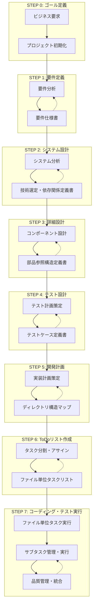

### 2.2 コーディング・テスト実行フロー詳細

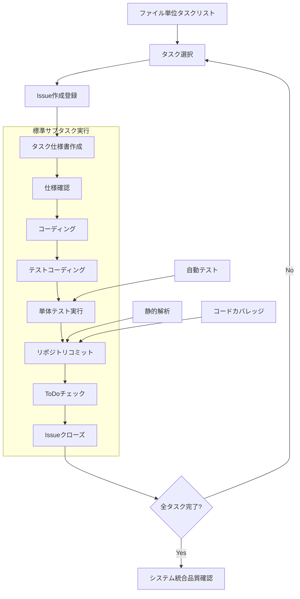

## 3. ステップ別詳細プロセス定義

### STEP 0: ゴール定義

#### サブステップ構造

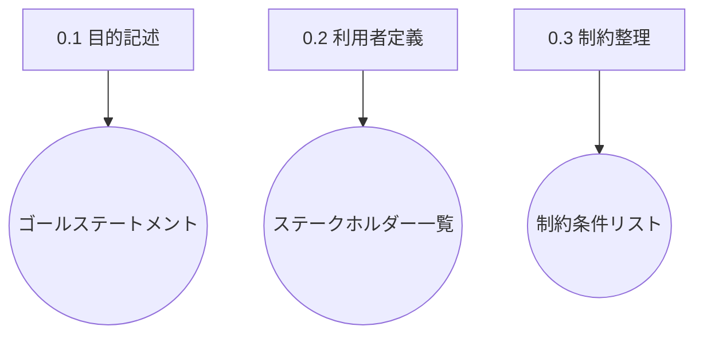

#### 成果物一覧
| サブステップ | インプット | アウトプット | 用途 |
|-------------|-----------|-------------|------|
| 0.1 目的記述 | 要望・背景 | ゴールステートメント | 以降の全ステップの指針 |
| 0.2 利用者定義 | ゴール | ステークホルダー一覧 | ユースケース抽出時に使用 |
| 0.3 制約整理 | 要望・運用条件 | 制約条件リスト | 要件抽出時に使用 |

### STEP 1: 要件定義

#### サブステップ構造

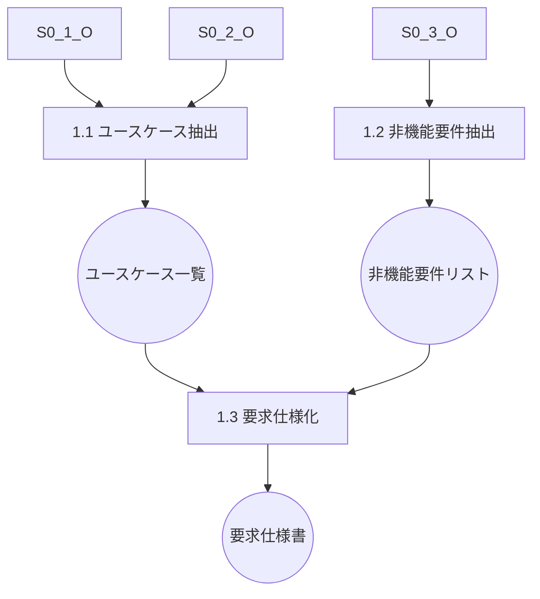

#### 成果物一覧
| サブステップ | インプット | アウトプット | 用途 |
|-------------|-----------|-------------|------|
| 1.1 ユースケース抽出 | ゴール、ステークホルダー | ユースケース一覧 | 機能要件定義の基礎 |
| 1.2 非機能要件抽出 | ゴール、制約条件 | 非機能要件リスト | アーキテクチャ定義に使用 |
| 1.3 要求仕様化 | ユースケース、非機能要件 | 要求仕様書 | システム設計の前提 |

### STEP 2: システム設計

#### サブステップ構造

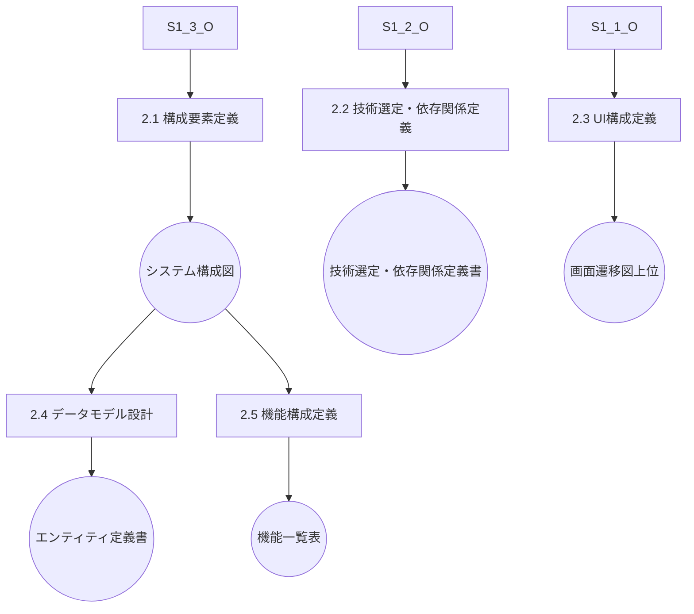

#### 成果物一覧
| サブステップ | インプット | アウトプット | 用途 |
|-------------|-----------|-------------|------|
| 2.1 構成要素定義 | 要求仕様書 | システム構成図 | レイヤー設計の元情報 |
| 2.2 技術選定・依存関係定義 | 非機能要件、構成図 | **技術選定・依存関係定義書** | 開発フレーム・ライブラリ選定 |
| 2.3 UI構成定義 | ユースケース、ステークホルダー | 画面遷移図（上位） | 詳細UI設計に継承 |
| 2.4 データモデル設計 | ユースケース、構成図 | エンティティ定義書 | DBスキーマ、データ契約 |
| 2.5 機能構成定義 | ユースケース、構成図 | 機能一覧表 | コンポーネント設計に使用 |

### STEP 3: 詳細設計

#### サブステップ構造

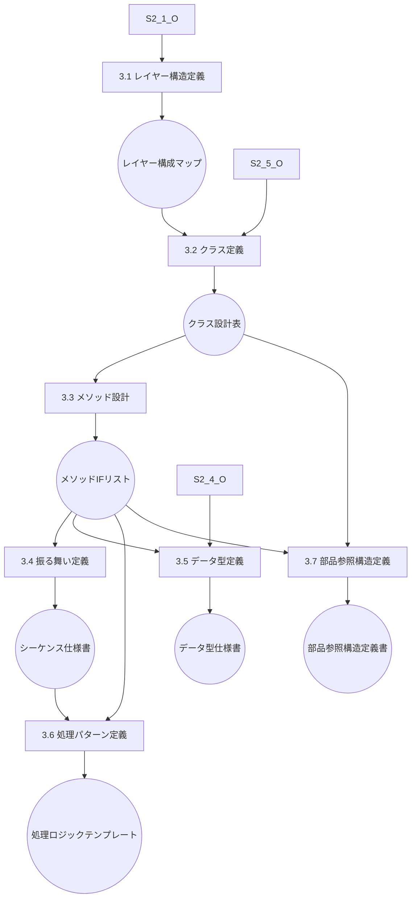

#### 成果物一覧
| サブステップ | インプット | アウトプット | 用途 |
|-------------|-----------|-------------|------|
| 3.1 レイヤー構造定義 | システム構成図、技術選定書 | レイヤー構成マップ | クラス設計の基盤 |
| 3.2 クラス定義 | 機能一覧表、レイヤーマップ | クラス設計表 | I/F・ロジック設計に使用 |
| 3.3 メソッド設計 | クラス設計表、データ定義 | メソッドI/Fリスト | シーケンス定義に使用 |
| 3.4 振る舞い定義 | メソッドI/F、ユースケース | シーケンス仕様書 | テスト設計に使用 |
| 3.5 データ型定義 | エンティティ定義、I/F定義 | データ型仕様書 | 入出力形式の標準化 |
| 3.6 処理パターン定義 | メソッドI/F、振る舞い仕様 | 処理ロジックテンプレート | テスト設計・実装補助 |
| 3.7 部品参照構造定義 | クラス設計表、メソッドI/F | **部品参照構造定義書** | 再利用・依存関係管理 |

### STEP 4: テスト設計

#### サブステップ構造

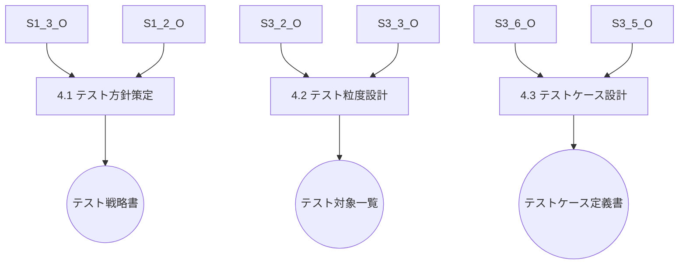

#### 成果物一覧
| サブステップ | インプット | アウトプット | 用途 |
|-------------|-----------|-------------|------|
| 4.1 テスト方針策定 | 要求仕様書、非機能要件 | テスト戦略書 | 粒度設定と優先付けに使用 |
| 4.2 テスト粒度設計 | クラス設計表、メソッドI/F | テスト対象一覧 | ケース網羅の起点 |
| 4.3 テストケース設計 | 処理パターン、データ型 | テストケース定義書 | テストコード生成の基盤 |

### STEP 5: 開発計画

#### サブステップ構造

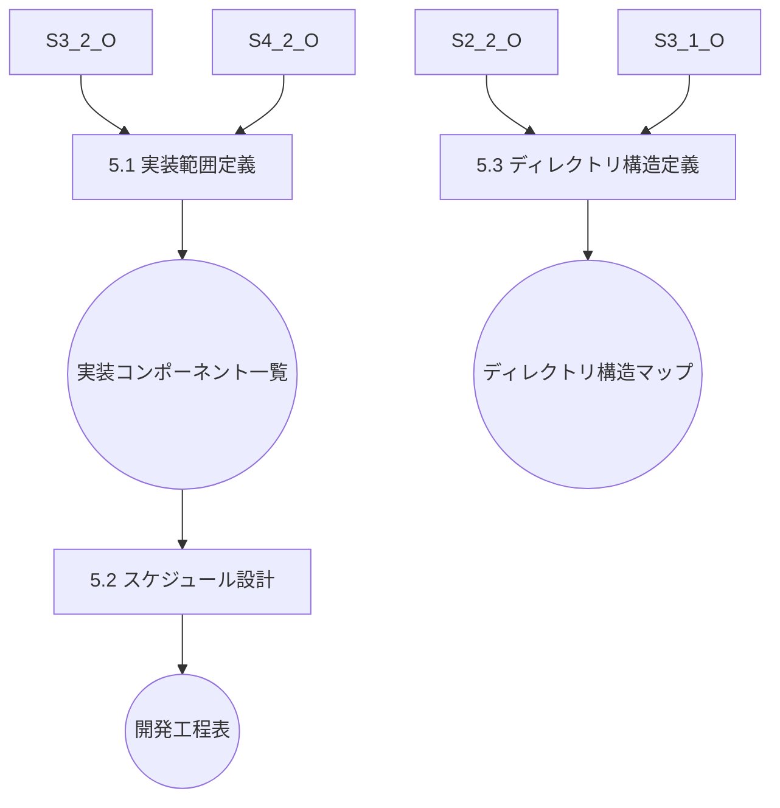

#### 成果物一覧
| サブステップ | インプット | アウトプット | 用途 |
|-------------|-----------|-------------|------|
| 5.1 実装範囲定義 | テスト対象一覧、クラス設計 | 実装コンポーネント一覧 | WBS定義に使用 |
| 5.2 スケジュール設計 | 実装一覧、優先度 | 開発工程表 | ToDoリストの構成単位に |
| 5.3 ディレクトリ構造定義 | 技術選定書、レイヤー構成 | **ディレクトリ構造マップ** | ファイル配置の基準 |

### STEP 6: ToDoリスト作成

#### サブステップ構造

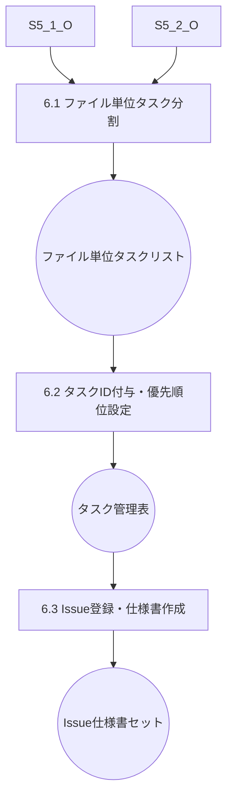

#### 成果物一覧
| サブステップ | インプット | アウトプット | 用途 |
|-------------|-----------|-------------|------|
| 6.1 ファイル単位タスク分割 | 実装一覧、スケジュール表 | ファイル単位タスクリスト | コーディング実行の基本単位 |
| 6.2 タスクID付与・優先順位設定 | タスクリスト、依存関係 | タスク管理表 | 実行順序とトレーサビリティ確保 |
| 6.3 Issue登録・仕様書作成 | タスク管理表、設計書 | Issue・仕様書セット | 実作業の詳細指示書 |

### STEP 7: コーディング・テスト実行

#### サブステップ構造

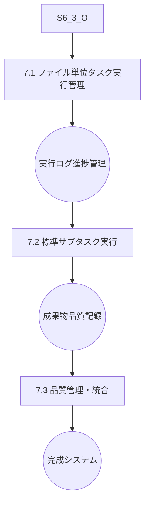

#### 成果物一覧
| サブステップ | インプット | アウトプット | 用途 |
|-------------|-----------|-------------|------|
| 7.1 ファイル単位タスク実行管理 | Issue・仕様書セット | 実行ログ・進捗管理 | タスク実行状況の可視化 |
| 7.2 標準サブタスク実行 | タスク仕様、設計書 | 成果物・品質記録 | 実装・テスト・コミット |
| 7.3 品質管理・統合 | 全成果物、品質記録 | 完成システム | 最終品質確認・リリース準備 |

## 4. ファイル単位タスク管理の詳細定義

### 4.1 タスク階層構造

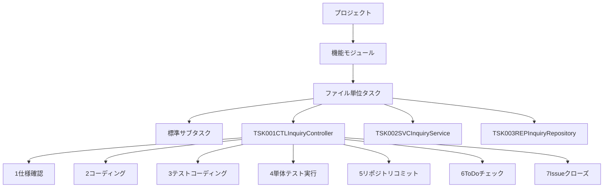

### 4.2 タスクID命名規則

**基本形式**: `TSK-{連番3桁}-{レイヤー}-{ファイル名}`

**レイヤー略語**:
- CTL: Controller（プレゼンテーション層）
- SVC: Service（アプリケーション層）
- ENT: Entity（ドメイン層）
- REP: Repository（インフラ層）
- DTO: Data Transfer Object
- UTL: Utility（共通モジュール）

**命名例**:
- `TSK-001-CTL-InquiryController`: 問い合わせコントローラ
- `TSK-002-SVC-InquiryService`: 問い合わせサービス
- `TSK-003-REP-InquiryRepository`: 問い合わせリポジトリ
- `TSK-004-ENT-Inquiry`: 問い合わせエンティティ

### 4.3 標準サブタスク定義

| サブタスク | 内容 | 成果物 | チェック項目 | 所要時間目安 |
|-----------|------|--------|-------------|-------------|
| 1. 仕様確認 | 設計書・I/F仕様の確認 | 仕様理解メモ | 依存関係、入出力、例外処理の理解 | 15分 |
| 2. コーディング | 実装コードの作成 | ソースファイル | コーディング規約、設計仕様への準拠 | 60分 |
| 3. テストコーディング | 単体テストコードの作成 | テストファイル | テストケース網羅、境界値テスト | 45分 |
| 4. 単体テスト実行 | テストの実行・デバッグ | テスト結果レポート | 全テストケースの成功 | 30分 |
| 5. リポジトリコミット | Gitへのコミット | コミット履歴 | コミットメッセージの規約準拠 | 10分 |
| 6. ToDoチェック | タスク完了マーク | チェック済みToDoリスト | 全サブタスクの完了確認 | 5分 |
| 7. Issueクローズ | 対応するIssueのクローズ | クローズ済みIssue | 成果物の品質確認 | 10分 |

### 4.4 Issue管理との連携

#### Issue作成規則

**タイトル形式**: `[{TaskID}] {ファイル名}の実装`

**本文構成**:
```markdown
## 概要
ファイルの役割と責任

## 実装仕様
### メソッド一覧
- method1(): 機能説明
- method2(): 機能説明

### 依存関係
- 参照するクラス・メソッド一覧
- 提供するI/F一覧

## テスト要件
### 必要なテストケース
- 正常系テスト
- 異常系テスト
- 境界値テスト

## 完了条件
- [ ] 全メソッドの実装完了
- [ ] 単体テスト100%カバレッジ
- [ ] コーディング規約準拠
- [ ] 設計仕様への適合
```

**ラベル設定**:
- `feature`: 新機能実装
- `layer:{レイヤー名}`: 対象レイヤー
- `priority:{高/中/低}`: 優先度
- `size:{S/M/L}`: 作業規模

#### タスク仕様書管理

**ディレクトリ構造**:
```
docs/tasks/
├── TSK-001-CTL-InquiryController.md
├── TSK-002-SVC-InquiryService.md
├── TSK-003-REP-InquiryRepository.md
└── ...
```

**仕様書テンプレート**:
```markdown
# TSK-001-CTL-InquiryController

## 概要
問い合わせ管理のREST APIコントローラ

## 実装仕様
### メソッド一覧
- POST /api/inquiries - 問い合わせ登録
- GET /api/inquiries - 問い合わせ一覧取得
- GET /api/inquiries/{id} - 問い合わせ詳細取得

### 依存関係
- InquiryService: ビジネスロジック処理
- InquiryCreateRequest: リクエストDTO
- InquiryResponse: レスポンスDTO

## テスト要件
- 正常系: 各エンドポイントの正常動作
- 異常系: バリデーションエラー、認証エラー
- 境界値: ページング、検索条件

## 完了条件
- [ ] 全メソッドの実装完了
- [ ] 単体テスト100%カバレッジ
- [ ] APIドキュメント更新
```

### 4.5 コミット管理ルール

#### コミットメッセージ規約

**基本形式**:
```
{type}(#{issue_number}): {概要}

{詳細説明}

Closes #{issue_number}
```

**例**:
```
feat(#123): InquiryControllerの実装

- 問い合わせ登録APIの実装
- バリデーション処理の追加
- 単体テストの作成

Closes #123
```

#### コミットタイプ

| タイプ | 用途 | 例 |
|--------|------|-----|
| feat | 新機能実装 | feat(#123): InquiryService実装 |
| test | テストコード追加 | test(#123): InquiryService単体テスト |
| fix | バグ修正 | fix(#123): バリデーション処理修正 |
| refactor | リファクタリング | refactor(#123): メソッド分割 |
| docs | ドキュメント更新 | docs(#123): API仕様書更新 |

### 4.6 品質管理の統合

#### 自動化チェックポイント

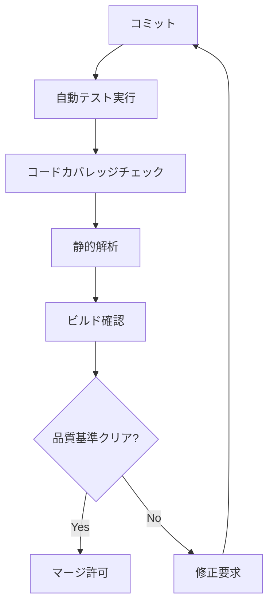

#### 品質基準

| 項目 | 基準値 | チェック方法 | 自動化レベル |
|------|--------|-------------|-------------|
| テストカバレッジ | 90%以上 | Jest/Coverage | 自動 |
| 静的解析 | エラー0件 | ESLint/SonarQube | 自動 |
| ビルド | 成功 | CI/CDパイプライン | 自動 |
| コーディング規約 | 準拠 | Prettier/ESLint | 自動 |
| セキュリティ | 脆弱性0件 | npm audit | 自動 |

#### トレーサビリティ管理

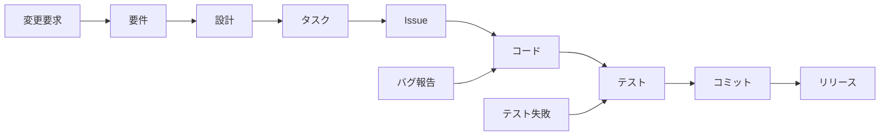

## 5. 重要成果物詳細定義

### 5.1 STEP 2.2: 技術選定・依存関係定義書

**目的**: アーキテクチャ方針と具体的な技術選定、ライブラリ・バージョン管理を統合定義

#### 5.1.1 アーキテクチャ方針
- 設計原則（単一責任、疎結合・高凝集等）
- 品質特性（性能、可用性、セキュリティ等）
- 制約条件（技術・運用制約）

#### 5.1.2 技術スタック選定
| レイヤー | 技術 | バージョン | 選定理由 | 代替案 | ライセンス | セキュリティ考慮 |
|---------|------|----------|----------|--------|-----------|--------------|
| フロントエンド | React | 18.x | コンポーネント再利用性 | Vue.js, Angular | MIT | 定期更新必要 |
| バックエンド | Node.js + NestJS | 18.x + 10.x | TypeScript統一 | Java Spring, .NET | MIT | LTS版使用 |
| データベース | PostgreSQL | 15.x | ACID特性、拡張性 | MySQL, MongoDB
