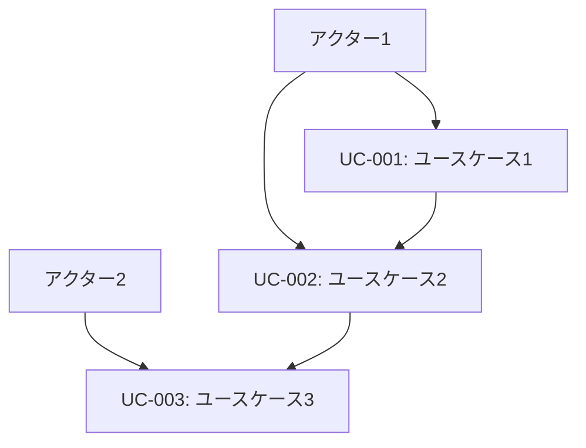
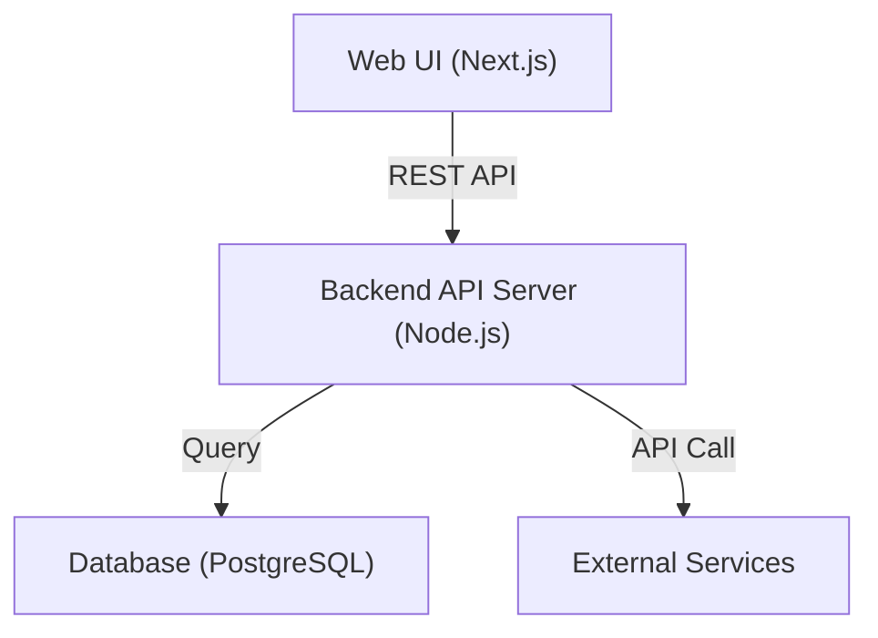
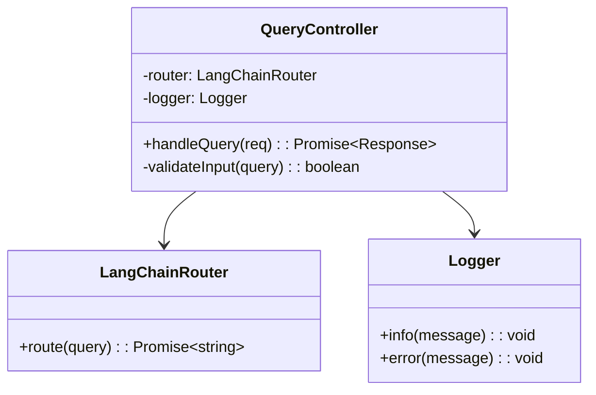

# Cline用プロセスエンジニアリング実装ルール（更新版）

## 概要

本ルールファイルは、「人間によるコーディングとAIコーディングの違い：プロセスエンジニアリングアプローチによる体系化」論文の理論を、Cline AIエージェントで再現するための具体的な実装ルールです。

このルールを適用することで、誰でも論文で提示されたプロセスエンジニアリング手法を実際のソフトウェア開発で再現できます。

**文書フォーマット参照**: 本ルールの実装時は、`docs/document-format-specifications.md`で定義された標準フォーマットに従って文書を作成してください。

## 基本原則

### 1. 段階的詳細化の徹底
- 抽象的な要件から具体的な実装まで、必ず7段階のプロセスを経る
- 各段階で前段階の成果物を必ずインプットとして使用する
- 飛び級や省略は禁止
- **文書フォーマット**: 各段階の文書は標準フォーマットに準拠

### 2. ファイル単位タスク管理の実装
- すべてのコーディング作業をファイル単位で分割する
- 各ファイルに対して7つの標準サブタスクを適用する
- タスクIDによる完全なトレーサビリティを確保する
- **文書フォーマット**: タスク管理文書は標準テンプレートを使用

### 3. 品質保証の統合
- 各段階で品質チェックポイントを設定する
- 自動化可能な品質管理は必ず自動化する
- 手動チェックが必要な項目は明確に定義する
- **文書フォーマット**: 完了確認チェックリストを必ず含める

## プロセス実装ルール

### STEP 0: ゴール定義

#### 必須成果物
1. **ゴールステートメント** (`docs/goal-statement.md`)
2. **ステークホルダー一覧** (`docs/stakeholders.md`)
3. **制約条件リスト** (`docs/constraints.md`)

#### 文書フォーマット要件
- **メタデータセクション**: ドキュメントID、作成日、関連文書を必ず記載
- **完了確認**: 各文書に標準チェックリストを含める
- **図表**: 必要に応じてMermaid記法を使用

#### 実装ルール
```markdown
## ゴールステートメント作成ルール

### 必須要素
- プロジェクトの目的（1文で表現）
- 解決する課題の明確化
- 成功の定義（定量的指標を含む）

### 禁止事項
- 曖昧な表現（「改善する」「向上させる」等）
- 技術的詳細の記述
- 実装方法の言及

### 標準フォーマット適用
docs/document-format-specifications.md の「STEP 0: ゴール定義文書」セクションに従って作成

### テンプレート
このプロジェクトは、[対象ユーザー]が[現在の課題]を解決し、[期待する結果]を実現するために、[提供する価値]を提供することを目的とする。
```

### STEP 1: 要件定義

#### 必須成果物
1. **ユースケース一覧** (`docs/requirements/use-cases.md`)
2. **非機能要件リスト** (`docs/requirements/non-functional.md`)
3. **要求仕様書** (`docs/requirements/specification.md`)

#### 文書フォーマット要件
- **ユースケース関係図**: Mermaid記法で図示
- **表形式**: アクター定義、ユースケース一覧は表形式で整理
- **トレーサビリティ**: 前段階文書への参照を明記

#### 実装ルール
```markdown
## ユースケース抽出ルール

### 必須要素
- アクター（ユーザー種別）の明確化
- 主要シナリオ（正常系）の記述
- 代替シナリオ（異常系）の記述
- 事前条件・事後条件の定義

### 品質基準
- 各ユースケースは独立して理解可能
- ビジネス価値が明確
- テスト可能な形で記述

### 標準フォーマット適用
docs/document-format-specifications.md の「STEP 1: 要件定義文書」セクションに従って作成

### Mermaid図の必須使用
ユースケース関係図は以下の形式で作成：



### テンプレート
**UC-001: [ユースケース名]**
- アクター: [ユーザー種別]
- 目的: [達成したい目標]
- 事前条件: [実行前の状態]
- 主要シナリオ: [ステップ1-N]
- 代替シナリオ: [例外処理]
- 事後条件: [実行後の状態]
```

### STEP 2: システム設計

#### 必須成果物
1. **システム構成図** (`docs/design/system-architecture.md`)
2. **技術選定・依存関係定義書** (`docs/design/tech-stack.md`)

#### 文書フォーマット要件
- **システム構成図**: Mermaid記法で必ず図示
- **技術選定表**: 標準表形式を使用
- **レイヤー構成**: 表形式で整理

#### 実装ルール
```markdown
## 技術選定ルール

### 必須要素
- 選定技術の明確な理由
- バージョン指定（具体的なバージョン番号）
- 代替案の検討結果
- ライセンス・セキュリティ考慮

### 品質基準
- 非機能要件との整合性
- 保守性・拡張性の考慮
- チーム技術レベルとの適合性

### 標準フォーマット適用
docs/document-format-specifications.md の「STEP 2: システム設計文書」セクションに従って作成

### 必須Mermaid図
システム全体アーキテクチャ：



### テンプレート
| レイヤー | 技術 | バージョン | 選定理由 | 代替案 | リスク |
|---------|------|----------|----------|--------|--------|
| Frontend | React | 18.2.0 | コンポーネント再利用性 | Vue.js | 学習コスト |
```

### STEP 3: 詳細設計

#### 必須成果物
1. **クラス設計表** (`docs/detailed-design/classes.md`)
2. **メソッドI/Fリスト** (`docs/detailed-design/interfaces.md`)

#### 文書フォーマット要件
- **クラス図**: Mermaid記法で依存関係を図示
- **インターフェース表**: 標準表形式を使用
- **メソッドシグネチャ**: TypeScript形式で記述

#### 実装ルール
```markdown
## クラス設計ルール

### 必須要素
- 単一責任原則の遵守
- 依存関係の明確化
- インターフェース定義
- 例外処理方針

### 品質基準
- 循環依存の禁止
- 疎結合・高凝集の実現
- テスタビリティの確保

### 標準フォーマット適用
docs/document-format-specifications.md の「STEP 3: 詳細設計文書」セクションに従って作成

### 必須Mermaid図
クラス依存関係図：



### テンプレート
**クラス名**: UserService
**責任**: ユーザー管理のビジネスロジック
**依存関係**: 
- UserRepository (データアクセス)
- EmailService (通知機能)
**提供メソッド**:
- createUser(userData: UserCreateRequest): Promise<User>
- getUserById(id: string): Promise<User | null>
```

### STEP 4: テスト設計

#### 必須成果物
1. **テスト戦略書** (`docs/test-design/strategy.md`)
2. **テスト対象一覧** (`docs/test-design/targets.md`)
3. **テストケース定義書** (`docs/test-design/test-cases.md`)

#### 文書フォーマット要件
- **テスト戦略**: 標準フォーマットに準拠
- **テストケース表**: 標準表形式を使用
- **カバレッジ目標**: 定量的に設定

#### 実装ルール
```markdown
## テスト設計ルール

### 必須要素
- テストピラミッドの適用
- カバレッジ目標の設定（90%以上）
- 自動化方針の明確化
- テストデータ管理方針

### 品質基準
- 境界値テストの網羅
- 異常系テストの充実
- パフォーマンステストの考慮

### 標準フォーマット適用
標準的なテスト設計文書フォーマットに従って作成

### テンプレート
**テストケースID**: TC-001
**対象メソッド**: UserService.createUser
**テスト観点**: 正常系 - 有効なユーザーデータ
**入力**: { name: "John", email: "john@example.com" }
**期待結果**: ユーザー作成成功、IDが返却される
**事前条件**: データベースが空の状態
**事後条件**: ユーザーがデータベースに保存される
```

### STEP 5: 開発計画

#### 必須成果物
1. **実装コンポーネント一覧** (`docs/implementation/components.md`)
2. **開発工程表** (`docs/implementation/schedule.md`)
3. **ディレクトリ構造マップ** (`docs/implementation/directory-structure.md`)

#### 文書フォーマット要件
- **ディレクトリ構造**: ツリー形式で表現
- **工程表**: 表形式で整理
- **コンポーネント一覧**: 標準表形式を使用

#### 実装ルール
```markdown
## ディレクトリ構造ルール

### 必須要素
- レイヤー別の明確な分離
- 技術選定との整合性
- 拡張性を考慮した構造
- 命名規約の統一

### 品質基準
- 関心の分離の実現
- 依存関係の可視化
- 保守性の確保

### 標準フォーマット適用
標準的な開発計画文書フォーマットに従って作成

### テンプレート
```
src/
├── presentation/     # プレゼンテーション層
│   ├── controllers/  # REST APIコントローラ
│   └── dto/         # データ転送オブジェクト
├── application/     # アプリケーション層
│   ├── services/    # ビジネスロジック
│   └── usecases/    # ユースケース実装
├── domain/          # ドメイン層
│   ├── entities/    # エンティティ
│   └── repositories/ # リポジトリインターフェース
└── infrastructure/ # インフラ層
    ├── database/   # データベース実装
    └── external/   # 外部API連携
```

### STEP 6: ToDoリスト作成

#### 必須成果物
1. **ファイル単位タスクリスト** (`docs/tasks/task-list.md`)
2. **タスク管理表** (`docs/tasks/task-management.md`)
3. **Issue・仕様書セット** (`docs/tasks/specifications/`)

#### 文書フォーマット要件
- **タスクリスト**: 標準表形式を使用
- **タスクID**: 統一された命名規則
- **仕様書**: 各タスクに対応する詳細仕様

#### 実装ルール
```markdown
## ファイル単位タスク分割ルール

### タスクID命名規則
**形式**: TSK-{連番3桁}-{レイヤー}-{ファイル名}

**レイヤー略語**:
- CTL: Controller
- SVC: Service  
- ENT: Entity
- REP: Repository
- DTO: Data Transfer Object
- UTL: Utility

### 必須要素
- 実装対象ファイルの明確化
- 依存関係の順序付け
- 優先度の設定
- 所要時間の見積もり

### 品質基準
- 1タスク = 1ファイル
- 依存関係の循環禁止
- 並行実行可能性の考慮

### 標準フォーマット適用
標準的なタスク管理文書フォーマットに従って作成

### テンプレート
**タスクID**: TSK-001-CTL-UserController
**ファイル**: src/presentation/controllers/UserController.ts
**依存タスク**: TSK-002-SVC-UserService
**優先度**: 高
**見積時間**: 3時間
**担当者**: [担当者名]
```

### STEP 7: コーディング・テスト実行

#### 標準サブタスク実装ルール

```markdown
## 7つの標準サブタスク

### 1. 仕様確認
**目的**: 実装前の設計理解と依存関係確認
**成果物**: 仕様理解メモ
**文書参照**: 詳細設計文書、インターフェース仕様書
**チェック項目**:
- [ ] インターフェース仕様の理解
- [ ] 依存関係の確認
- [ ] 例外処理方針の理解
- [ ] テスト要件の確認

### 2. コーディング
**目的**: 設計に基づく実装コードの作成
**成果物**: ソースファイル
**文書参照**: クラス設計表、メソッドI/Fリスト
**チェック項目**:
- [ ] コーディング規約の遵守
- [ ] 設計仕様への準拠
- [ ] エラーハンドリングの実装
- [ ] ログ出力の適切な配置

### 3. テストコーディング
**目的**: 単体テストコードの作成
**成果物**: テストファイル
**文書参照**: テストケース定義書
**チェック項目**:
- [ ] 正常系テストの実装
- [ ] 異常系テストの実装
- [ ] 境界値テストの実装
- [ ] モック・スタブの適切な使用

### 4. 単体テスト実行
**目的**: テストの実行とデバッグ
**成果物**: テスト結果レポート
**文書参照**: テスト戦略書
**チェック項目**:
- [ ] 全テストケースの成功
- [ ] カバレッジ90%以上の達成
- [ ] パフォーマンス要件の確認
- [ ] メモリリークの確認

### 5. リポジトリコミット
**目的**: バージョン管理への登録
**成果物**: コミット履歴
**文書参照**: コミットメッセージ規約
**チェック項目**:
- [ ] コミットメッセージ規約の遵守
- [ ] 関連Issueの紐付け
- [ ] 適切な粒度でのコミット
- [ ] コンフリクトの解決

### 6. ToDoチェック
**目的**: タスク完了の確認
**成果物**: 更新されたToDoリスト
**文書参照**: タスク管理表
**チェック項目**:
- [ ] 全サブタスクの完了確認
- [ ] 品質基準の達成確認
- [ ] ドキュメントの更新
- [ ] 次タスクへの影響確認

### 7. Issueクローズ
**目的**: 作業完了の正式記録
**成果物**: クローズされたIssue
**文書参照**: Issue管理テンプレート
**チェック項目**:
- [ ] 完了条件の全項目達成
- [ ] レビュー結果の反映
- [ ] 関連ドキュメントの更新
- [ ] ステークホルダーへの報告
```

## 文書フォーマット統合ルール

### 必須適用事項

```markdown
## 文書作成時の必須チェック項目

### 1. メタデータセクション
- [ ] ドキュメントIDの付与
- [ ] 作成日・更新日の記録
- [ ] 関連文書への参照
- [ ] 作成者・レビュー者の明記

### 2. 構造化
- [ ] 必須セクションの完備
- [ ] 階層構造の適切な使用（H1-H6）
- [ ] 表形式の統一
- [ ] 図表の適切な配置

### 3. 図表作成
- [ ] Mermaid記法の正しい使用
- [ ] 4つのバッククォート（````）でのネスト
- [ ] 図表とテキストの明確な分離
- [ ] 図表の説明文の追加

### 4. 品質保証
- [ ] 完了確認チェックリストの追加
- [ ] トレーサビリティの確保
- [ ] 前段階文書との整合性確認
- [ ] 次段階への引き継ぎ情報の明記

### 5. 標準テンプレートの使用
各段階の文書は以下を参照：
- STEP 0: docs/document-format-specifications.md「STEP 0: ゴール定義文書」
- STEP 1: docs/document-format-specifications.md「STEP 1: 要件定義文書」
- STEP 2: docs/document-format-specifications.md「STEP 2: システム設計文書」
- STEP 3: docs/document-format-specifications.md「STEP 3: 詳細設計文書」
```

## 品質管理ルール

### 自動化チェックポイント

```markdown
## CI/CDパイプライン必須項目

### プルリクエスト時
1. **静的解析**: ESLint, SonarQube
2. **単体テスト**: Jest, Mocha等
3. **カバレッジチェック**: 90%以上
4. **ビルド確認**: エラー0件
5. **セキュリティスキャン**: npm audit, Snyk
6. **文書フォーマットチェック**: 標準フォーマット準拠確認

### マージ時
1. **結合テスト**: API, DB連携テスト
2. **E2Eテスト**: ユーザーシナリオテスト
3. **パフォーマンステスト**: 応答時間確認
4. **デプロイテスト**: 本番環境への配置確認
5. **文書整合性チェック**: トレーサビリティマトリクス確認

### 品質基準
| 項目 | 基準値 | 測定方法 | 自動化 |
|------|--------|----------|--------|
| テストカバレッジ | 90%以上 | Jest Coverage | ✅ |
| 静的解析 | エラー0件 | ESLint | ✅ |
| セキュリティ | 脆弱性0件 | npm audit | ✅ |
| パフォーマンス | 応答時間<200ms | Lighthouse | ✅ |
| 可用性 | 99.9%以上 | 監視ツール | ✅ |
| 文書品質 | フォーマット準拠100% | 自動チェック | ✅ |
```

## Issue管理ルール

### Issue作成テンプレート

```markdown
## タスクIssueテンプレート

**タイトル**: [TSK-XXX-XXX-FileName] ファイル名の実装

### 概要
実装対象ファイルの役割と責任を記述

### 実装仕様
#### メソッド一覧
- method1(): 機能説明
- method2(): 機能説明

#### 依存関係
- 参照するクラス・メソッド
- 提供するインターフェース

### 参照文書
- [ ] 詳細設計書: [リンク]
- [ ] インターフェース仕様書: [リンク]
- [ ] テストケース定義書: [リンク]

### テスト要件
#### 必要なテストケース
- [ ] 正常系テスト
- [ ] 異常系テスト  
- [ ] 境界値テスト
- [ ] パフォーマンステスト

### 完了条件
- [ ] 全メソッドの実装完了
- [ ] 単体テスト90%以上カバレッジ
- [ ] コーディング規約準拠
- [ ] 設計仕様への適合
- [ ] 文書フォーマット準拠
- [ ] レビュー完了

### 関連情報
- 設計書: [リンク]
- 依存タスク: [タスクID]
- 参考資料: [リンク]
```

### コミットメッセージ規約

```markdown
## コミットメッセージ規約

### 基本形式
```
{type}(#{issue_number}): {概要}

{詳細説明}

Closes #{issue_number}
```

### タイプ定義
- **feat**: 新機能実装
- **fix**: バグ修正
- **test**: テストコード追加
- **refactor**: リファクタリング
- **docs**: ドキュメント更新
- **style**: コードスタイル修正
- **perf**: パフォーマンス改善

### 例
```
feat(#123): UserControllerの実装

- ユーザー登録APIの実装
- バリデーション処理の追加
- 単体テストの作成
- OpenAPI仕様書の更新
- 標準フォーマットに準拠した文書作成

Closes #123
```
```

## トレーサビリティ管理

### 必須トレーサビリティマトリクス

```markdown
## トレーサビリティマトリクス

### 要件 → 設計 → 実装の追跡
| 要件ID | ユースケース | 設計クラス | 実装ファイル | テストケース | Issue | 文書 |
|--------|-------------|-----------|-------------|-------------|-------|------|
| REQ-001 | ユーザー登録 | UserService | UserService.ts | TC-001-005 | #123 | UC-001 |
| REQ-002 | ユーザー認証 | AuthService | AuthService.ts | TC-006-010 | #124 | UC-002 |

### 文書間の関連性
| 段階 | 文書 | 参照元 | 参照先 | フォーマット準拠 |
|------|------|--------|--------|------------------|
| STEP 0 | goal-statement.md | - | stakeholders.md | ✅ |
| STEP 1 | use-cases.md | goal-statement.md | specification.md | ✅ |
| STEP 2 | system-architecture.md | specification.md | classes.md | ✅ |

### 変更影響分析
変更要求発生時の影響範囲を即座に特定可能

### 品質確保
各段階での成果物が確実に次段階に引き継がれることを保証
```

## 再現性確保のためのチェックリスト

### プロジェクト開始時
- [ ] 本ルールファイルの配置確認
- [ ] 文書フォーマット仕様書の配置確認
- [ ] 必須ディレクトリ構造の作成
- [ ] CI/CDパイプラインの設定
- [ ] Issue管理テンプレートの設定
- [ ] 品質基準の設定
- [ ] 文書フォーマットチェック機能の設定

### 各STEP完了時
- [ ] 必須成果物の作成確認
- [ ] 標準フォーマット準拠確認
- [ ] 品質基準の達成確認
- [ ] 次STEPへの引き継ぎ情報確認
- [ ] トレーサビリティの更新
- [ ] 文書間整合性の確認

### プロジェクト完了時
- [ ] 全成果物の品質確認
- [ ] 全文書のフォーマット準拠確認
- [ ] トレーサビリティマトリクスの完成
- [ ] 再現性検証の実施
- [ ] 改善点の記録
- [ ] 文書アーカイブの作成

## カスタマイズガイド

### プロジェクト固有の調整項目

```markdown
## 調整可能項目

### 技術スタック
- プログラミング言語
- フレームワーク
- データベース
- インフラ構成

### 品質基準
- テストカバレッジ目標
- パフォーマンス要件
- セキュリティ要件
- 可用性要件

### プロセス調整
- レビュー方法
- デプロイ頻度
- リリース戦略
- 監視方法

### 文書カスタマイズ
- プロジェクト固有のセクション追加
- 業界特有の要件項目追加
- 組織固有のテンプレート適用

### 調整禁止項目
- 7段階プロセスの省略
- ファイル単位タスク管理の変更
- 標準サブタスクの削除
- トレーサビリティ管理の簡略化
- 文書フォーマットの基本構造変更
```

## 実装支援ツール

### 推奨ツール構成

```markdown
## 開発環境
- **IDE**: VSCode + 拡張機能
- **バージョン管理**: Git + GitHub
- **CI/CD**: GitHub Actions
- **品質管理**: ESLint + Prettier + SonarQube
- **テスト**: Jest + Cypress
- **監視**: Application Insights
- **文書管理**: Markdown + Mermaid + 自動フォーマットチェック

## 自動化スクリプト
- プロジェクト初期化スクリプト
- ディレクトリ構造生成スクリプト
- Issue一括作成スクリプト
- 品質レポート生成スクリプト
- 文書フォーマットチェックスクリプト
- トレーサビリティマトリクス生成スクリプト
```

## 論文再現性の検証方法

### 検証項目

```markdown
## 再現性検証チェックリスト

### プロセス再現性
- [ ] 7段階プロセスの完全実行
