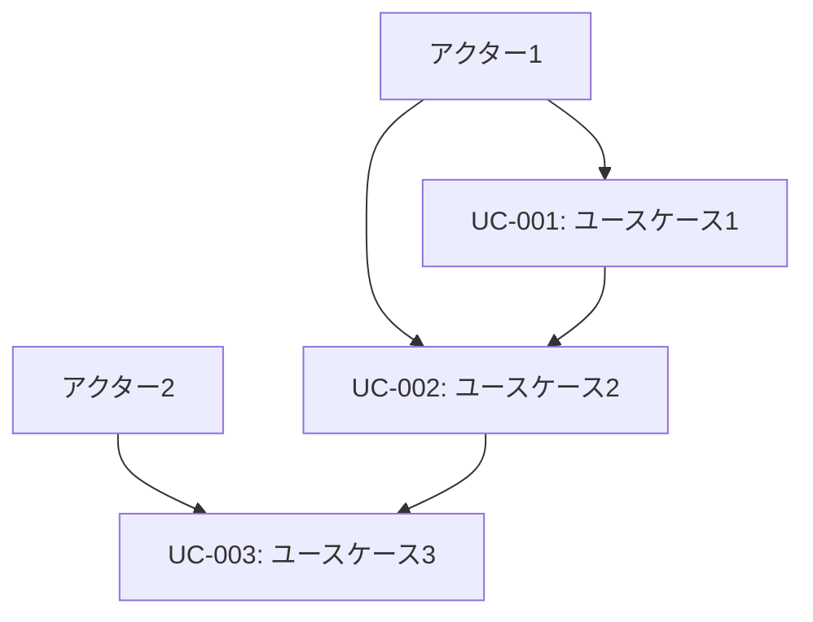
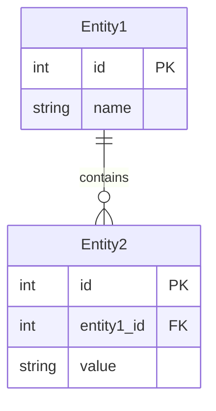
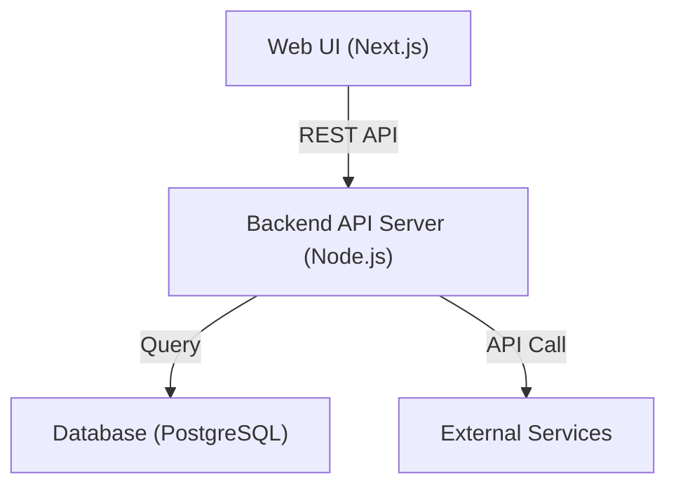
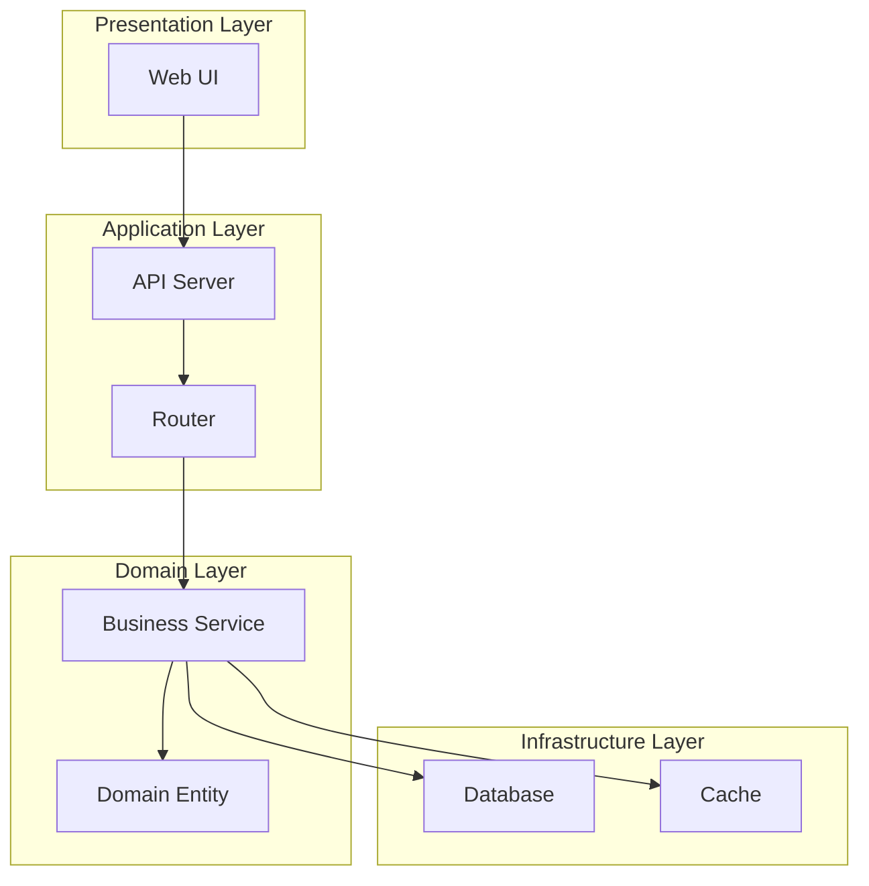
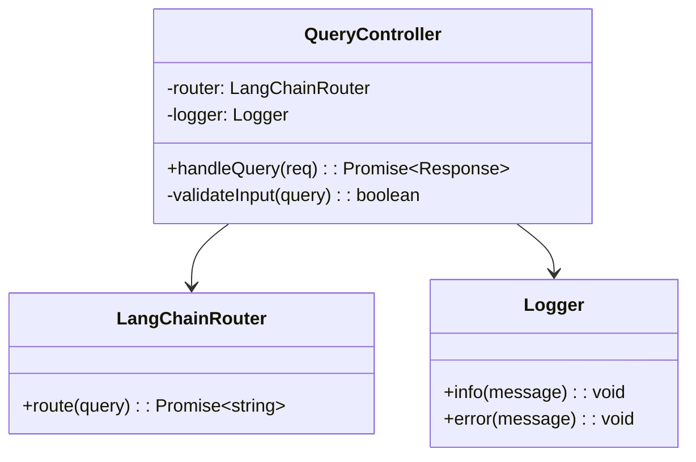

# プロセスエンジニアリング文書フォーマット仕様書（修正版）

## 概要

本仕様書は、「プロセスエンジニアリングfor AIコーディング」で定義される全ドキュメントの標準フォーマットを定義します。RagProtoプロジェクトでの実装例を基に、7段階すべての文書の必須項目、任意項目、書式、図示方法を標準化します。

## 基本原則

### 1. 文書構造の統一
- 全文書はMarkdown形式で作成
- 階層構造は最大6レベル（H1-H6）まで
- 必須セクションと任意セクションを明確に区分
- メタデータセクションを文書冒頭に配置

### 2. トレーサビリティの確保
- 各文書に一意のドキュメントIDを付与
- 前段階文書への参照を明記
- 次段階への引き継ぎ情報を明示

### 3. 品質基準の統一
- チェックリスト形式での完了確認
- レビュー項目の標準化
- 更新履歴の記録

### 4. 図示方法の標準化
- Mermaid記法を使用した図表作成
- 適切なコードブロック記法の使用
- 図表とテキストの明確な分離

---

## STEP 0: ゴール定義文書

### 0.1 ゴールステートメント（goal-statement.md）

#### 必須セクション

````markdown
# ゴールステートメント

## メタデータ
| 項目 | 内容 |
|------|------|
| ドキュメントID | GOAL-001 |
| 作成日 | YYYY-MM-DD |
| 最終更新日 | YYYY-MM-DD |
| 作成者 | [作成者名] |
| レビュー者 | [レビュー者名] |
| 承認者 | [承認者名] |

## 1. プロジェクト概要
| 項目 | 内容 |
|------|------|
| プロジェクト名 | [プロジェクト名] |
| 目的 | [1文で表現された明確な目的] |
| スコープ | [実装範囲の明確な定義] |
| 成果物 | [期待される具体的な成果物] |

## 2. 解決する課題
### 2.1 現状の問題
- [具体的な問題点1]
- [具体的な問題点2]
- [具体的な問題点3]

### 2.2 期待する結果
- [定量的な成果指標1]
- [定量的な成果指標2]
- [定量的な成果指標3]

## 3. 成功の定義
### 3.1 定量的指標
| 指標 | 目標値 | 測定方法 |
|------|--------|----------|
| [指標名1] | [目標値1] | [測定方法1] |
| [指標名2] | [目標値2] | [測定方法2] |

### 3.2 定性的指標
- [定性的成功基準1]
- [定性的成功基準2]

## 4. 完了確認
- [ ] 目的が1文で明確に表現されている
- [ ] 解決する課題が具体的に記述されている
- [ ] 成功の定義が定量的に設定されている
- [ ] ステークホルダーの合意が得られている
````

#### 任意セクション
- 背景情報
- 関連プロジェクト
- 参考資料

### 0.2 ステークホルダー一覧（stakeholders.md）

#### 必須セクション

````markdown
# ステークホルダー一覧

## メタデータ
| 項目 | 内容 |
|------|------|
| ドキュメントID | STAKE-001 |
| 関連文書 | GOAL-001 |
| 作成日 | YYYY-MM-DD |

## 1. ステークホルダー分類

### 1.1 プライマリステークホルダー
| 役割 | 氏名/組織 | 責任範囲 | 期待事項 | 連絡先 |
|------|-----------|----------|----------|--------|
| [役割1] | [氏名1] | [責任範囲1] | [期待事項1] | [連絡先1] |
| [役割2] | [氏名2] | [責任範囲2] | [期待事項2] | [連絡先2] |

### 1.2 セカンダリステークホルダー
| 役割 | 氏名/組織 | 影響度 | 関与レベル | 連絡先 |
|------|-----------|--------|------------|--------|
| [役割1] | [氏名1] | [高/中/低] | [関与レベル1] | [連絡先1] |

## 2. コミュニケーション計画
| ステークホルダー | 頻度 | 方法 | 内容 |
|------------------|------|------|------|
| [ステークホルダー1] | [頻度1] | [方法1] | [内容1] |

## 3. 完了確認
- [ ] 全ステークホルダーが特定されている
- [ ] 役割と責任が明確に定義されている
- [ ] コミュニケーション計画が策定されている
````

### 0.3 制約条件リスト（constraints.md）

#### 必須セクション

````markdown
# 制約条件リスト

## メタデータ
| 項目 | 内容 |
|------|------|
| ドキュメントID | CONST-001 |
| 関連文書 | GOAL-001 |
| 作成日 | YYYY-MM-DD |

## 1. 技術制約
| 制約項目 | 内容 | 影響度 | 対応策 |
|----------|------|--------|--------|
| [制約1] | [詳細1] | [高/中/低] | [対応策1] |
| [制約2] | [詳細2] | [高/中/低] | [対応策2] |

## 2. 運用制約
| 制約項目 | 内容 | 影響度 | 対応策 |
|----------|------|--------|--------|
| [制約1] | [詳細1] | [高/中/低] | [対応策1] |

## 3. リソース制約
| 制約項目 | 内容 | 影響度 | 対応策 |
|----------|------|--------|--------|
| [制約1] | [詳細1] | [高/中/低] | [対応策1] |

## 4. 時間制約
| 制約項目 | 期限 | 影響度 | 対応策 |
|----------|------|--------|--------|
| [制約1] | [期限1] | [高/中/低] | [対応策1] |

## 5. 完了確認
- [ ] 技術制約が全て特定されている
- [ ] 運用制約が明確に定義されている
- [ ] リソース制約が現実的に評価されている
- [ ] 時間制約が具体的に設定されている
````

---

## STEP 1: 要件定義文書

### 1.1 ユースケース一覧（requirements/use-cases.md）

#### 必須セクション

````markdown
# ユースケース一覧

## メタデータ
| 項目 | 内容 |
|------|------|
| ドキュメントID | UC-001 |
| 関連文書 | GOAL-001, STAKE-001 |
| 作成日 | YYYY-MM-DD |

## 1. ユースケース概要

### 1.1 アクター定義
| アクターID | アクター名 | 説明 | 権限レベル |
|------------|------------|------|------------|
| AC-001 | [アクター1] | [説明1] | [権限1] |
| AC-002 | [アクター2] | [説明2] | [権限2] |

### 1.2 ユースケース一覧
| UC-ID | ユースケース名 | アクター | 優先度 | 複雑度 |
|-------|----------------|----------|--------|--------|
| UC-001 | [ユースケース1] | AC-001 | 高 | 中 |
| UC-002 | [ユースケース2] | AC-002 | 中 | 低 |

## 2. ユースケース詳細

### UC-001: [ユースケース名]
**概要**: [ユースケースの概要]
**アクター**: [主要アクター]
**目的**: [達成したい目標]
**頻度**: [実行頻度]

#### 事前条件
- [事前条件1]
- [事前条件2]

#### 主要シナリオ
1. [ステップ1]
2. [ステップ2]
3. [ステップ3]

#### 代替シナリオ
**A1: [例外ケース1]**
- 1a. [例外処理1]
- 1b. [例外処理2]

#### 事後条件
- [事後条件1]
- [事後条件2]

#### 非機能要件
- **性能**: [性能要件]
- **セキュリティ**: [セキュリティ要件]
- **可用性**: [可用性要件]

## 3. ユースケース関係図



## 4. 完了確認
- [ ] 全アクターが特定されている
- [ ] ユースケースが網羅的に定義されている
- [ ] 主要シナリオが詳細に記述されている
- [ ] 代替シナリオが適切に定義されている
- [ ] 事前・事後条件が明確である
````

### 1.2 非機能要件リスト（requirements/non-functional.md）

#### 必須セクション

````markdown
# 非機能要件リスト

## メタデータ
| 項目 | 内容 |
|------|------|
| ドキュメントID | NFR-001 |
| 関連文書 | UC-001, CONST-001 |
| 作成日 | YYYY-MM-DD |

## 1. 性能要件

### 1.1 応答時間
| 機能 | 目標値 | 最大許容値 | 測定条件 |
|------|--------|------------|----------|
| [機能1] | [目標値1] | [最大値1] | [条件1] |
| [機能2] | [目標値2] | [最大値2] | [条件2] |

### 1.2 スループット
| 機能 | 目標値 | 最大許容値 | 測定条件 |
|------|--------|------------|----------|
| [機能1] | [目標値1] | [最大値1] | [条件1] |

### 1.3 リソース使用量
| リソース | 目標値 | 最大許容値 | 測定条件 |
|----------|--------|------------|----------|
| CPU使用率 | [目標値] | [最大値] | [条件] |
| メモリ使用量 | [目標値] | [最大値] | [条件] |
| ディスク使用量 | [目標値] | [最大値] | [条件] |

## 2. 可用性要件

### 2.1 稼働率
| システム | 目標稼働率 | 計画停止時間 | 障害復旧時間 |
|----------|------------|--------------|--------------|
| [システム1] | [稼働率1] | [停止時間1] | [復旧時間1] |

### 2.2 障害対応
| 障害レベル | 検知時間 | 復旧時間 | 対応手順 |
|------------|----------|----------|----------|
| 重大 | [時間1] | [時間1] | [手順1] |
| 軽微 | [時間2] | [時間2] | [手順2] |

## 3. セキュリティ要件

### 3.1 認証・認可
| 項目 | 要件 | 実装方法 |
|------|------|----------|
| 認証方式 | [要件1] | [方法1] |
| 認可制御 | [要件2] | [方法2] |

### 3.2 データ保護
| データ種別 | 保護レベル | 暗号化方式 | アクセス制御 |
|------------|------------|------------|--------------|
| [データ1] | [レベル1] | [方式1] | [制御1] |

## 4. 拡張性要件

### 4.1 スケーラビリティ
| 項目 | 現在 | 1年後 | 3年後 |
|------|------|-------|-------|
| 同時接続数 | [数値1] | [数値2] | [数値3] |
| データ量 | [数値1] | [数値2] | [数値3] |

## 5. 保守性要件

### 5.1 監視・ログ
| 項目 | 要件 | 実装方法 |
|------|------|----------|
| システム監視 | [要件1] | [方法1] |
| ログ管理 | [要件2] | [方法2] |

## 6. 完了確認
- [ ] 性能要件が定量的に定義されている
- [ ] 可用性要件が明確に設定されている
- [ ] セキュリティ要件が包括的に定義されている
- [ ] 拡張性要件が将来を見据えて設定されている
- [ ] 保守性要件が運用を考慮して定義されている
````

### 1.3 要求仕様書（requirements/specification.md）

#### 必須セクション

````markdown
# 要求仕様書

## メタデータ
| 項目 | 内容 |
|------|------|
| ドキュメントID | REQ-001 |
| 関連文書 | UC-001, NFR-001 |
| 作成日 | YYYY-MM-DD |
| バージョン | 1.0 |

## 1. 機能要件

### 1.1 機能一覧
| 機能ID | 機能名 | 優先度 | 関連UC | 説明 |
|--------|--------|--------|--------|------|
| F-001 | [機能1] | 必須 | UC-001 | [説明1] |
| F-002 | [機能2] | 重要 | UC-002 | [説明2] |

### 1.2 機能詳細

#### F-001: [機能名]
**概要**: [機能の概要]
**入力**: [入力データ・形式]
**処理**: [処理内容]
**出力**: [出力データ・形式]
**例外処理**: [例外ケースと対応]

**詳細仕様**:
- [仕様1]
- [仕様2]
- [仕様3]

**制約事項**:
- [制約1]
- [制約2]

## 2. 非機能要件サマリ

### 2.1 性能要件
| 項目 | 要件 |
|------|------|
| 応答時間 | [要件1] |
| スループット | [要件2] |

### 2.2 品質要件
| 項目 | 要件 |
|------|------|
| 可用性 | [要件1] |
| セキュリティ | [要件2] |

## 3. インターフェース要件

### 3.1 ユーザーインターフェース
- [UI要件1]
- [UI要件2]

### 3.2 システムインターフェース
| IF-ID | インターフェース名 | 種別 | プロトコル | データ形式 |
|-------|-------------------|------|------------|------------|
| IF-001 | [IF名1] | [種別1] | [プロトコル1] | [形式1] |

## 4. データ要件

### 4.1 データ項目
| データID | データ名 | 型 | 必須 | 説明 |
|----------|----------|----|----- |------|
| D-001 | [データ1] | [型1] | ○ | [説明1] |

### 4.2 データ関係図



## 5. 完了確認
- [ ] 機能要件が網羅的に定義されている
- [ ] 非機能要件が適切に統合されている
- [ ] インターフェース要件が明確に定義されている
- [ ] データ要件が詳細に記述されている
- [ ] 制約事項が明確に記載されている
````

---

## STEP 2: システム設計文書

### 2.1 システム構成図（design/system-architecture.md）

#### 必須セクション

````markdown
# システム構成図

## メタデータ
| 項目 | 内容 |
|------|------|
| ドキュメントID | ARCH-001 |
| 関連文書 | REQ-001 |
| 作成日 | YYYY-MM-DD |

## 1. システム全体アーキテクチャ



## 2. レイヤー構成

| レイヤー | 内容 | 技術 | 責任 |
|----------|------|------|------|
| Presentation Layer | [内容1] | [技術1] | [責任1] |
| Application Layer | [内容2] | [技術2] | [責任2] |
| Domain Layer | [内容3] | [技術3] | [責任3] |
| Infrastructure Layer | [内容4] | [技術4] | [責任4] |

## 3. コンポーネント構成図



## 4. 設計原則

### 4.1 アーキテクチャ原則
- [原則1]: [説明1]
- [原則2]: [説明2]
- [原則3]: [説明3]

### 4.2 設計パターン
| パターン名 | 適用箇所 | 目的 |
|------------|----------|------|
| [パターン1] | [箇所1] | [目的1] |
| [パターン2] | [箇所2] | [目的2] |

## 5. 完了確認
- [ ] システム全体像が明確に表現されている
- [ ] レイヤー構成が適切に定義されている
- [ ] コンポーネント間の関係が明確である
- [ ] 設計原則が明文化されている
````

### 2.2 技術選定・依存関係定義書（design/tech-stack.md）

#### 必須セクション

````markdown
# 技術選定・依存関係定義書

## メタデータ
| 項目 | 内容 |
|------|------|
| ドキュメントID | TECH-001 |
| 関連文書 | ARCH-001, NFR-001 |
| 作成日 | YYYY-MM-DD |

## 1. 技術スタック選定

### 1.1 フロントエンド
| レイヤー | 技術 | バージョン | 選定理由 | 代替案 | ライセンス | リスク |
|---------|------|----------|----------|--------|-----------|--------|
| UI Framework | React | 18.2.0 | [理由1] | Vue.js | MIT | [リスク1] |
| Build Tool | Next.js | 13.x | [理由2] | Vite | MIT | [リスク2] |

### 1.2 バックエンド
| レイヤー | 技術 | バージョン | 選定理由 | 代替案 | ライセンス | リスク |
|---------|------|----------|----------|--------|-----------|--------|
| Runtime | Node.js | 18.x | [理由1] | Deno | MIT | [リスク1] |
| Framework | Express | 4.x | [理由2] | Fastify | MIT | [リスク2] |

### 1.3 データベース
| レイヤー | 技術 | バージョン | 選定理由 | 代替案 | ライセンス | リスク |
|---------|------|----------|----------|--------|-----------|--------|
| RDBMS | PostgreSQL | 15.x | [理由1] | MySQL | PostgreSQL | [リスク1] |

### 1.4 外部サービス
| サービス | 用途 | API仕様 | 制約事項 | 代替案 |
|----------|------|---------|----------|--------|
| OpenAI API | [用途1] | [仕様1] | [制約1] | [代替案1] |

## 2. 依存関係管理

### 2.1 パッケージ管理
| 環境 | パッケージマネージャ | 設定ファイル | ロックファイル |
|------|---------------------|--------------|----------------|
| Frontend | npm | package.json | package-lock.json |
| Backend | npm | package.json | package-lock.json |

### 2.2 主要依存関係
| パッケージ名 | バージョン | 用途 | 更新方針 |
|-------------|------------|------|----------|
| [パッケージ1] | [バージョン1] | [用途1] | [方針1] |

## 3. 開発環境

### 3.1 開発ツール
| ツール | バージョン | 用途 | 設定ファイル |
|--------|------------|------|--------------|
| TypeScript | 5.x | 型チェック | tsconfig.json |
| ESLint | 8.x | 静的解析 | .eslintrc.json |
| Prettier | 3.x | コード整形 | .prettierrc |

### 3.2 実行環境
| 環境 | 技術 | 設定 |
|------|------|------|
| 開発 | Docker | docker-compose.dev.yml |
| テスト | Docker | docker-compose.test.yml |
| 本番 | Docker | docker-compose.prod.yml |

## 4. セキュリティ考慮事項

### 4.1 脆弱性対策
| 技術 | 脆弱性 | 対策 |
|------|--------|------|
| [技術1] | [脆弱性1] | [対策1] |

### 4.2 ライセンス管理
| ライセンス | 制約事項 | 対象パッケージ |
|------------|----------|----------------|
| MIT | [制約1] | [パッケージ群1] |
| Apache 2.0 | [制約2] | [パッケージ群2] |

## 5. 完了確認
- [ ] 技術選定理由が明確に記述されている
- [ ] バージョン指定が具体的である
- [ ] 代替案が検討されている
- [ ] ライセンス・セキュリティが考慮されている
- [ ] 依存関係が適切に管理されている
````

---

## STEP 3: 詳細設計文書

### 3.1 クラス設計表（detailed-design/classes.md）

#### 必須セクション

````markdown
# クラス設計表

## メタデータ
| 項目 | 内容 |
|------|------|
| ドキュメントID | CLASS-001 |
| 関連文書 | ARCH-001, TECH-001 |
| 作成日 | YYYY-MM-DD |

## 1. クラス一覧

| クラスID | クラス名 | レイヤー | 責任 | 依存関係 |
|----------|----------|----------|------|----------|
| CL-001 | QueryController | Presentation | [責任1] | [依存1] |
| CL-002 | UserService | Application | [責任2] | [依存2] |

## 2. クラス詳細設計

### CL-001: QueryController

#### 基本情報
- **パッケージ**: controllers
- **ファイル**: queryController.ts
- **責任**: HTTPリクエストの受信と応答の返却
- **設計原則**: 単一責任原則、依存性逆転原則

#### 属性
| 属性名 | 型 | 可視性 | 初期値 | 説明 |
|--------|----|---------|---------|----- |
| router | LangChainRouter | private | - | [説明1] |
| logger | Logger | private | - | [説明2] |

#### メソッド
| メソッド名 | 可視性 | 引数 | 戻り値 | 説明 |
|------------|--------|------|--------|------|
| handleQuery | public | req: Request | Promise<Response> | [説明1] |
| validateInput | private | query: string | boolean | [説明2] |

#### 依存関係図



#### 例外処理
| 例外 | 発生条件 | 処理方法 |
|------|----------|----------|
| ValidationError | [条件1] | [処理1] |
| SystemError | [条件2] | [処理2] |

## 3. 完了確認
- [ ] 全クラスが単一責任原則に従っている
- [ ] 依存関係が明確に定義されている
- [ ] インターフェースが適切に設計されている
- [ ] 例外処理が考慮されている
````

### 3.2 メソッドI/Fリスト（detailed-design/interfaces.md）

#### 必須セクション

````markdown
# メソッドインターフェースリスト

## メタデータ
| 項目 | 内容 |
|------|------|
| ドキュメントID | IF-001 |
| 関連文書 | CLASS-001 |
| 作成日 | YYYY-MM-DD |

## 1. インターフェース一覧

| IF-ID | クラス名 | メソッド名 | 種別 | 優先度 |
|-------|----------|------------|------|--------|
| IF-001 | QueryController | handleQuery | public | 高 |
| IF-002 | LangChainRouter | route | public | 高 |

## 2. インターフェース詳細

### IF-001: QueryController.handleQuery

#### 基本情報
- **目的**: ユーザークエリを受信し、処理結果を返却する
- **呼び出し元**: Express Router
- **呼び出し先**: LangChainRouter.route

#### シグネチャ
```typescript
async handleQuery(req: Request): Promise<Response>
