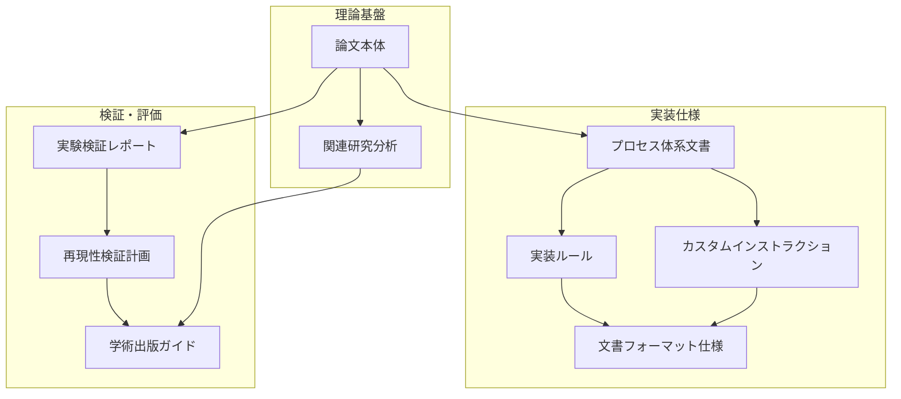

# プロセスエンジニアリング検証プロジェクト - 文書概要

## メタデータ
| 項目 | 内容 |
|------|------|
| ドキュメントID | OVERVIEW-001 |
| 作成日 | 2025-05-27 |
| 最終更新日 | 2025-05-27 |
| 作成者 | Cline AI |
| プロジェクト | ProcessEngineering-ValidationProject |

## 概要

本プロジェクトは、「人間によるコーディングとAIコーディングの違い：プロセスエンジニアリングアプローチによる体系化」論文で提示された手法の技術検証を目的とした包括的な検証環境です。

## 配置済み文書一覧

### 1. 論文・研究文書

#### 1.1 論文本体
- **ファイル**: `human-vs-ai-coding-process-engineering-paper.md`
- **内容**: プロセスエンジニアリングアプローチによるAIコーディング手法の理論的基盤
- **用途**: 検証対象となる理論の参照

#### 1.2 プロセス体系文書
- **ファイル**: `ai-coding-development-process-v1.1.md`
- **内容**: 7段階プロセスの詳細定義と実装ガイドライン
- **用途**: 実装時の詳細仕様参照

#### 1.3 実験検証レポート
- **ファイル**: `experimental-validation-report.md`
- **内容**: 既存の実験結果と検証データ
- **用途**: 比較検証のベースライン

### 2. 検証・分析文書

#### 2.1 再現性検証計画
- **ファイル**: `reproducibility-validation-plan.md`
- **内容**: 論文手法の再現性検証のための詳細計画
- **用途**: 検証プロセスの指針

#### 2.2 関連研究分析
- **ファイル**: `related-research-analysis.md`
- **内容**: 関連研究の分析と本手法の位置づけ
- **用途**: 学術的背景の理解

#### 2.3 学術出版ガイド
- **ファイル**: `academic-publication-guide.md`
- **内容**: 学術論文としての出版に向けたガイドライン
- **用途**: 成果の学術発表準備

### 3. 実装支援文書

#### 3.1 文書フォーマット仕様
- **ファイル**: `document-format-specifications.md`
- **内容**: 全文書の標準フォーマット定義（Mermaid記法修正版）
- **用途**: 文書作成時の標準テンプレート

#### 3.2 実装ルール
- **ファイル**: `cline-process-engineering-ruless.md`
- **内容**: Cline AIエージェント用の詳細実装ルール
- **用途**: 自動化実装の指針

#### 3.3 カスタムインストラクション
- **ファイル**: `cline-custom-instructions.md`
- **内容**: Cline AIエージェント用のカスタムインストラクション
- **用途**: AI実装の自動化設定

## 文書間の関連性

## 検証プロセスでの活用方法

### Phase 1: 理論理解
1. **論文本体**を読み、理論的基盤を理解
2. **関連研究分析**で学術的位置づけを確認
3. **プロセス体系文書**で実装詳細を把握

### Phase 2: 実装準備
1. **文書フォーマット仕様**で標準化ルールを確認
2. **実装ルール**で詳細な実装方針を理解
3. **カスタムインストラクション**でAI設定を準備

### Phase 3: 検証実行
1. **再現性検証計画**に従って検証を実行
2. **実験検証レポート**と結果を比較
3. 新たな検証データを蓄積

### Phase 4: 成果発表
1. **学術出版ガイド**に従って成果をまとめ
2. 論文として発表準備
3. 学術コミュニティへの貢献

## 品質保証

### 文書品質チェック項目
- [ ] 全文書にメタデータセクション存在
- [ ] 完了確認チェックリスト存在
- [ ] Mermaid図の正しいネスト（4つのバッククォート）
- [ ] 表形式の統一
- [ ] トレーサビリティの確保

### 内容整合性チェック項目
- [ ] 論文理論と実装仕様の整合性
- [ ] 検証計画と実験レポートの整合性
- [ ] 文書フォーマットと実装ルールの整合性
- [ ] カスタムインストラクションと実装ルールの整合性

## 使用上の注意事項

### 1. 文書の更新管理
- 文書間の整合性を常に維持
- 変更時は関連文書への影響を確認
- バージョン管理でトレーサビリティを確保

### 2. 実装時の参照順序
1. 論文本体で理論を理解
2. プロセス体系文書で詳細を確認
3. 実装ルールで具体的な手順を把握
4. 文書フォーマット仕様で標準化を確認

### 3. 検証時の品質基準
- 論文で定義された品質基準を厳守
- 文書フォーマット準拠100%を維持
- トレーサビリティマトリクスを完全に維持

## 期待される成果

### 1. 技術的成果
- 論文手法の完全な技術実装
- 高品質なソフトウェアシステム
- 自動化されたプロセス実行環境

### 2. 学術的成果
- 論文手法の実用性証明
- 定量的な効果測定データ
- 学術論文としての発表

### 3. 実用的成果
- 再現可能な開発プロセス
- 標準化された文書体系
- AI開発手法の実用化

## 完了確認

- [ ] 全必要文書が配置されている
- [ ] 文書間の関連性が明確である
- [ ] 検証プロセスが定義されている
- [ ] 品質保証体制が整備されている
- [ ] 成果発表計画が策定されている

このプロジェクトを通じて、プロセスエンジニアリング手法の有効性を包括的に検証し、学術的・実用的価値を証明します。
