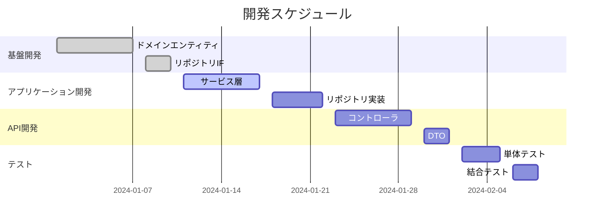

# 開発工程表

## メタデータ
| 項目 | 内容 |
|------|------|
| ドキュメントID | SCHED-001 |
| 関連文書 | COMP-001 |
| 作成日 | YYYY-MM-DD |

## 1. プロジェクト概要

### 1.1 期間・工数
| 項目 | 内容 |
|------|------|
| 開始日 | YYYY-MM-DD |
| 終了日 | YYYY-MM-DD |
| 総工数 | XXX人日 |
| 参加者数 | X名 |

### 1.2 マイルストーン
| マイルストーン | 日付 | 成果物 | 完了条件 |
|----------------|------|--------|----------|
| M1: 基盤完成 | YYYY-MM-DD | ドメイン層 | [条件1] |
| M2: 機能完成 | YYYY-MM-DD | アプリケーション層 | [条件2] |
| M3: API完成 | YYYY-MM-DD | プレゼンテーション層 | [条件3] |

## 2. 詳細スケジュール

### 2.1 ガントチャート

````mermaid

````

### 2.2 週次計画
| 週 | 期間 | 主要タスク | 成果物 | 担当者 |
|----|------|------------|--------|--------|
| W1 | MM/DD-MM/DD | [タスク1] | [成果物1] | [担当者1] |
| W2 | MM/DD-MM/DD | [タスク2] | [成果物2] | [担当者2] |

## 3. リスク管理

### 3.1 リスク一覧
| リスクID | リスク内容 | 影響度 | 発生確率 | 対策 |
|----------|------------|--------|----------|------|
| R-001 | [リスク1] | 高 | 中 | [対策1] |
| R-002 | [リスク2] | 中 | 高 | [対策2] |

### 3.2 バッファ計画
| 項目 | バッファ | 理由 |
|------|----------|------|
| 技術調査 | 20% | 新技術学習 |
| テスト | 30% | 品質確保 |

## 4. 完了確認
- [ ] スケジュールが現実的である
- [ ] マイルストーンが明確に定義されている
- [ ] リスクが適切に管理されている
- [ ] バッファが適切に設定されている
