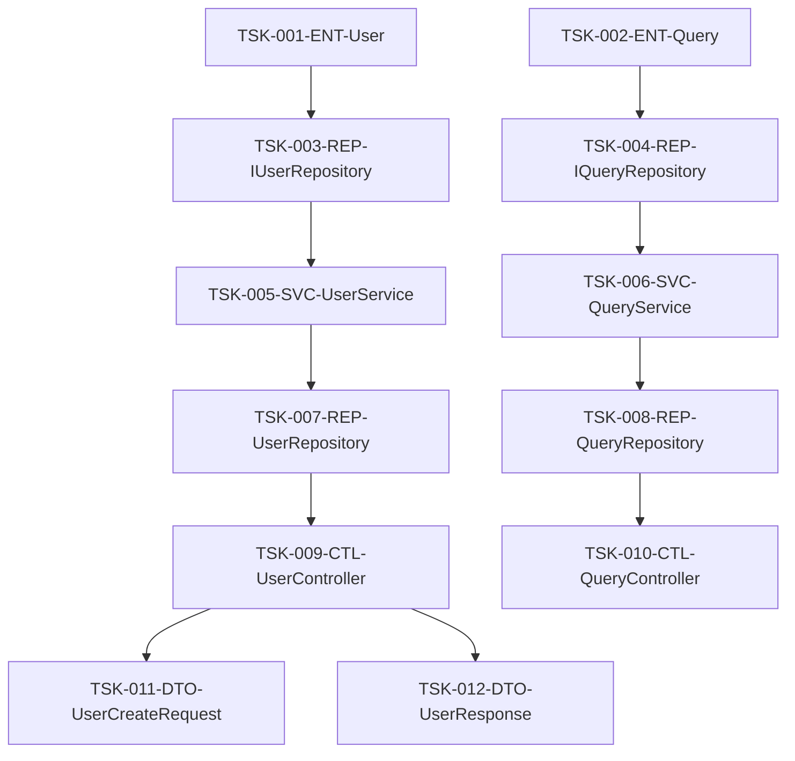

# ファイル単位タスクリスト

## メタデータ
| 項目 | 内容 |
|------|------|
| ドキュメントID | TASK-001 |
| 関連文書 | COMP-001, SCHED-001 |
| 作成日 | YYYY-MM-DD |

## 1. タスク概要

### 1.1 タスク分割方針
- 1タスク = 1ファイル
- 依存関係に基づく順序付け
- 見積時間は4-8時間/タスク
- 並行実行可能性を考慮

### 1.2 タスクID命名規則
**形式**: `TSK-{連番3桁}-{レイヤー}-{ファイル名}`

**レイヤー略語**:
- CTL: Controller（プレゼンテーション層）
- SVC: Service（アプリケーション層）
- ENT: Entity（ドメイン層）
- REP: Repository（インフラ層）
- DTO: Data Transfer Object
- UTL: Utility（共通モジュール）

## 2. タスク一覧

### 2.1 フェーズ1: ドメイン層
| タスクID | ファイル名 | 優先度 | 見積時間 | 依存タスク | 担当者 |
|----------|------------|--------|----------|------------|--------|
| TSK-001-ENT-User | User.ts | 高 | 3h | なし | [担当者1] |
| TSK-002-ENT-Query | Query.ts | 高 | 3h | なし | [担当者1] |
| TSK-003-REP-IUserRepository | IUserRepository.ts | 高 | 2h | TSK-001 | [担当者2] |
| TSK-004-REP-IQueryRepository | IQueryRepository.ts | 高 | 2h | TSK-002 | [担当者2] |

### 2.2 フェーズ2: アプリケーション層
| タスクID | ファイル名 | 優先度 | 見積時間 | 依存タスク | 担当者 |
|----------|------------|--------|----------|------------|--------|
| TSK-005-SVC-UserService | UserService.ts | 高 | 6h | TSK-003 | [担当者1] |
| TSK-006-SVC-QueryService | QueryService.ts | 高 | 6h | TSK-004 | [担当者2] |

### 2.3 フェーズ3: インフラ層
| タスクID | ファイル名 | 優先度 | 見積時間 | 依存タスク | 担当者 |
|----------|------------|--------|----------|------------|--------|
| TSK-007-REP-UserRepository | UserRepository.ts | 中 | 5h | TSK-005 | [担当者1] |
| TSK-008-REP-QueryRepository | QueryRepository.ts | 中 | 5h | TSK-006 | [担当者2] |

### 2.4 フェーズ4: プレゼンテーション層
| タスクID | ファイル名 | 優先度 | 見積時間 | 依存タスク | 担当者 |
|----------|------------|--------|----------|------------|--------|
| TSK-009-CTL-UserController | UserController.ts | 高 | 4h | TSK-007 | [担当者1] |
| TSK-010-CTL-QueryController | QueryController.ts | 高 | 4h | TSK-008 | [担当者2] |
| TSK-011-DTO-UserCreateRequest | UserCreateRequest.ts | 中 | 2h | TSK-009 | [担当者1] |
| TSK-012-DTO-UserResponse | UserResponse.ts | 中 | 2h | TSK-009 | [担当者1] |

## 3. 依存関係図

````mermaid

````

## 4. 進捗管理

### 4.1 ステータス定義
| ステータス | 説明 | 次のアクション |
|------------|------|----------------|
| 未着手 | タスク未開始 | 着手準備 |
| 進行中 | 実装作業中 | 継続実装 |
| レビュー待ち | 実装完了、レビュー依頼中 | レビュー実施 |
| 修正中 | レビュー指摘事項対応中 | 修正完了 |
| 完了 | 全作業完了 | 次タスク着手 |

### 4.2 進捗トラッキング
| タスクID | ステータス | 進捗率 | 開始日 | 完了予定日 | 実績 |
|----------|------------|--------|--------|------------|------|
| TSK-001-ENT-User | 完了 | 100% | MM/DD | MM/DD | 3h |
| TSK-002-ENT-Query | 進行中 | 60% | MM/DD | MM/DD | 2h |

## 5. 完了確認
- [ ] 全ファイルがタスクとして定義されている
- [ ] 依存関係が正しく設定されている
- [ ] 見積時間が現実的である
- [ ] 担当者が適切にアサインされている
- [ ] 進捗管理方法が明確である
