# AIコーディング開発プロセス体系化ドキュメント v1.3（Part 1/3）

## 1. 概要

本ドキュメントは、AIエージェントによるソフトウェア開発プロセスを体系化したものです。従来の開発手法とは異なり、**段階的タスク管理アプローチ**を核心とし、プロジェクト規模に応じた最適な管理手法と選択的品質投資により、効率的かつ高品質な開発を実現します。

**v1.3の主要改良点**:
- 設計書間の数量的整合性チェック機能の追加
- コードレビューサブタスクの標準化
- 型定義書の独立管理
- シーケンス図による動的設計の体系化
- 依存関係順序チェックの精密化
- Issue管理統合による完全なトレーサビリティ

### 1.1 AIコーディングの基本原則（改良版）

1. **段階的詳細化**: 抽象的な要件から具体的な実装まで、段階的に詳細化
2. **段階的タスク管理**: プロジェクト規模に応じたカテゴリ単位管理の適用
3. **選択的品質投資**: 重要度・複雑度に応じた最適な品質保証レベル
4. **多層品質保証**: タスク・カテゴリ・プロジェクトレベルでの統合品質管理
5. **情報の構造化**: 各段階での情報を標準化された形式で管理
6. **検証可能性**: 各段階で品質チェックポイントを設定
7. **トレーサビリティ**: 要件から実装まで追跡可能な情報管理
8. **数量的整合性保証**: 設計書間の定義数の一致を数量的に検証【新規追加】
9. **設計書統合レビュー**: 全設計書完了後の相互整合性チェック【新規追加】
10. **コードレビュー統合**: 実装後の設計書との整合性確認【新規追加】

### 1.2 段階的タスク管理アプローチの概要（改良版）

#### 1.2.1 プロジェクト規模による管理手法の使い分け

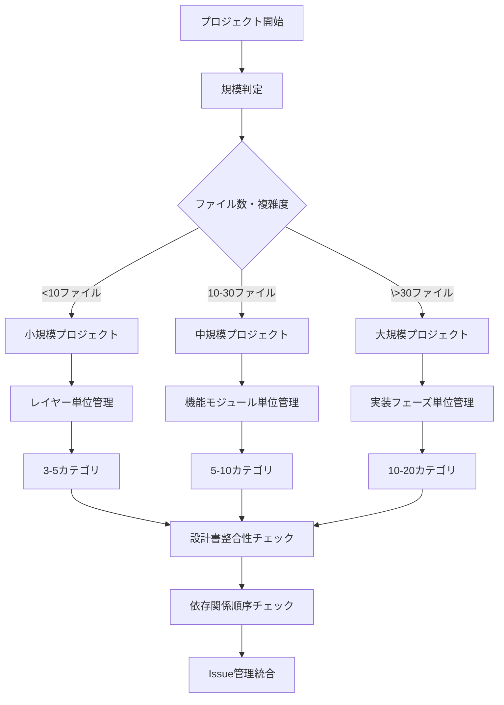

#### 1.2.2 選択的品質投資の概念（改良版）

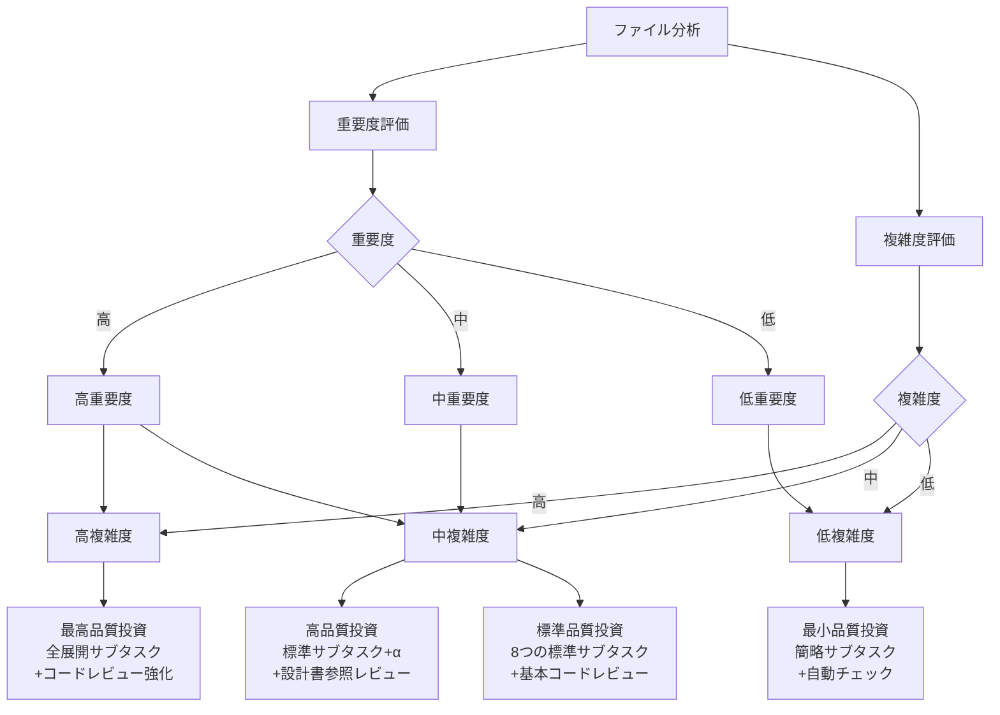

### 1.3 従来開発プロセスとの違い（改良版）

| 項目 | 従来プロセス | AIコーディングプロセス v1.2 | AIコーディングプロセス v1.3 |
|------|------------|---------------------------|---------------------------|
| タスク管理 | 機能単位・人的判断 | 段階的タスク管理・規模別最適化 | **依存関係順序チェック統合** |
| 品質管理 | 一律の品質基準 | 選択的品質投資・多層品質保証 | **コードレビュー標準化** |
| 設計整合性 | 人的レビューに依存 | 部分的な整合性チェック | **数量的整合性チェック** |
| 型管理 | クラス定義と混在 | クラス定義と混在 | **型定義書独立管理** |
| 動的設計 | 不十分または欠如 | 部分的なシーケンス図 | **API・UI単位シーケンス図** |
| Issue管理 | 手動・不完全 | 基本的なタスク管理 | **完全な1:1対応管理** |
| 詳細化方法 | 人間の経験と判断 | AI による段階的分析・設計 | **設計統合レビュー追加** |
| ドキュメント作成 | 手動作成、属人的 | 構造化テンプレート、自動生成 | **整合性自動チェック** |
| 変更管理 | 影響分析が困難 | トレーサビリティによる影響分析 | **完全トレーサビリティ** |
| 部品再利用 | 暗黙知に依存 | 明示的な参照構造による管理 | **循環依存自動検出** |
| 進捗管理 | 主観的な進捗評価 | カテゴリ単位での客観的進捗管理 | **Issue連携進捗管理** |

## 2. 全体プロセスフロー（改良版）

### 2.1 プロセス全体図

```mermaid
flowchart TD
    subgraph "STEP 0: ゴール定義"
        A[ビジネス要求] --> B[プロジェクト初期化]
    end
    
    subgraph "STEP 1: 要件定義"
        B --> C[要件分析]
        C --> D[要件仕様書]
    end
    
    subgraph "STEP 2: システム設計"
        D --> E[システム分析]
        E --> F[技術選定・依存関係定義書]
    end
    
    subgraph "STEP 3: 詳細設計（改良版）"
        F --> G[コンポーネント設計]
        G --> H[型定義書作成]
        H --> I[シーケンス図作成]
        I --> J[設計統合レビュー]
        J --> K[部品参照構造定義書]
    end
    
    subgraph "STEP 4: テスト設計"
        K --> L[テスト計画策定]
        L --> M[テストケース定義書]
    end
    
    subgraph "STEP 5: 開発計画"
        M --> N[実装計画策定]
        N --> O[ディレクトリ構造マップ]
    end
    
    subgraph "STEP 6: 段階的タスク管理（改良版）"
        O --> P[プロジェクト規模判定]
        P --> Q[カテゴリ単位タスク分割]
        Q --> R[ファイル単位タスク詳細化]
        R --> S[依存関係順序チェック]
        S --> T[選択的サブタスク展開]
        T --> U[Issue管理統合]
    end
    
    subgraph "STEP 7: コーディング・テスト実行（改良版）"
        U --> V[多層品質保証実行]
        V --> W[ファイル単位タスク実行]
        W --> X[サブタスク管理・実行]
        X --> Y[カテゴリ単位進捗管理]
        Y --> Z[システム統合・最終品質確認]
    end
    
    %% フィードバックループ
    D -.-> C
    F -.-> E
    K -.-> J
    M -.-> L
    O -.-> N
    U -.-> T
    Z -.-> Y
```

### 2.2 段階的タスク管理フロー詳細（改良版）

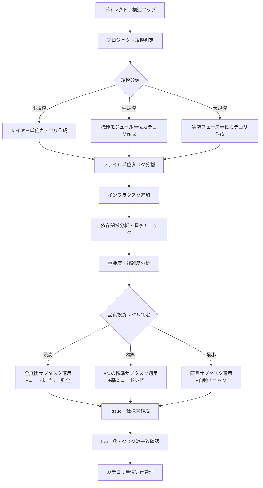

### 2.3 設計書整合性チェックフロー【新規追加】

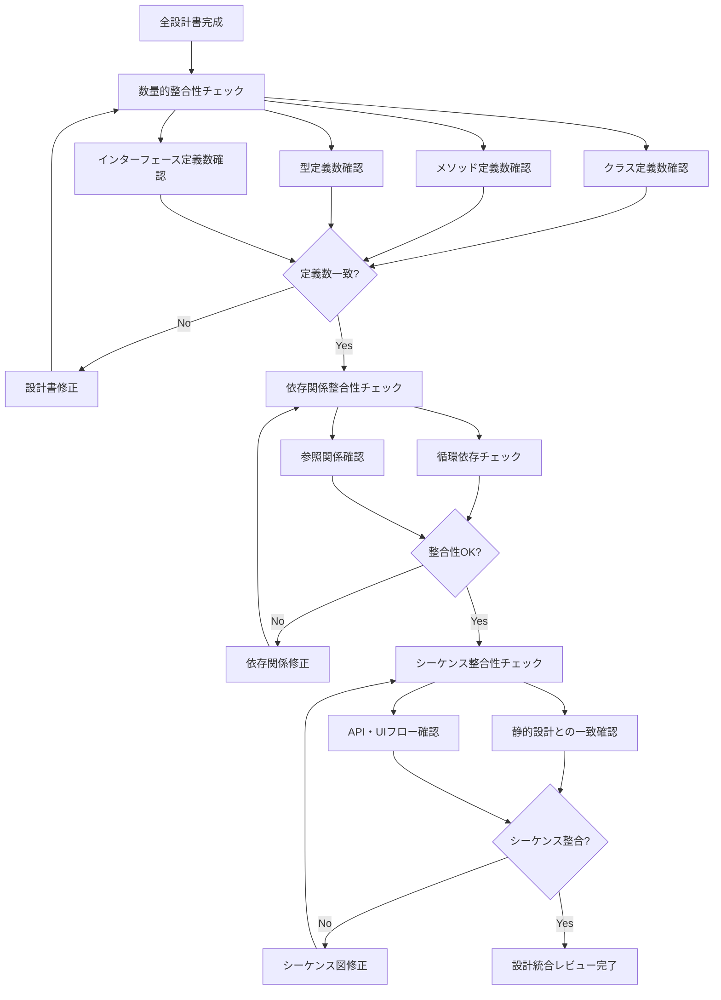

## 3. ステップ別詳細プロセス定義（改良版）

### STEP 0: ゴール定義

#### サブステップ構造

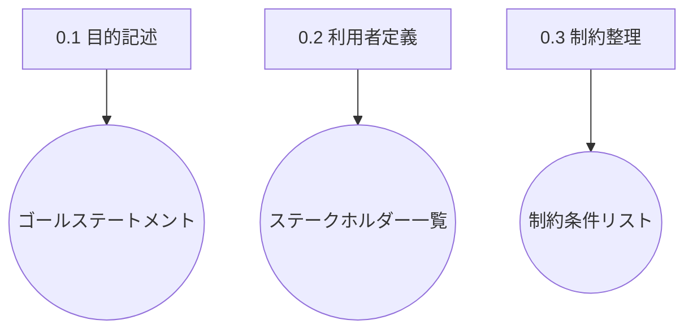

#### 成果物一覧
| サブステップ | インプット | アウトプット | 用途 |
|-------------|-----------|-------------|------|
| 0.1 目的記述 | 要望・背景 | ゴールステートメント | 以降の全ステップの指針 |
| 0.2 利用者定義 | ゴール | ステークホルダー一覧 | ユースケース抽出時に使用 |
| 0.3 制約整理 | 要望・運用条件 | 制約条件リスト | 要件抽出時に使用 |

### STEP 1: 要件定義

#### サブステップ構造

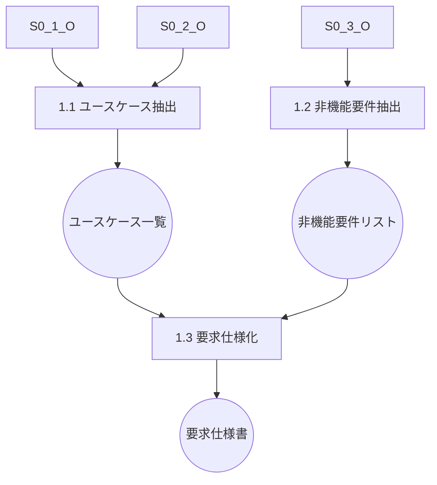

#### 成果物一覧
| サブステップ | インプット | アウトプット | 用途 |
|-------------|-----------|-------------|------|
| 1.1 ユースケース抽出 | ゴール、ステークホルダー | ユースケース一覧 | 機能要件定義の基礎 |
| 1.2 非機能要件抽出 | ゴール、制約条件 | 非機能要件リスト | アーキテクチャ定義に使用 |
| 1.3 要求仕様化 | ユースケース、非機能要件 | 要求仕様書 | システム設計の前提 |

### STEP 2: システム設計

#### サブステップ構造

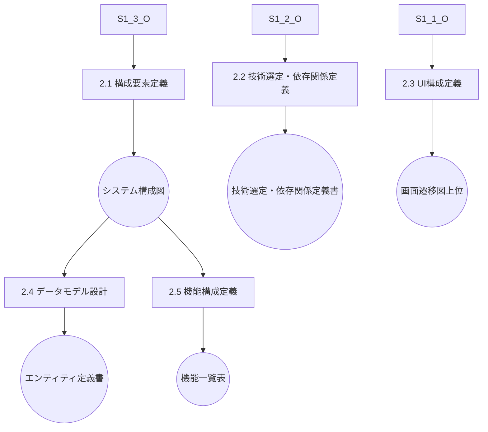

#### 成果物一覧
| サブステップ | インプット | アウトプット | 用途 |
|-------------|-----------|-------------|------|
| 2.1 構成要素定義 | 要求仕様書 | システム構成図 | レイヤー設計の元情報 |
| 2.2 技術選定・依存関係定義 | 非機能要件、構成図 | **技術選定・依存関係定義書** | 開発フレーム・ライブラリ選定 |
| 2.3 UI構成定義 | ユースケース、ステークホルダー | 画面遷移図（上位） | 詳細UI設計に継承 |
| 2.4 データモデル設計 | ユースケース、構成図 | エンティティ定義書 | DBスキーマ、データ契約 |
| 2.5 機能構成定義 | ユースケース、構成図 | 機能一覧表 | コンポーネント設計に使用 |

### STEP 3: 詳細設計（改良版）

#### サブステップ構造

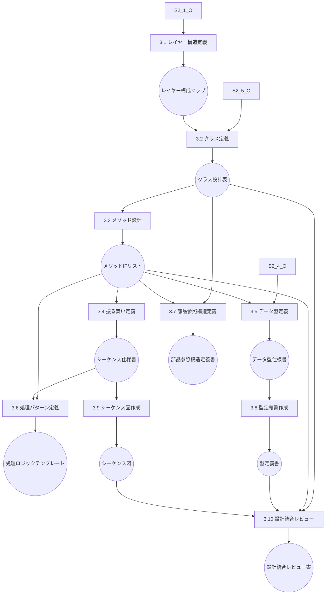

#### 成果物一覧（改良版）
| サブステップ | インプット | アウトプット | 用途 |
|-------------|-----------|-------------|------|
| 3.1 レイヤー構造定義 | システム構成図、技術選定書 | レイヤー構成マップ | クラス設計の基盤 |
| 3.2 クラス定義 | 機能一覧表、レイヤーマップ | クラス設計表 | I/F・ロジック設計に使用 |
| 3.3 メソッド設計 | クラス設計表、データ定義 | メソッドI/Fリスト | シーケンス定義に使用 |
| 3.4 振る舞い定義 | メソッドI/F、ユースケース | シーケンス仕様書 | テスト設計に使用 |
| 3.5 データ型定義 | エンティティ定義、I/F定義 | データ型仕様書 | 入出力形式の標準化 |
| 3.6 処理パターン定義 | メソッドI/F、振る舞い仕様 | 処理ロジックテンプレート | テスト設計・実装補助 |
| 3.7 部品参照構造定義 | クラス設計表、メソッドI/F | 部品参照構造定義書 | 再利用・依存関係管理 |
| 3.8 型定義書作成【新規】 | データ型仕様書 | **型定義書** | TypeScript型定義の独立管理 |
| 3.9 シーケンス図作成【新規】 | 振る舞い定義 | **シーケンス図** | API・UIアクション単位の動的設計 |
| 3.10 設計統合レビュー【新規】 | 全設計書 | **設計統合レビュー書** | 設計書間の整合性確保 |

#### 3.8 型定義書作成【新規追加】

**目的**: TypeScript開発における型ファーストアプローチの実現

**プロセス**:
1. **基本型定義の抽出**
   - エンティティから基本型を抽出
   - ID型、ステータス型などの共通型定義

2. **Enum定義の体系化**
   - 列挙型の一元管理
   - 値の一貫性確保

3. **Interface定義の整理**
   - API契約の型定義
   - DTO型の明確化

4. **型依存関係の明示**
   - 型間の参照関係をMermaid図で表現
   - 循環参照の検出と回避

**成果物**: 型定義書（独立したMarkdownファイル）

#### 3.9 シーケンス図作成【新規追加】

**目的**: 動的な振る舞い設計の体系化

**プロセス**:
1. **API単位シーケンス図**
   - バックエンドAPIの処理フロー
   - エラーハンドリングフローの明示

2. **UIアクション単位シーケンス図**
   - フロントエンドの操作フロー
   - 状態変更の流れの明示

3. **パフォーマンス考慮**
   - 処理時間・リソース使用量の設計
   - ボトルネック箇所の特定

**成果物**: シーケンス図（Mermaid形式）

#### 3.10 設計統合レビュー【新規追加】

**目的**: 設計書間の整合性確保

**プロセス**:
1. **数量的整合性チェック**
   - クラス定義数の一致確認
   - メソッド定義数の一致確認
   - 型定義数の一致確認

2. **依存関係整合性チェック**
   - クラス間依存関係の確認
   - 循環依存の検出

3. **シーケンス整合性チェック**
   - 静的設計と動的設計の整合性確認
   - API定義とシーケンス図の一致確認

**完了条件**:
- 「作業の元となるアウトプットで定義された件数に対してインプット内で定義された数を比較しイコールである事、またはインプット内で定義された数から導き出される想定アウトプット数がイコールである事を確認する」

**成果物**: 設計統合レビュー書（チェック結果の記録）

### STEP 4: テスト設計

#### サブステップ構造

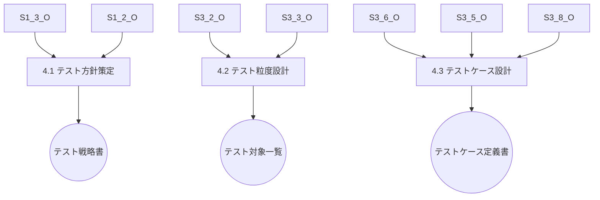

#### 成果物一覧
| サブステップ | インプット | アウトプット | 用途 |
|-------------|-----------|-------------|------|
| 4.1 テスト方針策定 | 要求仕様書、非機能要件 | テスト戦略書 | 粒度設定と優先付けに使用 |
| 4.2 テスト粒度設計 | クラス設計表、メソッドI/F | テスト対象一覧 | ケース網羅の起点 |
| 4.3 テストケース設計 | 処理パターン、データ型、型定義書 | テストケース定義書 | テストコード生成の基盤 |

### STEP 5: 開発計画

#### サブステップ構造

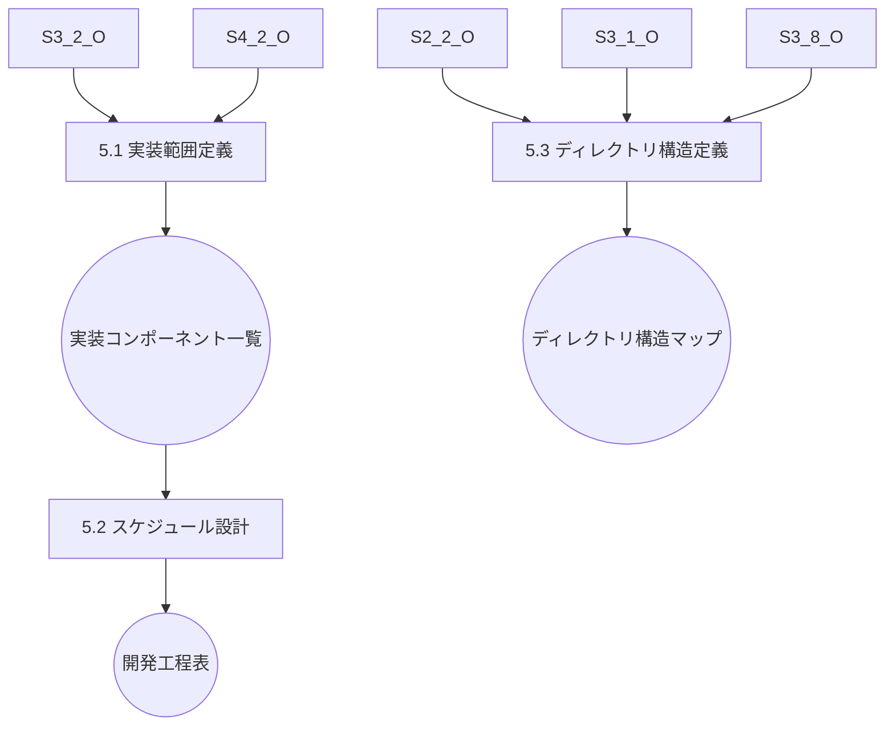

#### 成果物一覧
| サブステップ | インプット | アウトプット | 用途 |
|-------------|-----------|-------------|------|
| 5.1 実装範囲定義 | テスト対象一覧、クラス設計 | 実装コンポーネント一覧 | WBS定義に使用 |
| 5.2 スケジュール設計 | 実装一覧、優先度 | 開発工程表 | ToDoリストの構成単位に |
| 5.3 ディレクトリ構造定義 | 技術選定書、レイヤー構成、型定義書 | **ディレクトリ構造マップ** | ファイル配置の基準 |
