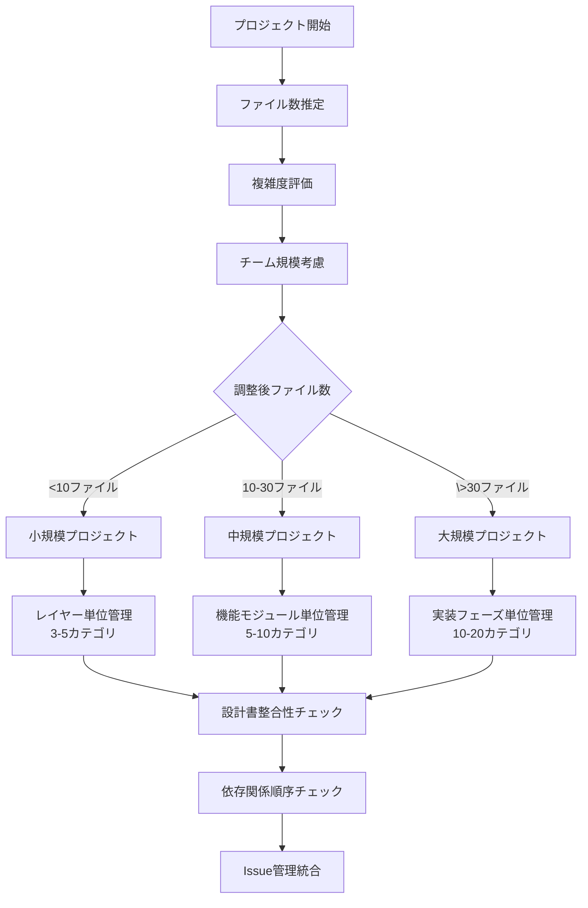
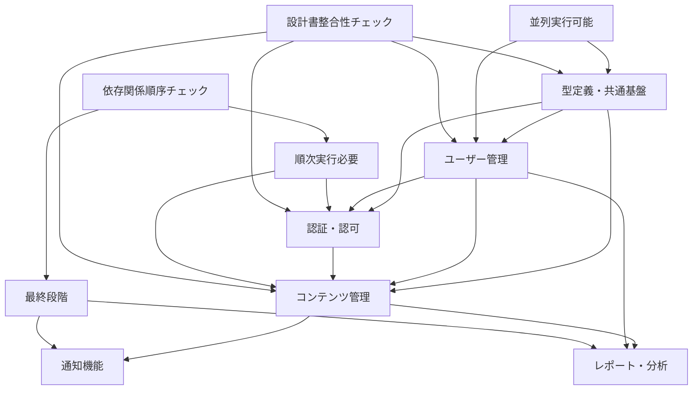
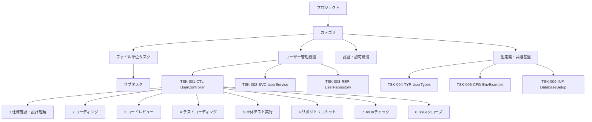
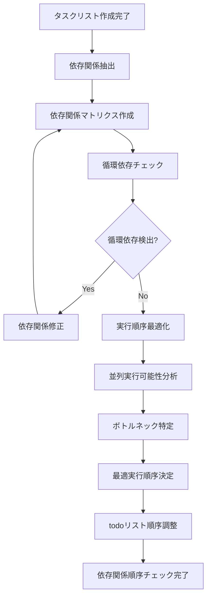
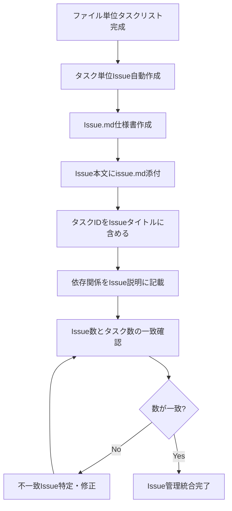

# AIコーディング開発プロセス体系化ドキュメント v1.3（Part 2/3）

## 4. STEP 6: 段階的タスク管理（詳細・改良版）

### 4.1 プロジェクト規模判定

#### 4.1.1 判定基準

**基本判定フロー（改良版）**


**複雑度調整係数（改良版）**
```typescript
interface ComplexityFactor {
  domainComplexity: number;    // ビジネスロジックの複雑さ (1.0-2.0)
  technicalComplexity: number; // 技術的複雑さ (1.0-2.0)
  integrationComplexity: number; // 外部連携の複雑さ (1.0-1.5)
  teamSize: number;           // チームサイズ (1.0-1.3)
  designConsistency: number;  // 設計書整合性要求 (1.0-1.2) 【新規追加】
}

// 調整後ファイル数 = 実ファイル数 × 複雑度係数
const adjustedFileCount = actualFileCount * 
  (domainComplexity * technicalComplexity * integrationComplexity * teamSize * designConsistency);
```

#### 4.1.2 規模別管理手法（改良版）

**小規模プロジェクト（<10ファイル）: レイヤー単位管理**
```markdown
### 特徴
- シンプルな3層アーキテクチャ
- 開発期間: 1-2週間
- チーム規模: 1-2人

### カテゴリ構成例
1. プレゼンテーション層 [Controllers, DTOs]
2. アプリケーション層 [Services, UseCases]
3. インフラストラクチャ層 [Repositories, External APIs]
4. 型定義・共通 [Types, Enums, Utilities] 【新規追加】

### 管理方針（改良版）
- レイヤー単位での進捗管理
- 依存関係の明確化
- シンプルな品質基準
- 設計書整合性の基本チェック 【新規追加】
- 型定義の独立管理 【新規追加】
```

**中規模プロジェクト（10-30ファイル）: 機能モジュール単位管理**
```markdown
### 特徴
- 複数の機能モジュール
- 開発期間: 1-3ヶ月
- チーム規模: 3-5人

### カテゴリ構成例
1. ユーザー管理機能
2. 認証・認可機能
3. コンテンツ管理機能
4. 通知機能
5. レポート機能
6. 共通基盤
7. 型定義・インフラ設定 【新規追加】

### 管理方針（改良版）
- 機能モジュール単位での進捗管理
- モジュール間依存関係の管理
- 段階的品質投資
- 設計書間の数量的整合性チェック 【新規追加】
- シーケンス図による動的設計確認 【新規追加】
- Issue管理との完全連携 【新規追加】
```

**大規模プロジェクト（>30ファイル）: 実装フェーズ単位管理**
```markdown
### 特徴
- 複数フェーズでの段階的実装
- 開発期間: 3ヶ月以上
- チーム規模: 6人以上

### カテゴリ構成例
#### フェーズ1: MVP実装
1. コア機能（ユーザー管理）
2. 基本認証機能
3. 基本UI/API
4. 基盤インフラ
5. 型定義・共通設定 【新規追加】

#### フェーズ2: 機能拡張
6. 高度なユーザー機能
7. 高度なコンテンツ機能
8. 通知・コミュニケーション
9. 分析・レポート
10. 外部連携・API拡張 【新規追加】

#### フェーズ3: 最適化・スケール
11. パフォーマンス最適化
12. スケーラビリティ
13. 運用・監視
14. セキュリティ強化 【新規追加】

### 管理方針（改良版）
- フェーズ単位での段階的リリース
- 複数チームでの並列開発
- 高度な品質保証システム
- 完全な設計書整合性管理 【新規追加】
- 依存関係の自動チェック・最適化 【新規追加】
- Issue-Task完全トレーサビリティ 【新規追加】
```

### 4.2 カテゴリ単位タスク分割（改良版）

#### 4.2.1 カテゴリ設計原則（改良版）

**カテゴリ設計の基本原則**
1. **単一責任**: 1カテゴリ = 1つの明確な責任
2. **適切な粒度**: 5-10タスクで構成
3. **疎結合**: カテゴリ間の依存関係を最小化
4. **高凝集**: 関連性の高いタスクをグループ化
5. **並列性**: 可能な限り並列実行可能な設計
6. **設計整合性**: カテゴリ内での設計書整合性確保 【新規追加】
7. **型安全性**: 型定義の一貫性保証 【新規追加】
8. **トレーサビリティ**: Issue-Task間の完全な追跡可能性 【新規追加】

#### 4.2.2 カテゴリ間依存関係管理（改良版）

**依存関係マップ**


#### 4.2.3 カテゴリ別進捗管理（改良版）

**進捗可視化テンプレート**
```markdown
## カテゴリ別進捗状況

### 1. 型定義・共通基盤 [██████████] 100% (4/4タスク完了) 【新規追加】
- **状況**: ✅ 完了
- **最終更新**: 2025-05-30
- **担当者**: 横井
- **品質スコア**: 98/100
- **設計書整合性**: ✅ 確認済み
- **Issue連携**: ✅ 完全同期

### 2. ユーザー管理機能 [██████████] 100% (6/6タスク完了)
- **状況**: ✅ 完了
- **最終更新**: 2025-05-25
- **担当者**: 田中
- **品質スコア**: 95/100
- **設計書整合性**: ✅ 確認済み
- **Issue連携**: ✅ 完全同期

### 3. 認証・認可機能 [████████░░] 80% (4/5タスク完了)
- **状況**: 🔄 進行中
- **最終更新**: 2025-05-28
- **担当者**: 佐藤
- **残りタスク**: TSK-015-SVC-AuthService
- **品質スコア**: 88/100
- **設計書整合性**: ⚠️ 要確認（メソッド定義数不一致）
- **Issue連携**: ✅ 同期済み
- **コードレビュー**: 🔄 進行中

### 4. コンテンツ管理機能 [██████░░░░] 60% (6/10タスク完了)
- **状況**: 🔄 進行中
- **最終更新**: 2025-05-27
- **担当者**: 鈴木
- **課題**: シーケンス図と実装の不整合
- **品質スコア**: 82/100
- **設計書整合性**: ❌ 要修正
- **Issue連携**: ✅ 同期済み
- **依存関係**: ⚠️ 順序要確認

### 5. 通知機能 [████░░░░░░] 40% (2/5タスク完了)
- **状況**: ⚠️ 遅延
- **最終更新**: 2025-05-26
- **担当者**: 山田
- **課題**: 外部API連携の遅れ、型定義の不整合
- **品質スコア**: 75/100
- **設計書整合性**: ❌ 要修正
- **Issue連携**: ⚠️ 部分的同期
- **依存関係**: ❌ 前提タスク未完了
```

### 4.3 ファイル単位タスク詳細化（改良版）

#### 4.3.1 タスク階層構造（改良版）



#### 4.3.2 タスクID命名規則（改良版）

**基本形式**: `TSK-{連番3桁}-{レイヤー}-{ファイル名}`

**レイヤー略語（改良版）**:
- **CTL**: Controller（プレゼンテーション層）
- **SVC**: Service（アプリケーション層）
- **ENT**: Entity（ドメイン層）
- **REP**: Repository（インフラ層）
- **DTO**: Data Transfer Object
- **TYP**: Type Definitions（型定義）【新規追加】
- **UTL**: Utility（共通モジュール）
- **CFG**: Configuration（設定）
- **MID**: Middleware（ミドルウェア）
- **INF**: Infrastructure Setup（インフラ設定）【新規追加】

**命名例（改良版）**:
```
TSK-001-CTL-UserController      # ユーザーコントローラ
TSK-002-SVC-UserService         # ユーザーサービス
TSK-003-ENT-User                # ユーザーエンティティ
TSK-004-REP-UserRepository      # ユーザーリポジトリ
TSK-005-DTO-UserCreateRequest   # ユーザー作成リクエストDTO
TSK-006-DTO-UserResponse        # ユーザーレスポンスDTO
TSK-007-TYP-UserTypes           # ユーザー関連型定義 【新規追加】
TSK-008-UTL-PasswordHasher      # パスワードハッシュユーティリティ
TSK-009-CFG-DatabaseConfig      # データベース設定
TSK-010-CFG-EnvExample          # 環境変数設定例 【新規追加】
TSK-011-MID-AuthMiddleware      # 認証ミドルウェア
TSK-012-INF-DatabaseSetup       # データベースセットアップ 【新規追加】
TSK-013-INF-TableCreation       # テーブル作成スクリプト 【新規追加】
```

#### 4.3.3 インフラタスク追加【新規追加】

**インフラ関連タスクの体系化**:
```markdown
### 環境設定タスク
- TSK-XXX-CFG-EnvExample: .env.exampleファイルの作成
- TSK-XXX-CFG-DockerCompose: docker-compose.ymlの設定
- TSK-XXX-CFG-PackageJson: package.jsonの依存関係設定

### データベース関連タスク
- TSK-XXX-INF-DatabaseSetup: データベース初期設定
- TSK-XXX-INF-TableCreation: テーブル作成スクリプト
- TSK-XXX-INF-SeedData: 初期データ投入スクリプト
- TSK-XXX-INF-Migration: マイグレーションスクリプト

### 型定義関連タスク
- TSK-XXX-TYP-CommonTypes: 共通型定義
- TSK-XXX-TYP-ApiTypes: API関連型定義
- TSK-XXX-TYP-DatabaseTypes: データベース関連型定義
```

### 4.4 依存関係順序チェック【新規追加】

#### 4.4.1 依存関係分析プロセス

**依存関係分析フロー**


#### 4.4.2 依存関係マトリクス

**依存関係マトリクス例**
```markdown
| タスクID | 依存タスク | 理由 | 並列可能 |
|----------|-----------|------|----------|
| TSK-001-TYP-UserTypes | なし | 基本型定義 | ✅ |
| TSK-002-ENT-User | TSK-001 | 型定義が必要 | ❌ |
| TSK-003-DTO-UserRequest | TSK-001 | 型定義が必要 | ❌ |
| TSK-004-DTO-UserResponse | TSK-001, TSK-002 | Entity型が必要 | ❌ |
| TSK-005-REP-UserRepository | TSK-002 | Entity定義が必要 | ❌ |
| TSK-006-SVC-UserService | TSK-002, TSK-005 | Entity, Repositoryが必要 | ❌ |
| TSK-007-CTL-UserController | TSK-003, TSK-004, TSK-006 | DTO, Serviceが必要 | ❌ |
| TSK-008-CFG-EnvExample | なし | 独立した設定 | ✅ |
| TSK-009-INF-DatabaseSetup | TSK-008 | 環境設定が必要 | ❌ |
```

#### 4.4.3 実行順序最適化

**最適化アルゴリズム**
```typescript
interface TaskDependency {
  taskId: string;
  dependencies: string[];
  estimatedHours: number;
  priority: 'high' | 'medium' | 'low';
  canRunInParallel: boolean;
}

function optimizeExecutionOrder(tasks: TaskDependency[]): ExecutionPlan {
  // 1. トポロジカルソートで基本順序決定
  const sortedTasks = topologicalSort(tasks);
  
  // 2. 並列実行可能なタスクをグループ化
  const parallelGroups = groupParallelTasks(sortedTasks);
  
  // 3. 優先度とリソース制約を考慮して最適化
  const optimizedPlan = optimizeWithConstraints(parallelGroups);
  
  return optimizedPlan;
}

function detectBottlenecks(tasks: TaskDependency[]): BottleneckAnalysis {
  const criticalPath = findCriticalPath(tasks);
  const resourceConstraints = analyzeResourceConstraints(tasks);
  
  return {
    criticalPath,
    bottleneckTasks: criticalPath.filter(task => 
      task.dependencies.length > 2 || task.estimatedHours > 8
    ),
    resourceConstraints,
    recommendations: generateOptimizationRecommendations(criticalPath, resourceConstraints)
  };
}
```

### 4.5 選択的サブタスク展開（改良版）

#### 4.5.1 品質投資レベル判定（改良版）

**重要度・複雑度マトリクス（改良版）**
| 重要度 | 複雑度 | 投資レベル | サブタスク展開 | 対象ファイル例 |
|--------|--------|-----------|---------------|---------------|
| 高 | 高 | 最高 | 全展開（15-18サブタスク） | Entity, Service |
| 高 | 中 | 高 | 拡張（10-12サブタスク） | Controller, Repository |
| 中 | 高 | 高 | 拡張（10-12サブタスク） | Middleware, Validator |
| 中 | 中 | 標準 | 標準（8サブタスク） | 一般的なクラス |
| 中 | 低 | 標準 | 標準（8サブタスク） | 単純なController |
| 低 | 中 | 最小 | 簡略（5-6サブタスク） | DTO, Configuration |
| 低 | 低 | 最小 | 簡略（5-6サブタスク） | Utility, Constants |

#### 4.5.2 8つの標準サブタスク（改良版）

**コードレビューを追加した標準サブタスク**
```markdown
### 8つの標準サブタスク
1. 仕様確認・設計理解
2. コーディング
3. **コードレビュー** 【新規追加】
4. テストコーディング
5. 単体テスト実行
6. リポジトリコミット
7. ToDoチェック
8. Issueクローズ
```

#### 4.5.3 サブタスク展開パターン（改良版）

**最高品質投資（全展開）**
```markdown
### Entity, Service等の重要ファイル
1. 要件・仕様確認
   - [ ] 設計書との整合性確認
   - [ ] 型定義との整合性確認 【新規追加】
   - [ ] シーケンス図との整合性確認 【新規追加】
2. 設計レビュー
3. コーディング
4. **コードレビュー** 【新規追加】
   - [ ] 設計書との整合性確認
   - [ ] 参照ライブラリ・モジュール・クラスの使用確認
   - [ ] 処理ロジックの設計書準拠確認
   - [ ] 命名規約・コーディング規約の確認
5. 単体テストコーディング
6. テストレビュー
7. 単体テスト実行
8. 結合テスト準備
9. 結合テスト実行
10. パフォーマンステスト
11. セキュリティテスト
12. リポジトリコミット
13. ドキュメント更新
14. ToDoチェック
15. Issueクローズ
```

**標準品質投資（8つの標準サブタスク）**
```markdown
### 一般的なファイル
1. 仕様確認・設計理解
   - [ ] 設計書との整合性確認
   - [ ] 依存関係の確認
2. コーディング
3. **コードレビュー** 【新規追加】
   - [ ] 設計書との整合性確認
   - [ ] 基本的な品質基準確認
4. テストコーディング
5. 単体テスト実行
6. リポジトリコミット
7. ToDoチェック
8. Issueクローズ
```

**最小品質投資（簡略展開）**
```markdown
### DTO, Configuration等の単純ファイル
1. 仕様確認
2. コーディング
3. **基本コードレビュー** 【新規追加】
   - [ ] 型定義の整合性確認
   - [ ] 命名規約の確認
4. 基本テスト
5. リポジトリコミット
6. Issueクローズ
```

### 4.6 Issue管理統合【新規追加】

#### 4.6.1 Issue-Task完全対応システム

**Issue作成プロセス**


#### 4.6.2 Issue作成規則（改良版）

**タイトル形式**: `[{TaskID}] {ファイル名}の実装`

**本文構成テンプレート（改良版）**:
```markdown
## 概要
{ファイルの役割と責任の説明}

## 実装仕様
### 品質投資レベル
- **レベル**: {最高/高/標準/最小}
- **理由**: {重要度・複雑度の評価結果}

### 設計書整合性要件 【新規追加】
- **参照設計書**: {クラス設計表、型定義書、シーケンス図等}
- **整合性チェック項目**: {定義数、依存関係、型安全性等}

### メソッド一覧
- method1(): 機能説明
- method2(): 機能説明

### 依存関係
- **前提タスク**: {依存するタスクID}
- **後続タスク**: {このタスクに依存するタスクID}
- **参照するクラス・メソッド**: 一覧
- **提供するI/F**: 一覧

## テスト要件
### 必要なテストケース
- 正常系テスト
- 異常系テスト
- 境界値テスト
{品質投資レベルに応じた追加テスト}

## サブタスク
{選択的展開による適切なサブタスクリスト}
{コードレビューサブタスクを含む} 【新規追加】

## 完了条件
- [ ] 全メソッドの実装完了
- [ ] 設計書との整合性確認 【新規追加】
- [ ] コードレビュー完了 【新規追加】
- [ ] 品質基準達成（カバレッジ、静的解析等）
- [ ] コーディング規約準拠
- [ ] 設計仕様への適合
```

#### 4.6.3 Issue-Task数一致確認

**確認プロセス**
```typescript
interface TaskIssueMapping {
  taskId: string;
  issueId: number;
  issueTitle: string;
  status: 'open' | 'in_progress' | 'closed';
  assignee: string;
}

function validateTaskIssueConsistency(
  tasks: TaskDefinition[],
  issues: IssueDefinition[]
): ValidationResult {
  const taskCount = tasks.length;
  const issueCount = issues.length;
  
  if (taskCount !== issueCount) {
    return {
      isValid: false,
      error: `Task count (${taskCount}) does not match Issue count (${issueCount})`,
      missingTasks: findMissingTasks(tasks, issues),
      missingIssues: findMissingIssues(tasks, issues)
    };
  }
  
  // タスクIDとIssueタイトルの対応確認
  const mappingErrors = validateTaskIssueMapping(tasks, issues);
  
  return {
    isValid: mappingErrors.length === 0,
    mappingErrors,
    summary: generateValidationSummary(tasks, issues)
  };
}
```

### 4.7 タスク仕様書管理（改良版）

#### 4.7.1 ディレクトリ構造（改良版）

```
docs/tasks/
├── specifications/
│   ├── category-types-common/          【新規追加】
│   │   ├── TSK-001-TYP-UserTypes.md
│   │   ├── TSK-002-CFG-EnvExample.md
│   │   └── TSK-003-INF-DatabaseSetup.md
│   ├── category-user-management/
│   │   ├── TSK-004-CTL-UserController.md
│   │   ├── TSK-005-SVC-UserService.md
│   │   └── TSK-006-REP-UserRepository.md
│   ├── category-auth/
│   │   ├── TSK-007-SVC-AuthService.md
│   │   └── TSK-008-MID-AuthMiddleware.md
│   └── category-content/
│       ├── TSK-009-CTL-ContentController.md
│       └── TSK-010-SVC-ContentService.md
├── progress/
│   ├── category-progress.md
│   ├── overall-progress.md
│
