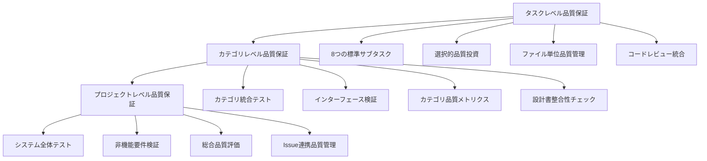

# AIコーディング開発プロセス体系化ドキュメント v1.3（Part 3/3）

## 4.7 タスク仕様書管理（改良版・続き）

#### 4.7.2 品質投資レベル別仕様書例（改良版）

**最高品質投資の仕様書例（改良版）**
```markdown
# TSK-002-SVC-UserService

## 概要
ユーザー管理のコアビジネスロジックを担当するサービスクラス

## 品質投資レベル
- **レベル**: 最高
- **理由**: 
  - 重要度: 0.9（ビジネスロジック中心、影響範囲大）
  - 複雑度: 0.8（複雑なバリデーション、外部連携）

## 設計書整合性要件【新規追加】
- **参照設計書**: クラス設計表、型定義書、シーケンス図
- **整合性チェック項目**: 
  - メソッド定義数の一致
  - 型定義との整合性
  - シーケンス図との処理フロー一致

## 実装仕様
### メソッド一覧
- createUser(userData: CreateUserRequest): Promise<User>
- updateUser(id: string, userData: UpdateUserRequest): Promise<User>
- deleteUser(id: string): Promise<void>
- getUserById(id: string): Promise<User>
- getUserList(filter: UserFilter): Promise<UserList>
- validateUserData(userData: UserData): Promise<ValidationResult>

### 依存関係
- **前提タスク**: TSK-001-TYP-UserTypes, TSK-003-ENT-User
- **後続タスク**: TSK-007-CTL-UserController
- **参照**: UserRepository, EmailService, ValidationService
- **提供**: UserController, NotificationService

## テスト要件
### 包括的テストケース
- **正常系**: 全メソッドの正常動作
- **異常系**: バリデーションエラー、DB接続エラー、外部API障害
- **境界値**: 最大・最小文字数、特殊文字、大量データ
- **セキュリティ**: SQLインジェクション、XSS対策
- **パフォーマンス**: 大量データでの応答時間
- **並行処理**: 同時アクセス時の整合性

## サブタスク（全展開・改良版）
- [ ] 1. 要件・仕様確認
  - [ ] 設計書との整合性確認
  - [ ] 型定義との整合性確認【新規追加】
  - [ ] シーケンス図との整合性確認【新規追加】
- [ ] 2. 設計レビュー
- [ ] 3. コーディング
- [ ] 4. **コードレビュー**【新規追加】
  - [ ] 設計書との整合性確認
  - [ ] 参照ライブラリ・モジュール・クラスの使用確認
  - [ ] 処理ロジックの設計書準拠確認
  - [ ] 命名規約・コーディング規約の確認
- [ ] 5. 単体テストコーディング
- [ ] 6. テストレビュー
- [ ] 7. 単体テスト実行
- [ ] 8. 結合テスト準備
- [ ] 9. 結合テスト実行
- [ ] 10. パフォーマンステスト
- [ ] 11. セキュリティテスト
- [ ] 12. リポジトリコミット
- [ ] 13. ドキュメント更新
- [ ] 14. ToDoチェック
- [ ] 15. Issueクローズ

## 完了条件
- [ ] 全メソッドの実装完了
- [ ] 設計書との整合性確認【新規追加】
- [ ] コードレビュー完了【新規追加】
- [ ] 単体テストカバレッジ 95%以上
- [ ] 結合テスト成功
- [ ] パフォーマンステスト通過（100ms以内）
- [ ] セキュリティテスト通過
- [ ] ドキュメント更新完了
```

**標準品質投資の仕様書例（改良版）**
```markdown
# TSK-004-CTL-UserController

## 概要
ユーザー管理APIのエンドポイントを提供するコントローラクラス

## 品質投資レベル
- **レベル**: 標準
- **理由**: 
  - 重要度: 0.6（API層、標準的な処理）
  - 複雑度: 0.4（基本的なCRUD操作）

## 設計書整合性要件【新規追加】
- **参照設計書**: クラス設計表、API仕様書
- **整合性チェック項目**: 
  - エンドポイント定義の一致
  - レスポンス型の一致

## 実装仕様
### エンドポイント一覧
- POST /users - ユーザー作成
- GET /users/:id - ユーザー取得
- PUT /users/:id - ユーザー更新
- DELETE /users/:id - ユーザー削除
- GET /users - ユーザー一覧取得

### 依存関係
- **前提タスク**: TSK-002-SVC-UserService, TSK-005-DTO-UserRequest
- **後続タスク**: なし
- **参照**: UserService, ValidationPipe
- **提供**: REST API

## テスト要件
### 基本テストケース
- **正常系**: 各エンドポイントの正常動作
- **異常系**: バリデーションエラー、認証エラー
- **境界値**: パラメータの境界値テスト

## サブタスク（8つの標準サブタスク・改良版）
- [ ] 1. 仕様確認・設計理解
  - [ ] 設計書との整合性確認
  - [ ] 依存関係の確認
- [ ] 2. コーディング
- [ ] 3. **コードレビュー**【新規追加】
  - [ ] 設計書との整合性確認
  - [ ] 基本的な品質基準確認
- [ ] 4. テストコーディング
- [ ] 5. 単体テスト実行
- [ ] 6. リポジトリコミット
- [ ] 7. ToDoチェック
- [ ] 8. Issueクローズ

## 完了条件
- [ ] 全エンドポイントの実装完了
- [ ] 設計書との整合性確認【新規追加】
- [ ] コードレビュー完了【新規追加】
- [ ] 単体テストカバレッジ 90%以上
- [ ] API仕様書との一致確認
- [ ] コーディング規約準拠
```

## 5. STEP 7: 多層品質保証実行（改良版）

### 5.1 多層品質保証システム（改良版）

#### 5.1.1 品質保証の3層構造（改良版）



#### 5.1.2 タスクレベル品質保証（改良版）

**8つの標準サブタスクでの品質管理**
```markdown
### 1. 仕様確認・設計理解
**品質チェック項目（改良版）**:
- [ ] 要件の完全理解
- [ ] 設計仕様との整合性確認
- [ ] 型定義書との整合性確認【新規追加】
- [ ] シーケンス図との整合性確認【新規追加】
- [ ] 依存関係の明確化
- [ ] 例外処理方針の理解
- [ ] パフォーマンス要件の確認

**完了基準**:
- 仕様理解メモの作成
- 設計書整合性チェック完了【新規追加】
- 不明点の解決
- レビュー担当者の承認

### 2. コーディング
**品質チェック項目（改良版）**:
- [ ] コーディング規約準拠
- [ ] 設計仕様への適合
- [ ] 型安全性の確保【新規追加】
- [ ] セキュリティ要件の実装
- [ ] エラーハンドリングの実装
- [ ] ログ出力の適切な実装

**完了基準**:
- ESLint エラー 0件
- TypeScript コンパイルエラー 0件
- セキュリティスキャン通過
- 基本的な動作確認完了

### 3. コードレビュー【新規追加】
**品質チェック項目**:
- [ ] 設計書との整合性確認
  - [ ] クラス名・メソッド名の一致
  - [ ] 処理フローの一致
  - [ ] データ型の一致
- [ ] 参照ライブラリ・モジュール・クラスの使用確認
  - [ ] 設計書で指定されたライブラリの使用
  - [ ] 不要なライブラリの未使用
  - [ ] 適切なバージョンの使用
- [ ] 処理ロジックの設計書準拠確認
  - [ ] ビジネスロジックの正確性
  - [ ] エラーハンドリングの適切性
  - [ ] パフォーマンス要件の満足
- [ ] 命名規約・コーディング規約の確認
  - [ ] 命名規約の準拠
  - [ ] コードフォーマットの統一
  - [ ] コメントの適切性

**完了基準**:
- 設計書整合性100%確認
- 全チェック項目の承認
- レビュー指摘事項の修正完了

### 4. テストコーディング
**品質チェック項目（改良版）**:
- [ ] 正常系テストの網羅
- [ ] 異常系テストの実装
- [ ] 境界値テストの実装
- [ ] 型安全性テストの実装【新規追加】
- [ ] モック・スタブの適切な使用
- [ ] テストデータの分離

**完了基準**:
- テストカバレッジ目標達成
- 全テストケース実装
- テストコードレビュー完了

### 5. 単体テスト実行
**品質チェック項目（改良版）**:
- [ ] 全テストケースの成功
- [ ] カバレッジ基準の達成
- [ ] パフォーマンス要件の確認
- [ ] メモリリークの確認
- [ ] 並行処理の安全性確認
- [ ] 型安全性の確認【新規追加】

**完了基準**:
- テスト成功率 100%
- カバレッジ基準達成
- パフォーマンステスト通過

### 6. リポジトリコミット
**品質チェック項目（改良版）**:
- [ ] コミットメッセージ規約準拠
- [ ] 関連Issue番号の紐付け【新規追加】
- [ ] 適切な粒度でのコミット
- [ ] コンフリクトの解決
- [ ] CI/CDパイプライン成功

**完了基準**:
- コミット規約準拠
- Issue連携確認【新規追加】
- CI/CD成功
- コードレビュー承認

### 7. ToDoチェック
**品質チェック項目（改良版）**:
- [ ] 全サブタスクの完了確認
- [ ] 品質基準の達成確認
- [ ] 設計書整合性の最終確認【新規追加】
- [ ] ドキュメントの更新
- [ ] 次タスクへの影響確認
- [ ] 技術的負債の記録

**完了基準**:
- チェックリスト100%完了
- 品質メトリクス達成
- 設計書整合性確認【新規追加】
- ドキュメント更新完了

### 8. Issueクローズ
**品質チェック項目（改良版）**:
- [ ] 完了条件の全項目達成
- [ ] レビュー結果の反映
- [ ] 関連ドキュメントの更新
- [ ] ステークホルダーへの報告
- [ ] 知識ベースの更新
- [ ] Issue-Task連携の確認【新規追加】

**完了基準**:
- 受け入れ基準100%達成
- ステークホルダー承認
- Issue管理システム更新【新規追加】
- 知識ベース更新
```

#### 5.1.3 カテゴリレベル品質保証（改良版）

**カテゴリ統合テスト（改良版）**
```typescript
// ユーザー管理機能の統合テスト例（改良版）
describe('User Management Category Integration v1.3', () => {
  let app: INestApplication;
  let userService: UserService;
  let authService: AuthService;
  let database: TestDatabase;

  beforeAll(async () => {
    // テスト環境セットアップ
    const moduleFixture = await Test.createTestingModule({
      imports: [UserModule, AuthModule, DatabaseModule],
    }).compile();

    app = moduleFixture.createNestApplication();
    userService = moduleFixture.get<UserService>(UserService);
    authService = moduleFixture.get<AuthService>(AuthService);
    database = moduleFixture.get<TestDatabase>(TestDatabase);
    
    await app.init();
  });

  describe('Complete User Flow with Design Consistency', () => {
    it('should complete user registration and authentication flow', async () => {
      // 1. 型定義整合性チェック【新規追加】
      const userTypeDefinition = await import('../types/UserTypes');
      expect(userTypeDefinition.CreateUserRequest).toBeDefined();
      expect(userTypeDefinition.UserResponse).toBeDefined();
      
      // 2. ユーザー登録（設計書準拠確認）
      const userData: CreateUserRequest = {
        email: 'test@example.com',
        password: 'password123',
        name: 'Test User'
      };
      
      const user = await userService.createUser(userData);
      expect(user.id).toBeDefined();
      expect(user.email).toBe(userData.email);
      
      // 3. 設計書で定義されたレスポンス形式の確認【新規追加】
      expect(user).toMatchObject({
        id: expect.any(String),
        email: expect.any(String),
        name: expect.any(String),
        createdAt: expect.any(Date),
        updatedAt: expect.any(Date)
      });
      
      // 4. 認証テスト（シーケンス図準拠確認）
      const authResult = await authService.authenticate(
        userData.email, 
        userData.password
      );
      expect(authResult.token).toBeDefined();
      expect(authResult.user.id).toBe(user.id);
      
      // 5. 認証済みユーザーでのAPI呼び出し
      const response = await request(app.getHttpServer())
        .get('/users/profile')
        .set('Authorization', `Bearer ${authResult.token}`)
        .expect(200);
        
      expect(response.body.id).toBe(user.id);
      expect(response.body.email).toBe(userData.email);
    });
    
    // 6. カテゴリ間依存関係テスト【新規追加】
    it('should maintain proper category dependencies', async () => {
      // 依存関係マトリクスに基づくテスト
      const dependencies = await this.checkCategoryDependencies();
      expect(dependencies.circularDependencies).toHaveLength(0);
      expect(dependencies.looseCoupling).toBe(true);
    });
  });
});
```

**設計書整合性チェック統合【新規追加】**
```typescript
describe('Design Document Consistency Check', () => {
  it('should verify class definition count consistency', async () => {
    const designDoc = await loadDesignDocument('class-design.md');
    const implementedClasses = await scanImplementedClasses('src/');
    
    expect(implementedClasses.length).toBe(designDoc.classCount);
    
    for (const designClass of designDoc.classes) {
      const implementedClass = implementedClasses.find(c => c.name === designClass.name);
      expect(implementedClass).toBeDefined();
      expect(implementedClass.methods.length).toBe(designClass.methods.length);
    }
  });
  
  it('should verify type definition consistency', async () => {
    const typeDoc = await loadTypeDefinitions('type-definitions.md');
    const implementedTypes = await scanTypeDefinitions('src/types/');
    
    expect(implementedTypes.length).toBe(typeDoc.typeCount);
    
    for (const designType of typeDoc.types) {
      const implementedType = implementedTypes.find(t => t.name === designType.name);
      expect(implementedType).toBeDefined();
      expect(implementedType.properties).toEqual(designType.properties);
    }
  });
  
  it('should verify sequence diagram consistency', async () => {
    const sequenceDoc = await loadSequenceDiagrams('sequence-diagrams.md');
    const apiEndpoints = await scanApiEndpoints('src/controllers/');
    
    for (const sequence of sequenceDoc.sequences) {
      const endpoint = apiEndpoints.find(e => e.path === sequence.endpoint);
      expect(endpoint).toBeDefined();
      expect(endpoint.flow).toMatchSequence(sequence.flow);
    }
  });
});
```

#### 5.1.4 プロジェクトレベル品質保証（改良版）

**システム全体テスト（E2E）改良版**
```typescript
// E2Eテストの実装例（Playwright）改良版
import { test, expect } from '@playwright/test';

describe('Complete System E2E Tests v1.3', () => {
  test('User journey with Issue tracking integration', async ({ page }) => {
    // Issue連携確認【新規追加】
    const issueId = process.env.TEST_ISSUE_ID;
    expect(issueId).toBeDefined();
    
    // 1. ユーザー登録（設計書準拠UI確認）
    await page.goto('/register');
    
    // 設計書で定義されたUI要素の確認【新規追加】
    await expect(page.locator('[data-testid=email]')).toBeVisible();
    await expect(page.locator('[data-testid=password]')).toBeVisible();
    await expect(page.locator('[data-testid=name]')).toBeVisible();
    
    await page.fill('[data-testid=email]', 'e2e-test@example.com');
    await page.fill('[data-testid=password]', 'password123');
    await page.fill('[data-testid=name]', 'E2E Test User');
    await page.click('[data-testid=register-button]');
    
    // 登録成功の確認
    await expect(page.locator('[data-testid=success-message]')).toBeVisible();
    
    // 2. ログイン（シーケンス図準拠フロー確認）
    await page.goto('/login');
    await page.fill('[data-testid=email]', 'e2e-test@example.com');
    await page.fill('[data-testid=password]', 'password123');
    await page.click('[data-testid=login-button]');
    
    // ダッシュボードへのリダイレクト確認
    await expect(page).toHaveURL('/dashboard');
    await expect(page.locator('[data-testid=user-name]')).toContainText('E2E Test User');
    
    // 3. コンテンツ作成（型定義準拠データ確認）
    await page.click('[data-testid=create-content-button]');
    await page.fill('[data-testid=content-title]', 'E2E Test Content');
    await page.fill('[data-testid=content-body]', 'This is a test content created by E2E test.');
    await page.click('[data-testid=publish-button]');
    
    // コンテンツ作成成功の確認
    await expect(page.locator('[data-testid=content-published]')).toBeVisible();
    
    // 4. Issue連携確認【新規追加】
    const issueStatus = await checkIssueStatus(issueId);
    expect(issueStatus).toBe('completed');
    
    // 5. 品質メトリクス確認【新規追加】
    const qualityMetrics = await getQualityMetrics();
    expect(qualityMetrics.overallScore).toBeGreaterThan(80);
    
    // 6. ログアウト
    await page.click('[data-testid=user-menu]');
    await page.click('[data-testid=logout-button]');
    
    // ログアウト確認
    await expect(page).toHaveURL('/');
    await expect(page.locator('[data-testid=login-link]')).toBeVisible();
  });
  
  test('Cross-category integration with dependency validation', async ({ page }) => {
    // カテゴリ間依存関係の実際の動作確認【新規追加】
    await page.goto('/admin/dependencies');
    
    // 依存関係マトリクスの表示確認
    await expect(page.locator('[data-testid=dependency-matrix]')).toBeVisible();
    
    // 循環依存がないことの確認
    const circularDeps = await page.locator('[data-testid=circular-dependencies]').textContent();
    expect(circularDeps).toBe('0');
    
    // 各カテゴリの健全性確認
    const categories = ['user-management', 'authentication', 'content-management', 'notification'];
    for (const category of categories) {
      const healthStatus = await page.locator(`[data-testid=category-health-${category}]`).textContent();
      expect(healthStatus).toBe('healthy');
    }
  });
});
```

### 5.2 コードレビュー統合システム【新規追加】

#### 5.2.1 設計書参照レビューシステム

**自動設計書整合性チェック**
```typescript
class DesignDocumentReviewSystem {
  async performDesignConsistencyReview(
    filePath: string, 
    designDocuments: DesignDocumentSet
  ): Promise<ReviewResult> {
    const sourceCode = await this.loadSourceCode(filePath);
    const analysis = await this.analyzeSourceCode(sourceCode);
    
    const checks = await Promise.all([
      this.checkClassDefinitionConsistency(analysis, designDocuments.classDesign),
      this.checkMethodSignatureConsistency(analysis, designDocuments.interfaceDesign),
      this.checkTypeDefinitionConsistency(analysis, designDocuments.typeDefinitions),
      this.checkSequenceFlowConsistency(analysis, designDocuments.sequenceDiagrams)
    ]);
    
    return {
      filePath,
      overallScore: this.calculateOverallScore(checks),
      checks,
      violations: this.extractViolations(checks),
      recommendations: this.generateRecommendations(checks)
    };
  }
  
  private async checkClassDefinitionConsistency(
    analysis: SourceCodeAnalysis,
    classDesign: ClassDesignDocument
  ): Promise<ConsistencyCheck> {
    const designClass = classDesign.classes.find(c => c.name === analysis.className);
    if (!designClass) {
      return {
        type: 'CLASS_DEFINITION',
        status: 'VIOLATION',
        message: `Class ${analysis.className} not found in design document`,
        severity: 'HIGH'
      };
    }
    
    // メソッド数の確認
    if (analysis.methods.length !== designClass.methods.length) {
      return {
        type: 'CLASS_DEFINITION',
        status: 'VIOLATION',
        message: `Method count mismatch: implemented ${analysis.methods.length}, designed ${designClass.methods.length}`,
        severity: 'HIGH'
      };
    }
    
    // 各メソッドの確認
    for (const designMethod of designClass.methods) {
      const implementedMethod = analysis.methods.find(m => m.name === designMethod.name);
      if (!implementedMethod) {
        return {
          type: 'CLASS_DEFINITION',
          status: 'VIOLATION',
          message: `Method ${designMethod.name} not implemented`,
          severity: 'HIGH'
        };
      }
      
      // シグネチャの確認
      if (!this.compareMethodSignatures(implementedMethod, designMethod)) {
        return {
          type: 'CLASS_DEFINITION',
          status: 'VIOLATION',
          message: `Method signature mismatch for ${designMethod.name}`,
          severity: 'MEDIUM'
        };
      }
    }
    
    return {
      type: 'CLASS_DEFINITION',
      status: 'PASS',
      message: 'Class definition matches design document',
      severity: 'INFO'
    };
  }
  
  private async checkLibraryUsageConsistency(
    analysis: SourceCodeAnalysis,
    techStack: TechnologyStackDocument
  ): Promise<ConsistencyCheck> {
    const usedLibraries = analysis.imports.map(imp => imp.library);
    const approvedLibraries = techStack.approvedLibraries;
    
    const unauthorizedLibraries = usedLibraries.filter(lib => 
      !approvedLibraries.some(approved => approved.name === lib)
    );
    
    if (unauthorizedLibraries.length > 0) {
      return {
        type: 'LIBRARY_USAGE',
        status: 'VIOLATION',
        message: `Unauthorized libraries used: ${unauthorizedLibraries.join(', ')}`,
        severity: 'MEDIUM'
      };
    }
    
    // バージョン確認
    for (const usedLib of analysis.imports) {
      const approvedLib = approvedLibraries.find(lib => lib.name === usedLib.library);
      if (approvedLib && usedLib.version !== approvedLib.version) {
        return {
          type: 'LIBRARY_USAGE',
          status: 'WARNING',
          message: `Library version mismatch: ${usedLib.library} using ${usedLib.version}, approved ${approvedLib.version}`,
          severity: 'LOW'
        };
      }
    }
    
    return {
      type: 'LIBRARY_USAGE',
      status: 'PASS',
      message: 'All libraries are approved and correctly versioned',
      severity: 'INFO'
    };
  }
}
```

#### 5.2.2 処理ロジック設計書準拠チェック

**ビジネスロジック整合性検証**
```typescript
class BusinessLogicReviewSystem {
  async checkBusinessLogicConsistency(
    sourceCode: string,
    businessLogicSpec: BusinessLogicSpecification
  ): Promise<LogicConsistencyResult> {
    const ast = await this.parseSourceCode(sourceCode);
    const logicFlow = await this.extractLogicFlow(ast);
    
    const checks = await Promise.all([
      this.checkValidationLogic(logicFlow, businessLogicSpec.validationRules),
      this.checkBusinessRules(logicFlow, businessLogicSpec.businessRules),
      this.checkErrorHandling(logicFlow, businessLogicSpec.errorHandling),
      this.checkDataTransformation(logicFlow, businessLogicSpec.dataTransformation)
    ]);
    
    return {
      overallCompliance: this.calculateCompliance(checks),
      checks,
      violations: this.extractLogicViolations(checks),
      suggestions: this.generateLogicSuggestions(checks)
    };
  }
  
  private async checkValidationLogic(
    logicFlow: LogicFlow,
    validationRules: ValidationRule[]
  ): Promise<LogicCheck> {
    const implementedValidations = logicFlow.validations;
    
    for (const rule of validationRules) {
      const implementation = implementedValidations.find(v => v.field === rule.field);
      
      if (!implementation
