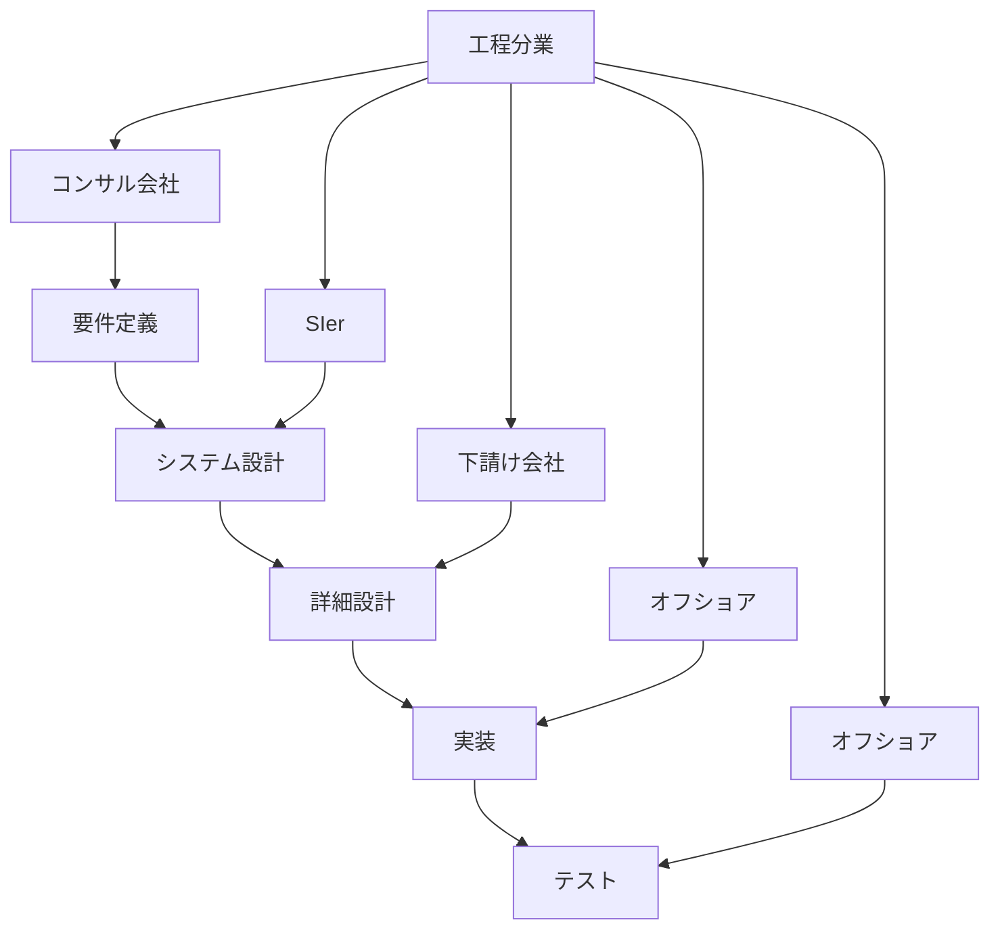
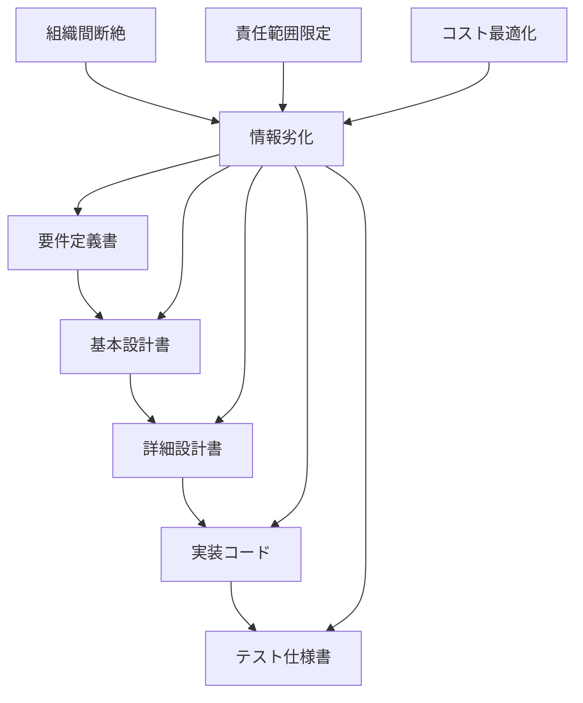
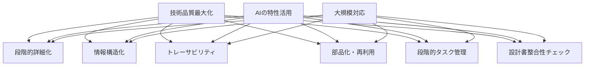
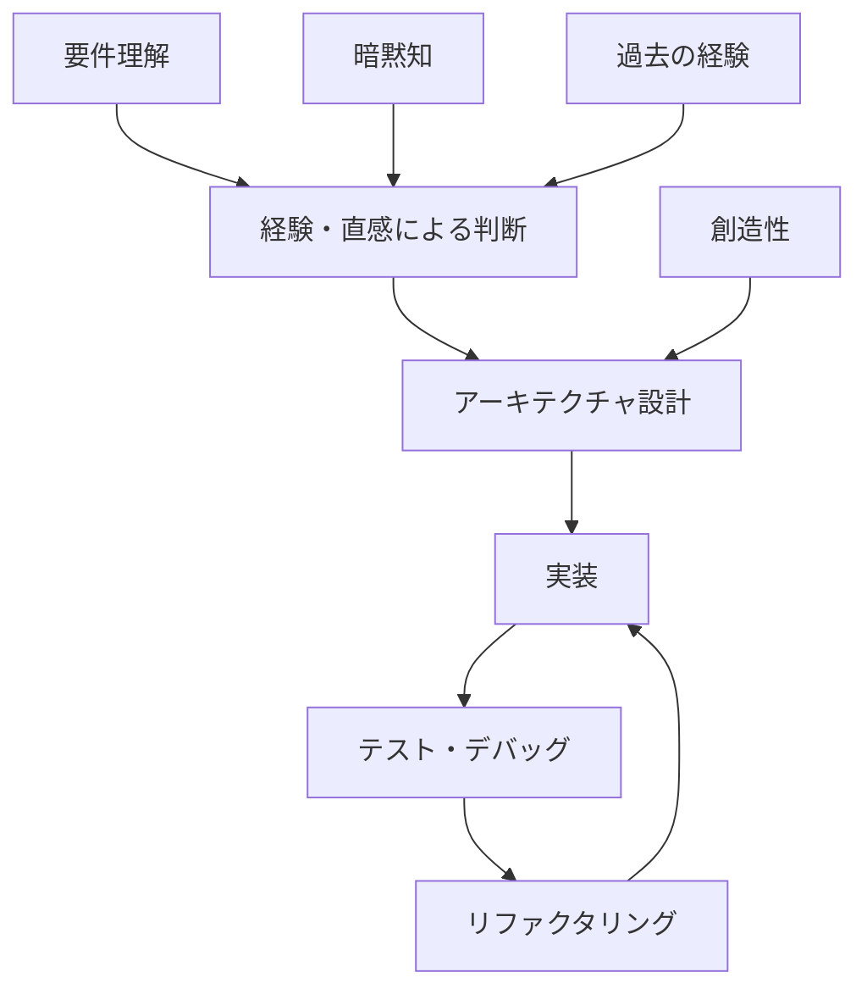
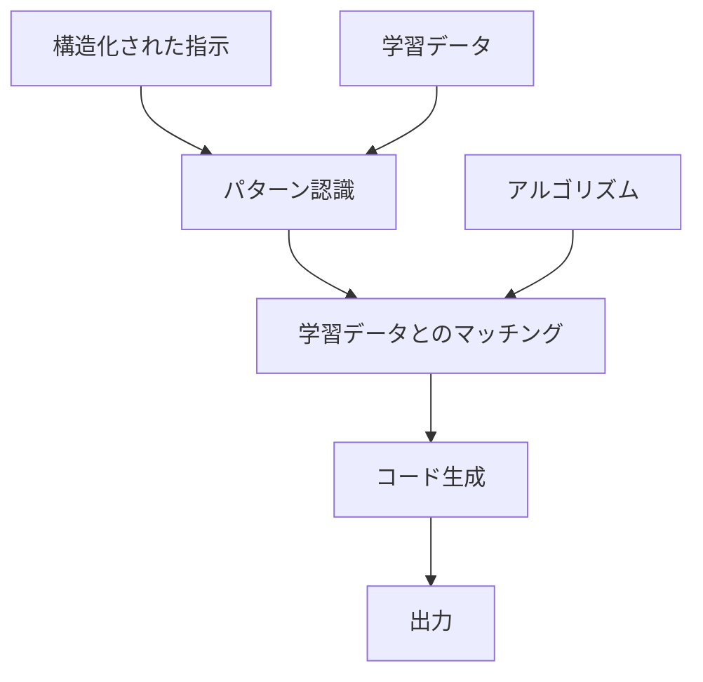
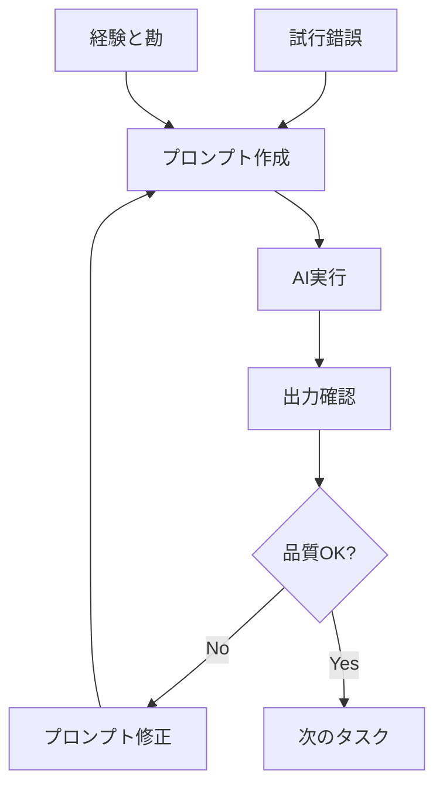
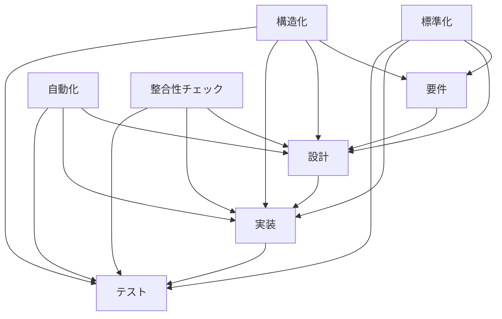
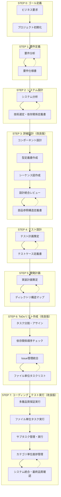

# 人間によるコーディングとAIコーディングの違い：プロセスエンジニアリングアプローチによる体系化 v1.2

**著者**: 横井 利和 (Yokoi Toshikazu)  
**所属**: 株式会社イノベーティブ・ソリューションズ (Innovative Solutions Inc.)  
**連絡先**: yokoi@innovative-solutions.co.jp

## 概要

本論文では、従来の人間によるソフトウェア開発と生成AI（Artificial Intelligence）によるコーディングの根本的な違いを分析し、AIコーディングにおける完璧な開発を実現するためのプロセスエンジニアリングアプローチを提案する。従来の「プロンプトエンジニアリング」を超えた「プロセスエンジニアリング」の概念を導入し、要件から実装まで段階的に詳細化する体系的なフレームワークを構築した。特に、カテゴリ単位管理と選択的サブタスク展開による革新的なタスク管理手法を確立し、実証実験により設計書間の整合性チェック、コードレビューの標準化、作業完了条件の厳密化などの重要な改善点を特定・実装した。

**キーワード**: AIコーディング、プロセスエンジニアリング、ソフトウェア開発、生成AI、段階的詳細化、ファイル単位タスク管理、カテゴリ単位管理、選択的展開、設計書整合性、コードレビュー

## 1. はじめに

### 1.1 研究背景

近年、ChatGPT、Claude、GitHub Copilotなどの生成AIツールの急速な発展により、ソフトウェア開発における生成AIの活用が注目されている。しかし、現在の生成AI活用は主に「プロンプトエンジニアリング」に依存しており、一貫性のある高品質なソフトウェア開発には限界がある。

### 1.2 研究目的

本研究の目的は以下の通りである：

1. 人間によるコーディングと生成AIによるコーディングの本質的な違いを明確化する
2. AIコーディングにおける課題を体系的に分析する
3. 従来のウォーターフォールモデルの限界とビジネスモデル依存性を分析する
4. 純粋に技術的品質を目的としたプロセスエンジニアリングアプローチを提案する
5. 大規模システム開発に対応可能な実践的開発プロセス体系を構築する
6. 段階的タスク管理による実装レベルでの品質保証手法を確立する
7. **実証実験による手法の精緻化と実用性向上を実現する**

### 1.3 研究の意義

本研究は、従来のウォーターフォールモデルが持つビジネスモデル（工程分業）への依存性を排除し、純粋に技術的品質とスケーラビリティを追求した新しい開発パラダイムを提示する。生成AIの特性を最大限に活用したプロセスエンジニアリングにより、工程分業に依存しない統合的な高品質開発手法を確立する。さらに、実証実験により発見された課題を解決し、実用性を大幅に向上させた。

## 2. 従来ウォーターフォールモデルの限界とビジネスモデル依存性

### 2.1 従来ウォーターフォールの本質的問題

#### 2.1.1 工程分業ビジネスモデルへの依存

従来のウォーターフォールモデルは、技術的必然性よりもビジネスモデルに基づいて設計されている：



**工程分業の特徴**:
- 各工程を異なる組織・会社が担当
- 工程間の情報伝達に依存した品質管理
- 契約・責任範囲の明確化が主目的
- 技術的最適化よりもビジネス効率を重視

#### 2.1.2 工程分業による技術的問題



**技術的問題**:
- **情報の劣化**: 工程間での情報伝達による品質低下
- **全体最適化の困難**: 各工程の局所最適化による全体品質の低下
- **フィードバックループの断絶**: 後工程からの改善提案の反映困難
- **技術的一貫性の欠如**: 異なる組織による技術判断の不整合

#### 2.1.3 ビジネスモデル優先の弊害

| 側面 | ビジネスモデル重視 | 技術品質重視 |
|------|------------------|-------------|
| 主目的 | コスト削減・責任分散 | 品質向上・技術最適化 |
| 組織構造 | 工程別分業 | 統合チーム |
| 情報管理 | 文書ベース引き継ぎ | 継続的情報共有 |
| 品質管理 | 工程完了時点検査 | 継続的品質保証 |
| 改善アプローチ | 契約・プロセス改善 | 技術・手法改善 |
| 最適化対象 | 個別工程効率 | 全体システム品質 |

### 2.2 AIウォーターフォールの技術品質重視アプローチ

#### 2.2.1 純粋技術的最適化の追求

提案するAIウォーターフォールは、ビジネスモデルから解放された純粋に技術的な最適化を目指す：



**技術品質重視の特徴**:
- **統合的品質管理**: 全工程を通じた一貫した品質基準
- **継続的最適化**: 各段階での技術的改善の積み重ね
- **情報の完全性**: 段階間での情報劣化の防止
- **技術的一貫性**: 単一の技術判断基準による設計
- **実装レベル品質保証**: 段階的タスク管理による標準化された品質保証
- **設計書間整合性**: 数量的検証による設計品質の確保

#### 2.2.2 従来ウォーターフォールとAIウォーターフォールの根本的違い

| 項目 | 従来ウォーターフォール | AIウォーターフォール |
|------|---------------------|-------------------|
| **設計思想** | ビジネスモデル最適化 | 技術品質最適化 |
| **組織構造** | 工程分業（複数組織） | 統合プロセス（単一主体） |
| **情報管理** | 文書ベース引き継ぎ | 構造化データ継承 |
| **品質保証** | 工程完了時検査 | 段階的継続検証 |
| **最適化対象** | コスト・責任分散 | 品質・スケーラビリティ |
| **改善方向** | 契約・プロセス改善 | 技術・アルゴリズム改善 |
| **実行主体** | 複数の専門会社 | AI + プロセスエンジニア |
| **成果物** | 契約仕様書 | 実行可能システム |
| **タスク管理** | 機能単位・人的判断 | ファイル単位・段階的管理 |
| **設計整合性** | 人的レビューに依存 | 数量的・自動的チェック |

## 3. 人間コーディングとAIコーディングの根本的違い

### 3.1 認知プロセスの違い

#### 3.1.1 人間のコーディングプロセス

人間のソフトウェア開発は以下の特徴を持つ：

- **経験と直感に基づく判断**: 過去の経験や暗黙知を活用した意思決定
- **文脈理解と推論**: 不完全な情報から全体像を推測する能力
- **創造的問題解決**: 既存の枠組みを超えた革新的なアプローチ
- **継続的学習**: プロジェクトを通じた知識とスキルの蓄積



#### 3.1.2 AIのコーディングプロセス

生成AIのソフトウェア開発は以下の特徴を持つ：

- **パターン認識と再現**: 学習データに基づくパターンマッチング
- **明示的指示への依存**: 曖昧さのない具体的な指示が必要
- **一貫性のある出力**: 同じ入力に対する再現可能な結果
- **スケーラビリティ**: 大量のコード生成能力



### 3.2 情報処理の違い

| 側面 | 人間 | AI |
|------|------|-----|
| 情報処理方式 | 直感的・非線形 | 論理的・線形 |
| 曖昧さへの対応 | 推測・補完可能 | 明示的定義が必要 |
| 文脈理解 | 暗黙的理解 | 明示的記述が必要 |
| 学習方式 | 経験的学習 | パターン学習 |
| 創造性 | 既存枠組みの突破 | 既存パターンの組み合わせ |
| 一貫性 | 個人差・状況依存 | 高い一貫性 |

## 4. AIコーディングにおける課題分析

### 4.1 現在のAIコーディングの限界

#### 4.1.1 プロンプトエンジニアリングの限界

現在主流のプロンプトエンジニアリングアプローチには以下の限界がある：

1. **一貫性の欠如**: プロンプトの微細な変化による出力の大幅な変動
2. **スケーラビリティの問題**: 大規模プロジェクトでの管理困難
3. **品質の不安定性**: 出力品質の予測困難
4. **知識の蓄積困難**: プロジェクト間での学習内容の継承不可



#### 4.1.2 構造化不足による問題

- **情報の断片化**: 各タスクが独立し、全体最適化が困難
- **トレーサビリティの欠如**: 要件から実装までの追跡不可能
- **再利用性の低さ**: 過去の成果物の活用困難
- **品質管理の困難**: 一貫した品質基準の適用不可能

#### 4.1.3 実証実験で発見された新たな課題

**設計フェーズの課題**:
- **設計書の網羅性不足**: クラス一覧、I/F定義、メソッド定義、依存関係定義で定義漏れが発生
- **型定義の独立管理不足**: 型定義（enumを含む）がクラス定義と混在
- **シーケンス図の欠如**: 動的な振る舞い設計が不十分
- **設計書間の相互レビュー不足**: 矛盾や過不足のチェックが不十分

**計画フェーズの課題**:
- **タスク定義の不完全性**: .env.example、データベース作成などのインフラタスクが漏れ
- **サブタスクの品質保証不足**: コードレビューサブタスクが定義されていない
- **依存関係管理の不備**: todoリストの順序が依存関係に従っていない
- **Issue管理の体系化不足**: タスクとissueの1:1対応が不十分

**実装フェーズの課題**:
- **作業完了認識の誤り**: コミット完了をタスク完了と誤認識
- **todoリストチェックの不徹底**: 作業進行管理が曖昧

### 4.2 AIコーディングに必要な要素

#### 4.2.1 構造化された情報管理

AIが効果的にコーディングを行うためには以下が必要：

1. **明示的な仕様**: 曖昧さのない詳細な要求定義
2. **段階的詳細化**: 抽象から具体への体系的な展開
3. **標準化されたフォーマット**: 一貫した情報構造
4. **トレーサビリティ**: 要件から実装までの追跡可能性
5. **数量的整合性チェック**: 設計書間の定義数の一致確認

#### 4.2.2 プロセスの体系化



## 5. プロセスエンジニアリングアプローチの提案

### 5.1 プロセスエンジニアリングの概念

#### 5.1.1 定義

**プロセスエンジニアリング**とは、生成AIの特性を最大限に活用するために、ソフトウェア開発プロセス自体を工学的に設計・最適化するアプローチである。

従来のプロンプトエンジニアリングが「どう指示するか」に焦点を当てるのに対し、プロセスエンジニアリングは「どのような順序で何を生成するか」という開発プロセス全体の最適化に焦点を当てる。

#### 5.1.2 基本原則（実証実験による改良版）

1. **段階的詳細化**: 抽象的な要件から具体的な実装まで段階的に詳細化
2. **情報の構造化**: 各段階での情報を標準化された形式で管理
3. **検証可能性**: 各段階で品質チェックポイントを設定
4. **トレーサビリティ**: 要件から実装まで追跡可能な情報管理
5. **部品化と再利用**: クラス・メソッドの依存関係を明示し、重複実装を防止
6. **段階的タスク管理**: コーディング対象を段階的に管理し、標準化されたサブタスクで実行
7. **数量的整合性保証**: 設計書間の定義数の一致を数量的に検証
8. **設計書統合レビュー**: 全設計書完了後の相互整合性チェック
9. **コードレビュー統合**: 実装後の設計書との整合性確認

### 5.2 従来アプローチとの比較

| 項目 | プロンプトエンジニアリング | プロセスエンジニアリング v1.2 |
|------|-------------------------|------------------------------|
| 焦点 | 個別の指示最適化 | 開発プロセス全体の最適化 |
| アプローチ | 試行錯誤による改善 | 体系的なプロセス設計 |
| 一貫性 | プロンプト依存で不安定 | 構造化により高い一貫性 |
| スケーラビリティ | 大規模化で管理困難 | 体系的管理で拡張可能 |
| 品質管理 | 出力後の確認中心 | 各段階での品質保証 |
| 再利用性 | 低い | 高い（構造化された成果物） |
| 学習効果 | 個人の経験に依存 | プロセス改善による組織学習 |
| タスク管理 | アドホック | 段階的・標準化 |
| 設計整合性 | 人的レビューに依存 | 数量的・自動的チェック |
| コードレビュー | 任意実施 | 標準サブタスクとして必須 |

## 6. 体系的開発プロセスの構築

### 6.1 プロセス全体設計

#### 6.1.1 7段階プロセスモデル（実証実験による改良版）

本研究では、AIコーディングに最適化された7段階のプロセスモデルを提案する：



### 6.2 重要な革新要素（実証実験による改良）

#### 6.2.1 技術選定・依存関係定義書（STEP 2.2）

従来のアーキテクチャ設計を拡張し、以下を統合：

- **技術スタック選定**: 具体的な技術とバージョンの決定
- **依存ライブラリ管理**: Semantic Versioningによる管理方針
- **セキュリティ・ライセンス考慮**: 法的・技術的リスクの評価
- **バージョン管理方針**: 更新戦略と互換性管理

#### 6.2.2 型定義書（STEP 3.8）【新規追加】

TypeScript開発における型ファーストアプローチの実現：

- **独立した型定義管理**: クラス定義と分離した型定義書
- **enum定義の体系化**: 列挙型の一元管理
- **型の依存関係管理**: 型間の参照関係の明示
- **型安全性の確保**: コンパイル時エラーの事前防止

#### 6.2.3 シーケンス図（STEP 3.9）【新規追加】

動的な振る舞い設計の体系化：

- **API単位シーケンス**: バックエンドAPIの処理フロー
- **UIアクション単位シーケンス**: フロントエンドの操作フロー
- **エラーハンドリングフロー**: 例外処理の設計
- **パフォーマンス考慮**: 処理時間・リソース使用量の設計

#### 6.2.4 設計統合レビュー（STEP 3.10）【新規追加】

設計書間の整合性確保：

- **数量的整合性チェック**: 定義数の一致確認
- **依存関係整合性**: クラス・メソッド・型の参照関係確認
- **シーケンス整合性**: 静的設計と動的設計の整合性確認
- **完了条件の厳密化**: 「作業の元となるアウトプットで定義された件数に対してインプット内で定義された数を比較しイコールである事」の確認

#### 6.2.5 部品参照構造定義書（STEP 3.11）

AIコーディングにおける重複実装防止と品質向上のため：

- **依存関係の明示**: クラス・メソッド間の参照関係を表形式で管理
- **循環依存チェック**: 設計段階での問題検出
- **再利用可能性評価**: 部品の再利用レベルを評価
- **影響分析**: 変更時の影響範囲を特定

#### 6.2.6 ディレクトリ構造マップ（STEP 5.3）

IDEでの再現性確保とファイル配置の一貫性のため：

- **レイヤー別構造**: アーキテクチャに対応したディレクトリ構成
- **命名規則**: ファイル種別ごとの統一された命名規則
- **インポート規則**: 相対パス禁止、絶対パス使用の徹底

#### 6.2.7 依存関係順序チェック（STEP 6.4）【新規追加】

todoリストの実行順序最適化：

- **依存関係分析**: タスク間の依存関係の詳細分析
- **実行順序最適化**: 並列実行可能性を考慮した順序決定
- **ボトルネック特定**: 依存関係のボトルネックとなるタスクの特定
- **リスク評価**: 依存関係による遅延リスクの評価

#### 6.2.8 Issue管理統合（STEP 6.5）【新規追加】

タスクとissueの完全な1:1対応：

- **Issue自動作成**: タスク単位でのissue自動生成
- **issue.md作成**: タスク仕様書の詳細化
- **進捗連携**: todoリストとissueの進捗同期
- **完了確認**: issue数とtask数の一致確認

#### 6.2.9 段階的タスク管理アプローチ（STEP 6-7）【改良版】

AIコーディングの実装レベルでの品質保証を実現する革新的アプローチ：

##### 6.2.9.1 STEP 2: ファイル単位タスクリスト作成

**目的**: 実装対象ファイルの完全な把握と構造化管理

**プロセス**:
1. **実装対象ファイルの洗い出し**
   - ディレクトリ構造マップに基づくファイル特定
   - クラス設計表・メソッドI/Fリストとの対応付け
   - 型定義書との対応付け【新規追加】
   - 依存関係の明確化

2. **タスクID付与と属性設定**
   - 命名規則: `TSK-{連番3桁}-{レイヤー}-{ファイル名}`
   - 優先度設定（高・中・低）
   - 複雑度評価（高・中・低）
   - 見積時間の算出
   - インフラタスク追加（.env.example、DB作成等）【新規追加】

3. **表形式による構造化管理**
   ```markdown
   | タスクID | ファイル名 | レイヤー | 優先度 | 依存タスク | 見積時間 | 複雑度 |
   |----------|------------|----------|--------|------------|----------|--------|
   | TSK-001-ENT-User | User.ts | Domain | 高 | なし | 4h | 高 |
   | TSK-002-SVC-UserService | UserService.ts | Application | 高 | TSK-001 | 6h | 高 |
   | TSK-003-INF-EnvExample | .env.example | Infrastructure | 中 | なし | 1h | 低 |
   ```

**成果物**: ファイル単位タスクリスト（表形式）

#####
