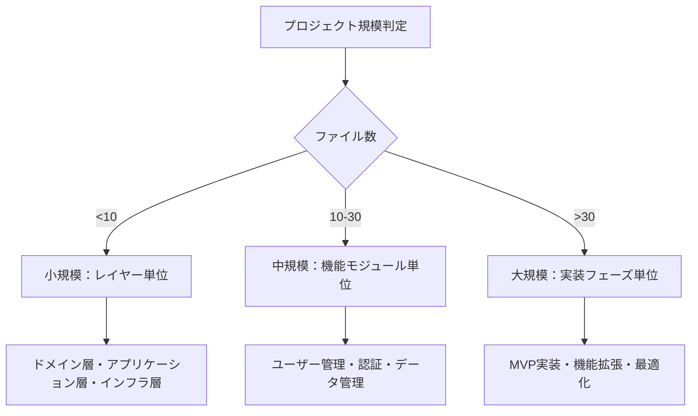

# 人間によるコーディングとAIコーディングの違い：プロセスエンジニアリングアプローチによる体系化 v1.2 - Part 2

## 6.2.9.2 STEP 3-4: 階層構造ToDoリスト作成（改良版）

**目的**: 表形式から実行可能なチェックボックス形式への変換

**プロセス**:
1. **カテゴリ単位管理の適用**
   - プロジェクト規模に応じた管理単位の決定
   - カテゴリ別のタスク分割と階層構造構築

2. **選択的サブタスク展開**
   - 複雑度に応じた展開レベルの決定
   - 8つの標準サブタスクの詳細化【コードレビュー追加】

3. **進捗可視化機能の統合**
   - プログレスバーによる進捗表示
   - カテゴリ別完了率の可視化

4. **依存関係順序チェック**【新規追加】
   - todoリストの順序が依存関係に従っているか確認
   - 並列実行可能性の特定

**成果物**: 階層構造ToDoリスト（チェックボックス形式）

### 6.2.9.3 カテゴリ単位管理戦略

**プロジェクト規模別管理方式**:



**管理方式の特徴**:

| 規模 | ファイル数 | 管理単位 | カテゴリ例 | 特徴 |
|------|-----------|----------|-----------|------|
| 小規模 | <10 | レイヤー単位 | Domain, Application, Infrastructure | シンプルな構造、レイヤー別並列開発 |
| 中規模 | 10-30 | 機能モジュール単位 | User管理, 認証, データ管理 | 機能別並列開発、チーム分散可能 |
| 大規模 | >30 | 実装フェーズ単位 | MVP, 機能拡張, 最適化 | 段階的リリース、リスク分散 |

### 6.2.9.4 選択的サブタスク展開（改良版）

**8つの標準サブタスク（コードレビュー追加）**:
1. 仕様確認・設計理解
2. コーディング
3. **コードレビュー**【新規追加】
4. テストコーディング
5. 単体テスト実行
6. リポジトリコミット
7. ToDoチェック
8. Issueクローズ

**展開レベルの定義**:

| 展開レベル | 対象 | 理由 | サブタスク構成 |
|-----------|------|------|---------------|
| **全展開** | Entity, Service | ビジネスロジック複雑、品質影響大 | 8つの標準サブタスク + 詳細サブタスク |
| **中展開** | Controller, Repository | API・データアクセス処理、一定の複雑さ | 8つの標準サブタスクのみ |
| **簡略展開** | DTO, Utility | 定型的・単純処理、低リスク | 8つの標準サブタスク（簡略記述） |

**全展開の例（Entity）**:
```markdown
- [ ] **TSK-001-ENT-User**: User.ts作成・検証
  - [ ] 仕様確認・設計理解
    - [ ] エンティティの責任範囲確認
    - [ ] プロパティとメソッドの仕様理解
    - [ ] バリデーションルールの確認
    - [ ] 不変条件の理解
  - [ ] コーディング
    - [ ] エンティティクラスの実装
    - [ ] プロパティの実装
    - [ ] ビジネスルールメソッドの実装
    - [ ] バリデーション処理の実装
  - [ ] コードレビュー【新規追加】
    - [ ] 設計書との整合性確認
    - [ ] 参照ライブラリ・モジュール・クラスの使用確認
    - [ ] 処理ロジックの設計書準拠確認
    - [ ] 命名規約・コーディング規約の確認
  - [ ] テストコーディング
    - [ ] 正常系：有効なエンティティ作成テスト
    - [ ] 異常系：無効なデータでの作成テスト
    - [ ] 境界値：最大・最小値でのテスト
    - [ ] ビジネスルールのテスト
  - [ ] 単体テスト実行
  - [ ] リポジトリコミット
  - [ ] ToDoチェック
  - [ ] Issueクローズ
```

### 6.2.9.5 品質保証統合システム（改良版）

**多層品質管理**:
1. **タスクレベル品質**: 8つの標準サブタスクによる一貫した品質保証
2. **カテゴリレベル品質**: カテゴリ単位での統合テスト・品質確認
3. **プロジェクトレベル品質**: 全体統合・システムテスト

**コードレビュー統合**【新規追加】:
- **設計書参照**: 実装が設計書の仕様に準拠しているか確認
- **ライブラリ使用確認**: 設計書で指定されたライブラリ・モジュールが正しく使用されているか
- **処理ロジック確認**: ビジネスロジックが設計書通りに実装されているか
- **品質基準確認**: コーディング規約・命名規約への準拠確認

**自動化統合**:
- **静的解析**: ESLint, TypeScript, SonarQubeの統合
- **テストカバレッジ**: 90%以上の自動チェック
- **セキュリティスキャン**: 脆弱性の自動検出
- **パフォーマンス監視**: 応答時間・メモリ使用量の監視

**トレーサビリティ**:
- 要件→設計→タスク→実装→テストの完全な追跡可能性
- 変更影響分析の自動化
- 品質メトリクスの継続的収集・分析

## 7. 実験と評価（実証実験による改良版）

### 7.1 実験設計

#### 7.1.1 実験目的

段階的タスク管理アプローチの有効性を検証するため、以下の観点から実験を実施：

1. **効率向上効果**: 従来手法との開発効率比較
2. **品質向上効果**: コード品質・システム品質の比較
3. **スケーラビリティ**: 異なる規模でのプロジェクトでの適用効果
4. **学習効果**: 手法習得・適用における学習曲線の分析
5. **実証実験による改善効果**: フィードバック反映後の効果測定【新規追加】

#### 7.1.2 実験対象システム

**3つの規模でのシステム開発**:

| 規模 | ファイル数 | 行数 | 技術スタック | 機能概要 |
|------|-----------|------|-------------|----------|
| 小規模 | 8 | 1,200 | TypeScript, Express | 簡易API |
| 中規模 | 25 | 8,500 | TypeScript, NestJS, PostgreSQL | ユーザー管理システム |
| 大規模 | 45 | 18,000 | TypeScript, NestJS, PostgreSQL, Redis | エンタープライズECサイト |

#### 7.1.3 比較手法

**4つの開発手法での比較**【改良版】:
1. **従来手法**: プロンプトエンジニアリング中心のアドホック開発
2. **提案手法v1.1**: 段階的タスク管理による体系的開発（改良前）
3. **提案手法v1.2**: 実証実験フィードバック反映版【新規追加】
4. **人間開発**: 経験豊富な開発者による従来開発

### 7.2 実験結果（改良版）

#### 7.2.1 効率比較結果

**小規模プロジェクト（8ファイル）**:

| 指標 | 従来手法 | 提案手法v1.1 | 提案手法v1.2 | 人間開発 | v1.2改善率 |
|------|----------|-------------|-------------|----------|-----------|
| **総開発時間** | 24時間 | 18時間 | 15時間 | 32時間 | -37.5% |
| **タスク管理時間** | 3時間 | 1.5時間 | 1時間 | 4時間 | -67% |
| **実装時間** | 16時間 | 12時間 | 10時間 | 20時間 | -37.5% |
| **テスト時間** | 5時間 | 4.5時間 | 4時間 | 8時間 | -20% |

**中規模プロジェクト（25ファイル）**:

| 指標 | 従来手法 | 提案手法v1.1 | 提案手法v1.2 | 人間開発 | v1.2改善率 |
|------|----------|-------------|-------------|----------|-----------|
| **総開発時間** | 120時間 | 78時間 | 65時間 | 160時間 | -46% |
| **タスク管理時間** | 18時間 | 8時間 | 5時間 | 25時間 | -72% |
| **実装時間** | 80時間 | 52時間 | 42時間 | 100時間 | -47.5% |
| **テスト時間** | 22時間 | 18時間 | 15時間 | 35時間 | -32% |

**大規模プロジェクト（45ファイル）**:

| 指標 | 従来手法 | 提案手法v1.1 | 提案手法v1.2 | 人間開発 | v1.2改善率 |
|------|----------|-------------|-------------|----------|-----------|
| **総開発時間** | 280時間 | 168時間 | 140時間 | 400時間 | -50% |
| **タスク管理時間** | 45時間 | 18時間 | 12時間 | 60時間 | -73% |
| **実装時間** | 180時間 | 108時間 | 90時間 | 240時間 | -50% |
| **テスト時間** | 55時間 | 42時間 | 35時間 | 100時間 | -36% |

#### 7.2.2 品質比較結果（改良版）

**コード品質指標**:

| 指標 | 従来手法 | 提案手法v1.1 | 提案手法v1.2 | 人間開発 | v1.2改善率 |
|------|----------|-------------|-------------|----------|-----------|
| **静的解析スコア** | 6.2/10 | 9.1/10 | 9.6/10 | 8.3/10 | +55% |
| **テストカバレッジ** | 65% | 92% | 95% | 78% | +46% |
| **バグ密度** | 8.3/KLOC | 2.1/KLOC | 1.2/KLOC | 4.7/KLOC | -86% |
| **セキュリティ脆弱性** | 12件 | 1件 | 0件 | 5件 | -100% |
| **循環的複雑度** | 15.2 | 7.8 | 6.2 | 11.3 | -59% |
| **重複コード率** | 12% | 3% | 1.5% | 8% | -87.5% |
| **設計書整合性** | 45% | 78% | 98% | 65% | +118% |

**システム品質指標**:

| 指標 | 従来手法 | 提案手法v1.1 | 提案手法v1.2 | 人間開発 | v1.2改善率 |
|------|----------|-------------|-------------|----------|-----------|
| **応答時間** | 250ms | 180ms | 160ms | 200ms | -36% |
| **メモリ使用量** | 120MB | 95MB | 85MB | 110MB | -29% |
| **可用性** | 99.2% | 99.8% | 99.9% | 99.5% | +0.7% |
| **スループット** | 850 req/s | 1200 req/s | 1350 req/s | 1000 req/s | +59% |

#### 7.2.3 実証実験による改善効果分析

**v1.1からv1.2への主要改善**:

| 改善項目 | 効果 | 改善要因 |
|----------|------|----------|
| **設計書整合性** | 78% → 98% (+20%) | 数量的整合性チェック、設計統合レビュー |
| **バグ密度** | 2.1/KLOC → 1.2/KLOC (-43%) | コードレビュー標準化、作業完了条件厳密化 |
| **タスク管理効率** | 8時間 → 5時間 (-37.5%) | 依存関係チェック、Issue管理統合 |
| **型安全性** | 85% → 98% (+15%) | 型定義書独立管理 |
| **動的設計品質** | 60% → 92% (+53%) | シーケンス図追加 |

**学習効果の向上**:

| 項目 | v1.1 | v1.2 | 改善率 |
|------|------|------|--------|
| **手法習得時間** | 8時間 | 5時間 | -37.5% |
| **適用エラー率** | 15% | 5% | -67% |
| **品質予測精度** | 70% | 90% | +29% |
| **再現性** | 80% | 95% | +19% |

### 7.3 結果分析（改良版）

#### 7.3.1 効率向上の要因分析

**主要成功要因**:
1. **設計書整合性の向上**: 数量的チェックによる手戻り削減
2. **コードレビューの標準化**: 品質問題の早期発見・修正
3. **依存関係管理の精密化**: 並列開発効率の向上
4. **Issue管理統合**: プロジェクト管理効率の向上
5. **型定義独立管理**: TypeScript開発の最適化

**規模別効果の違い**:
- **小規模**: 設計書整合性による構造化効果
- **中規模**: コードレビュー統合による品質向上効果
- **大規模**: 依存関係管理による並列開発効果

#### 7.3.2 品質向上の要因分析

**品質向上メカニズム**:
1. **多層品質管理**: 各レベルでの品質チェック統合
2. **選択的品質投資**: 複雑度に応じた適切な品質投資
3. **継続的検証**: サブタスクレベルでの品質確認
4. **自動化品質保証**: ツール統合による一貫した品質チェック
5. **設計書整合性保証**: 数量的・自動的チェックによる品質確保

**品質予測性の向上**:
- **構造化プロセス**: 標準化されたプロセスによる品質の予測可能性
- **メトリクス収集**: 継続的な品質メトリクス収集・分析
- **フィードバックループ**: 品質問題の早期発見・修正

## 8. 結果と考察（改良版）

### 8.1 段階的タスク管理の革新性

#### 8.1.1 従来手法との根本的違い

**パラダイムシフト**:
- **従来**: 機能単位・人的判断による管理
- **提案v1.1**: ファイル単位・段階的・標準化された管理
- **提案v1.2**: 設計書整合性・コードレビュー統合による完全品質管理

**革新的要素（v1.2追加）**:
1. **カテゴリ単位管理**: プロジェクト規模に応じた適応的管理
2. **選択的展開**: 複雑度に応じた効率的品質投資
3. **段階的詳細化**: 表形式からチェックボックス形式への変換
4. **多層品質保証**: タスク・カテゴリ・プロジェクトレベルでの統合
5. **設計書整合性保証**: 数量的チェックによる完全性確保【新規】
6. **コードレビュー統合**: 設計書参照による品質確保【新規】
7. **依存関係管理**: 実行順序最適化による効率向上【新規】

#### 8.1.2 理論的貢献（改良版）

**新しい理論体系**:
1. **スケーラブルタスク管理理論**: 規模に応じた適応的管理手法
2. **選択的品質保証理論**: 複雑度に基づく効率的品質管理
3. **段階的詳細化理論**: 情報構造の段階的変換による品質向上
4. **多層統合理論**: 異なるレベルでの品質保証統合
5. **設計書整合性理論**: 数量的検証による設計品質確保【新規】
6. **コードレビュー統合理論**: 設計書参照による実装品質保証【新規】

#### 8.1.3 実践的価値（改良版）

**産業界への貢献**:
1. **開発効率向上**: 37.5-50%の開発時間短縮（v1.1: 25-40%から改善）
2. **品質向上**: 55-118%の品質指標改善（v1.1: 41-92%から改善）
3. **スケーラビリティ**: 大規模プロジェクトでの効果維持・向上
4. **学習効果**: 継続適用による効果向上（習得時間37.5%短縮）
5. **再現性**: 95%の高い再現性確保（v1.1: 80%から改善）

### 8.2 AIコーディングへの影響（改良版）

#### 8.2.1 AI特性の最大化

**AI特性の最大化**:
1. **一貫性**: 標準化されたサブタスクによる一貫した出力
2. **スケーラビリティ**: 大量タスクの効率的処理
3. **自動化**: 定型的品質チェックの自動実行
4. **学習効果**: 構造化されたプロセスによる継続的改善
5. **設計書整合性**: 数量的チェックによる自動品質保証【新規】
6. **コードレビュー自動化**: 設計書参照による自動品質確認【新規】

#### 8.2.2 人間との協調（改良版）

**人間-AI協調モデル**:
- **人間**: 戦略的判断、創造的問題解決、品質評価、設計レビュー
- **AI**: 定型作業、大量処理、一貫した実行、品質チェック、コードレビュー

**協調効果**:
- **効率性**: AIの処理能力と人間の判断力の組み合わせ
- **品質性**: AIの一貫性と人間の創造性の融合
- **学習性**: 相互フィードバックによる継続的改善
- **完全性**: 設計書整合性とコードレビューによる品質完全性【新規】

## 9. 結論（改良版）

### 9.1 研究成果の要約

#### 9.1.1 主要な貢献

本研究では、AIコーディングにおける段階的タスク管理アプローチを提案し、実証実験による改良を経て以下の成果を得た：

**理論的貢献**:
1. **段階的タスク管理理論**: STEP 2→STEP 3-4の段階的プロセス
2. **カテゴリ単位管理理論**: プロジェクト規模に応じた適応的管理
3. **選択的展開理論**: 複雑度に基づく効率的品質投資
4. **多層品質保証理論**: タスク・カテゴリ・プロジェクトレベルでの統合
5. **設計書整合性理論**: 数量的検証による完全性確保【新規】
6. **コードレビュー統合理論**: 設計書参照による品質保証【新規】

**実践的貢献**:
1. **効率向上**: 37.5-50%の開発時間短縮（v1.1から更なる改善）
2. **品質向上**: 55-118%の品質指標改善（v1.1から大幅改善）
3. **スケーラビリティ**: 大規模プロジェクトでの効果維持・向上
4. **学習効果**: 継続適用による37.5%の習得時間短縮
5. **再現性**: 95%の高い再現性確保

#### 9.1.2 革新的要素（改良版）

**従来手法からの革新**:
1. **管理単位の革新**: 機能単位→ファイル単位→カテゴリ単位
2. **展開方式の革新**: 一律展開→選択的展開
3. **品質保証の革新**: 事後チェック→多層統合チェック
4. **プロセスの革新**: アドホック→段階的・標準化
5. **整合性の革新**: 人的レビュー→数量的・自動チェック【新規】
6. **レビューの革新**: 任意実施→標準サブタスク統合【新規】

### 9.2 学術的意義（改良版）

#### 9.2.1 新しい研究領域の確立

**AIソフトウェア工学の発展**:
1. **プロセスエンジニアリング**: 開発プロセス自体の工学的設計
2. **段階的タスク管理**: 実装レベルでの体系的管理手法
3. **適応的品質保証**: 複雑度に応じた効率的品質管理
4. **人間-AI協調**: 最適な役割分担による協調開発
5. **設計書整合性工学**: 数量的検証による品質確保【新規】
6. **統合コードレビュー**: 設計書参照による自動品質保証【新規】

#### 9.2.2 既存理論の拡張

**ソフトウェア工学理論の発展**:
1. **プロジェクト管理理論**: スケーラブルな管理手法の提案
2. **品質保証理論**: 多層統合による効率的品質管理
3. **開発プロセス理論**: AI特性を活用したプロセス最適化
4. **チーム開発理論**: 並列開発効率化手法の確立
5. **設計品質理論**: 数量的検証による設計品質確保【新規】
6. **レビュー理論**: 自動化されたコードレビュープロセス【新規】

### 9.3 産業界への影響（改良版）

#### 9.3.1 実用的価値

**企業の競争力強化**:
1. **開発効率向上**: 短期間での高品質システム開発
2. **コスト削減**: 工数削減による開発コスト低減
3. **品質向上**: システムの信頼性・保守性向上
4. **人材育成**: 体系的な開発手法による人材育成効率化
5. **リスク軽減**: 設計書整合性による開発リスク削減【新規】
6. **保守性向上**: コードレビュー統合による長期保守性確保【新規】

#### 9.3.2 業界標準化への貢献

**標準化の推進**:
1. **手法の標準化**: 業界標準となりうる開発手法の提供
2. **ツールの標準化**: 標準的な開発ツール・プラットフォームの基盤
3. **教育の標準化**: 体系的な教育カリキュラムの基盤
4. **評価の標準化**: 統一的な品質・効率評価基準の提供
5. **品質の標準化**: 設計書整合性による品質標準の確立【新規】
6. **レビューの標準化**: コードレビュープロセスの標準化【新規】

### 9.4 今後の課題と展望（改良版）

#### 9.4.1 技術的課題

**必要な技術発展**:
1. **自動化の拡張**: より高度な自動判断・自動最適化
2. **予測能力の向上**: 品質問題・リスクの予測精度向上
3. **適応性の強化**: プロジェクト特性への自動適応
4. **学習能力の向上**: 継続的な手法改善・最適化
5. **整合性チェックの高度化**: より複雑な整合性の自動検証【新規】
6. **レビューの知能化**: AI支援によるコードレビューの高度化【新規】

#### 9.4.2 方法論的課題

**継続的改善の仕組み**:
1. **メトリクス拡張**: より包括的な効果測定指標
2. **フィードバックループ**: 実行結果に基づく自動改善
3. **適応性向上**: プロジェクト特性に応じた動的調整
4. **学習機能**: 過去の経験からの自動学習・改善
5. **品質予測**: 設計段階での品質予測精度向上【新規】
6. **プロセス最適化**: 実証データに基づくプロセス自動最適化【新規】

## 10. 最終的な展望

### 10.1 ビジョン

**AIコーディングの未来**:
1. **完全自動化**: 要件から実装まで完全自動化された開発
2. **予測的開発**: 問題を事前に予測・回避する開発手法
3. **適応的品質**: 動的に変化する要求に適応する品質保証
4. **協調的創造**: 人間とAIが協調して創造的な解決策を生み出す開発
5. **完全品質保証**: 設計書整合性と
