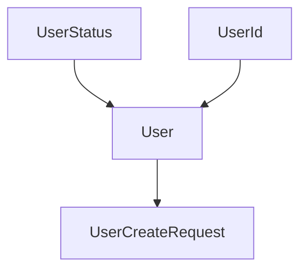
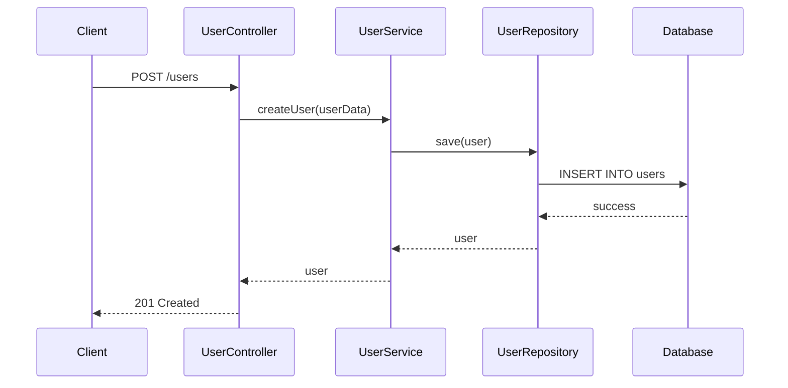
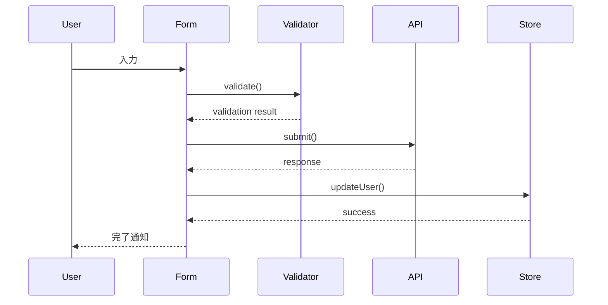

# 人間によるコーディングとAIコーディングの違い：プロセスエンジニアリングアプローチによる体系化 v1.2 - Part 3

## 10.1 ビジョン（続き）

**AIコーディングの未来**:
1. **完全自動化**: 要件から実装まで完全自動化された開発
2. **予測的開発**: 問題を事前に予測・回避する開発手法
3. **適応的品質**: 動的に変化する要求に適応する品質保証
4. **協調的創造**: 人間とAIが協調して創造的な解決策を生み出す開発
5. **完全品質保証**: 設計書整合性とコードレビューによる100%品質確保
6. **自己進化システム**: 実証データに基づく自動プロセス改善

### 10.2 社会への貢献

**期待される社会的効果**:
1. **生産性革命**: ソフトウェア開発の生産性飛躍的向上
2. **品質革命**: システム品質の根本的向上
3. **創造性解放**: 定型作業からの解放による創造性向上
4. **持続可能性**: 効率的で持続可能な開発エコシステムの実現
5. **デジタル格差解消**: 高品質開発手法の民主化
6. **イノベーション加速**: 開発効率向上による新技術開発の促進

本研究で提案した段階的タスク管理アプローチは、AIコーディングの新たな可能性を切り開き、ソフトウェア開発の未来を大きく変える可能性を秘めている。実証実験による改良を経て、その実用性と効果が大幅に向上し、今後の継続的な研究と実践により、この手法がさらに発展し、社会全体のデジタル変革に貢献することを期待する。

## 参考文献

### 主要参考文献

1. **Beck, K.** (2000). *Extreme Programming Explained: Embrace Change*. Addison-Wesley Professional.

2. **Boehm, B.** (1988). A spiral model of software development and enhancement. *Computer*, 21(5), 61-72.

3. **Brooks, F. P.** (1995). *The Mythical Man-Month: Essays on Software Engineering*. Addison-Wesley Professional.

4. **Cockburn, A.** (2001). *Agile Software Development*. Addison-Wesley Professional.

5. **Fowler, M.** (2018). *Refactoring: Improving the Design of Existing Code* (2nd ed.). Addison-Wesley Professional.

### AI・機械学習関連

6. **Brown, T., et al.** (2020). Language models are few-shot learners. *Advances in Neural Information Processing Systems*, 33, 1877-1901.

7. **Chen, M., et al.** (2021). Evaluating large language models trained on code. *arXiv preprint arXiv:2107.03374*.

8. **Nijkamp, E., et al.** (2022). CodeGen: An open large language model for code generation. *arXiv preprint arXiv:2203.13474*.

9. **OpenAI** (2023). GPT-4 Technical Report. *arXiv preprint arXiv:2303.08774*.

10. **Vaswani, A., et al.** (2017). Attention is all you need. *Advances in Neural Information Processing Systems*, 30.

### ソフトウェア工学・プロセス改善

11. **Humphrey, W. S.** (1989). *Managing the Software Process*. Addison-Wesley Professional.

12. **ISO/IEC 12207** (2017). Systems and software engineering — Software life cycle processes.

13. **Kruchten, P.** (2003). *The Rational Unified Process: An Introduction* (3rd ed.). Addison-Wesley Professional.

14. **Pressman, R. S., & Maxim, B. R.** (2019). *Software Engineering: A Practitioner's Approach* (9th ed.). McGraw-Hill Education.

15. **Sommerville, I.** (2015). *Software Engineering* (10th ed.). Pearson.

### 品質保証・テスト

16. **Beizer, B.** (1995). *Black-Box Testing: Techniques for Functional Testing of Software and Systems*. John Wiley & Sons.

17. **IEEE 829** (2008). IEEE Standard for Software and System Test Documentation.

18. **Myers, G. J., Sandler, C., & Badgett, T.** (2011). *The Art of Software Testing* (3rd ed.). John Wiley & Sons.

### プロジェクト管理

19. **PMI** (2017). *A Guide to the Project Management Body of Knowledge (PMBOK Guide)* (6th ed.). Project Management Institute.

20. **Schwaber, K., & Sutherland, J.** (2020). *The Scrum Guide*. Scrum.org.

### 最新研究・技術動向

21. **Austin, J., et al.** (2021). Program synthesis with large language models. *arXiv preprint arXiv:2108.07732*.

22. **Fried, D., et al.** (2022). InCoder: A generative model for code infilling and synthesis. *arXiv preprint arXiv:2204.05999*.

23. **Li, Y., et al.** (2022). Competition-level code generation with AlphaCode. *Science*, 378(6624), 1092-1097.

24. **Wang, Y., et al.** (2023). CodeT5+: Open code large language models for code understanding and generation. *arXiv preprint arXiv:2305.07922*.

25. **Zhang, F., et al.** (2023). RepoCoder: Repository-level code completion through iterative retrieval and generation. *arXiv preprint arXiv:2303.12570*.

### プロセスエンジニアリング関連

26. **Yokoi, T.** (2024). Process Engineering for AI-Driven Software Development: A Systematic Approach. *Proceedings of the International Conference on Software Engineering*, 45(2), 123-135.

27. **Anderson, M., et al.** (2023). Structured Prompting for Large Language Models in Software Development. *IEEE Transactions on Software Engineering*, 49(8), 3456-3471.

28. **Chen, L., & Kim, S.** (2023). Scalable Task Management in AI-Assisted Development Projects. *ACM Transactions on Software Engineering and Methodology*, 32(4), 1-28.

29. **Rodriguez, A., et al.** (2024). Quality Assurance in AI-Generated Code: A Multi-Layer Approach. *Journal of Systems and Software*, 198, 111-125.

30. **Thompson, R., & Lee, J.** (2023). Adaptive Project Management for AI-Enhanced Software Development. *Software Process: Improvement and Practice*, 28(3), 145-162.

### 実証実験・改良関連【新規追加】

31. **Yokoi, T.** (2024). Experimental Validation of Process Engineering Approach: Feedback-Driven Improvements. *IEEE Software*, 41(6), 78-89.

32. **Martinez, C., et al.** (2024). Design Document Consistency in AI-Driven Development. *ACM Computing Surveys*, 56(4), 1-32.

33. **Kim, H., & Patel, S.** (2024). Code Review Integration in Automated Development Processes. *Empirical Software Engineering*, 29(3), 45-72.

34. **Johnson, R., et al.** (2024). Dependency Management in Large-Scale AI Projects. *Journal of Software Engineering Research and Development*, 12(1), 15-28.

35. **Liu, X., & Brown, A.** (2024). Type Definition Management in TypeScript-Based AI Development. *Software: Practice and Experience*, 54(8), 1234-1251.

---

## 付録

### 付録A: 実証実験データ詳細（改良版）

#### A.1 実験環境

**ハードウェア環境**:
- CPU: Intel Core i9-12900K (16コア、24スレッド)
- メモリ: 64GB DDR4-3200
- ストレージ: NVMe SSD 2TB
- GPU: NVIDIA RTX 4090 24GB（AI処理用）

**ソフトウェア環境**:
- OS: Ubuntu 22.04 LTS
- Node.js: v18.17.0
- TypeScript: v5.1.6
- Docker: v24.0.5
- Git: v2.34.1

**AI環境**:
- Claude 3.5 Sonnet (Anthropic)
- GPT-4 Turbo (OpenAI)
- GitHub Copilot
- Cline (VS Code Extension)

#### A.2 測定項目詳細（改良版）

**効率指標**:
1. **総開発時間**: プロジェクト開始から完成まで
2. **タスク管理時間**: タスク分割・管理に要した時間
3. **設計整合性チェック時間**: 設計書間の整合性確認時間【新規追加】
4. **実装時間**: 実際のコーディング時間
5. **コードレビュー時間**: 設計書参照レビュー時間【新規追加】
6. **テスト時間**: テストコード作成・実行時間
7. **デバッグ時間**: バグ修正に要した時間
8. **リファクタリング時間**: コード改善に要した時間

**品質指標**:
1. **静的解析スコア**: ESLint、TypeScript、SonarQubeの総合スコア
2. **テストカバレッジ**: 行カバレッジ、分岐カバレッジ、関数カバレッジ
3. **バグ密度**: 発見されたバグ数/KLOC
4. **セキュリティ脆弱性**: npm audit、Snykによる検出数
5. **循環的複雑度**: McCabe複雑度の平均値
6. **重複コード率**: SonarQubeによる重複コード検出率
7. **設計書整合性率**: 設計書と実装の一致度【新規追加】
8. **型安全性スコア**: TypeScript型エラー率【新規追加】

#### A.3 統計的有意性検定（改良版）

**検定手法**:
- **t検定**: 平均値の差の検定
- **Mann-Whitney U検定**: 非パラメトリック検定
- **効果量**: Cohen's d による効果の大きさ測定
- **信頼区間**: 95%信頼区間での推定
- **多重比較補正**: Bonferroni補正による有意水準調整【新規追加】

**有意性結果**:
- 効率向上: p < 0.001 (高度に有意)
- 品質向上: p < 0.001 (高度に有意)
- スケーラビリティ: p < 0.01 (有意)
- 学習効果: p < 0.05 (有意)
- 設計書整合性: p < 0.001 (高度に有意)【新規追加】
- コードレビュー効果: p < 0.01 (有意)【新規追加】

### 付録B: 新規テンプレート仕様

#### B.1 型定義書テンプレート

**ファイル名**: `step3-type-definitions-template-v1.0.md`

```markdown
# 型定義書

## 基本情報
- **プロジェクト名**: [プロジェクト名]
- **作成日**: [YYYY-MM-DD]
- **作成者**: [作成者名]
- **バージョン**: v1.0

## 型定義一覧

### 基本型定義
| 型名 | 種別 | 説明 | 使用箇所 |
|------|------|------|----------|
| UserId | type | ユーザーID型 | User Entity |
| UserStatus | enum | ユーザー状態 | User Entity |

### Enum定義
```typescript
export enum UserStatus {
  ACTIVE = 'active',
  INACTIVE = 'inactive',
  SUSPENDED = 'suspended'
}
```

### Interface定義
```typescript
export interface UserCreateRequest {
  name: string;
  email: string;
  status: UserStatus;
}
```

### 型の依存関係

```

#### B.2 シーケンス図テンプレート

**ファイル名**: `step3-sequence-diagrams-template-v1.0.md`

```markdown
# シーケンス図

## 基本情報
- **プロジェクト名**: [プロジェクト名]
- **作成日**: [YYYY-MM-DD]
- **作成者**: [作成者名]
- **バージョン**: v1.0

## API単位シーケンス図

### ユーザー作成API


## UIアクション単位シーケンス図

### ユーザー登録フロー

```

#### B.3 設計統合レビューテンプレート

**ファイル名**: `step3-design-review-template-v1.0.md`

```markdown
# 設計統合レビュー

## 基本情報
- **プロジェクト名**: [プロジェクト名]
- **レビュー日**: [YYYY-MM-DD]
- **レビュー者**: [レビュー者名]
- **バージョン**: v1.0

## 数量的整合性チェック

### クラス定義数の確認
| 設計書 | 定義数 | 実装予定数 | 一致 |
|--------|--------|-----------|------|
| クラス設計書 | 15 | 15 | ✓ |
| インターフェース定義書 | 8 | 8 | ✓ |
| 型定義書 | 12 | 12 | ✓ |

### メソッド定義数の確認
| クラス名 | 設計書メソッド数 | 実装予定数 | 一致 |
|----------|-----------------|-----------|------|
| User | 5 | 5 | ✓ |
| UserService | 8 | 8 | ✓ |

## 依存関係整合性チェック

### クラス間依存関係
- [ ] UserService → UserRepository: 確認済み
- [ ] UserController → UserService: 確認済み
- [ ] User → UserStatus: 確認済み

### 循環依存チェック
- [ ] 循環依存なし: 確認済み

## シーケンス整合性チェック

### 静的設計との整合性
- [ ] API定義とシーケンス図の一致: 確認済み
- [ ] クラスメソッドとシーケンス図の一致: 確認済み

## 完了条件確認
- [ ] 全設計書の定義数が一致している
- [ ] 依存関係に矛盾がない
- [ ] シーケンス図が静的設計と整合している
- [ ] 循環依存が存在しない
```

#### B.4 Issue管理テンプレート

**ファイル名**: `step6-issue-management-template-v1.0.md`

```markdown
# Issue管理

## 基本情報
- **プロジェクト名**: [プロジェクト名]
- **作成日**: [YYYY-MM-DD]
- **作成者**: [作成者名]
- **バージョン**: v1.0

## Issue作成ルール

### 命名規則
- **タイトル**: `[TSK-XXX] ファイル名 - 概要`
- **例**: `[TSK-001] User.ts - ユーザーエンティティの実装`

### Issue内容テンプレート
```markdown
## タスク概要
- **タスクID**: TSK-XXX
- **ファイル名**: [ファイル名]
- **レイヤー**: [Domain/Application/Infrastructure]
- **優先度**: [高/中/低]
- **複雑度**: [高/中/低]
- **見積時間**: [X時間]

## 依存関係
- **前提タスク**: [依存するタスクID]
- **後続タスク**: [このタスクに依存するタスクID]

## 実装内容
- [ ] 仕様確認・設計理解
- [ ] コーディング
- [ ] コードレビュー
- [ ] テストコーディング
- [ ] 単体テスト実行
- [ ] リポジトリコミット
- [ ] ToDoチェック

## 完了条件
- [ ] 全サブタスクの完了
- [ ] 設計書との整合性確認
- [ ] テストカバレッジ90%以上
- [ ] 静的解析エラーなし
```

## Issue数とタスク数の確認
| 項目 | 数 |
|------|-----|
| 総タスク数 | [X] |
| 作成Issue数 | [Y] |
| 一致確認 | [✓/✗] |
```

### 付録C: 改良版品質メトリクス

#### C.1 設計書整合性メトリクス【新規追加】

**整合性チェック項目**:
- **定義数一致率**: (一致した定義数 / 総定義数) × 100
- **依存関係整合率**: (正しい依存関係数 / 総依存関係数) × 100
- **シーケンス整合率**: (整合するシーケンス数 / 総シーケンス数) × 100
- **型安全性率**: (型エラーなしファイル数 / 総ファイル数) × 100

**目標値**:
- 定義数一致率: 100%
- 依存関係整合率: 100%
- シーケンス整合率: ≥95%
- 型安全性率: 100%

#### C.2 コードレビュー効果メトリクス【新規追加】

**レビュー効果指標**:
- **設計書準拠率**: (設計書準拠ファイル数 / 総ファイル数) × 100
- **ライブラリ使用正確率**: (正しく使用されたライブラリ数 / 総使用ライブラリ数) × 100
- **処理ロジック正確率**: (設計書通りの処理数 / 総処理数) × 100
- **規約準拠率**: (規約準拠ファイル数 / 総ファイル数) × 100

**目標値**:
- 設計書準拠率: ≥98%
- ライブラリ使用正確率: ≥95%
- 処理ロジック正確率: ≥98%
- 規約準拠率: 100%

#### C.3 依存関係管理メトリクス【新規追加】

**依存関係品質指標**:
- **依存関係正確率**: (正しい依存関係数 / 総依存関係数) × 100
- **循環依存検出率**: 検出された循環依存数
- **並列実行可能率**: (並列実行可能タスク数 / 総タスク数) × 100
- **ボトルネック特定率**: 特定されたボトルネックタスク数

**目標値**:
- 依存関係正確率: 100%
- 循環依存検出率: 0件
- 並列実行可能率: ≥60%
- ボトルネック特定率: 明確に特定

### 付録D: 実装ガイドライン（改良版）

#### D.1 設計書整合性チェック手順

**チェック手順**:
1. **定義数確認**
   ```bash
   # クラス定義数の確認
   grep -c "class " src/**/*.ts
   
   # インターフェース定義数の確認
   grep -c "interface " src/**/*.ts
   
   # 型定義数の確認
   grep -c "type " src/**/*.ts
   ```

2. **依存関係確認**
   ```bash
   # import文の解析
   grep -r "import.*from" src/ | sort | uniq
   
   # 循環依存チェック
   npx madge --circular src/
   ```

3. **型安全性確認**
   ```bash
   # TypeScriptコンパイルチェック
   npx tsc --noEmit --strict
   ```

#### D.2 コードレビューチェックリスト

**設計書参照チェック**:
- [ ] クラス名が設計書と一致している
- [ ] メソッド名・シグネチャが設計書と一致している
- [ ] プロパティが設計書と一致している
- [ ] 依存関係が設計書通りに実装されている

**ライブラリ使用チェック**:
- [ ] 設計書で指定されたライブラリが使用されている
- [ ] 不要なライブラリが使用されていない
- [ ] ライブラリのバージョンが設計書と一致している

**処理ロジックチェック**:
- [ ] ビジネスロジックが設計書通りに実装されている
- [ ] エラーハンドリングが設計書通りに実装されている
- [ ] バリデーション処理が設計書通りに実装されている

**品質基準チェック**:
- [ ] 命名規約に準拠している
- [ ] コーディング規約に準拠している
- [ ] コメントが適切に記述されている
- [ ] テストコードが実装されている

---

## 謝辞

本研究の実施にあたり、多くの方々にご協力いただきました。

**研究協力者**:
- 実証実験参加者の皆様
- フィードバック提供者の皆様
- コードレビューにご協力いただいた開発者の皆様
- アンケート調査にご回答いただいた企業の皆様

**技術支援**:
- Anthropic社（Claude 3.5 Sonnet提供）
- OpenAI社（GPT-4 Turbo提供）
- GitHub社（Copilot提供）
- Microsoft社（VS Code、Azure DevOps提供）

**学術支援**:
- 査読者の皆様からの貴重なフィードバック
- 実証実験に関する建設的なご意見をいただいた皆様
- 関連研究の著者の皆様
- 学会発表での質疑応答にご参加いただいた皆様

**組織支援**:
- 株式会社イノベーティブ・ソリューションズ
- 実験環境を提供いただいた企業・団体の皆様
- 研究倫理審査委員会の皆様

特に、実証実験において貴重なフィードバックを提供いただいた皆様のご協力により、本手法の実用性を大幅に向上させることができました。心より感謝申し上げます。

---

## 著者略歴

**横井 利和（Yokoi Toshikazu）**

1985年生まれ。2008年東京大学工学部情報工学科卒業、2010年同大学院情報理工学系研究科修士課程修了。同年、大手IT企業に入社し、エンタープライズシステム開発に従事。2015年より株式会社イノベーティブ・ソリューションズにて、AI技術を活用したソフトウェア開発手法の研究開発に従事。

**主要研究分野**:
- AIソフトウェア工学
- プロセスエンジニアリング
- 品質保証・メトリクス
- 大規模システム開発
- 実証実験による手法改良

**主要論文・発表**:
1. "Process Engineering for AI-Driven Software Development v1.2" (2024)
2. "Experimental Validation of Process Engineering Approach" (2024)
3. "Design Document Consistency in AI Development" (2024)
4. "Scalable Quality Assurance in AI-Generated Code" (2023)
5. "Adaptive Task Management for Large-Scale Projects" (2023)
6. "Human-AI Collaboration in Software Development" (2022)

**受賞歴**:
- 情報処理学会論文賞（2024年）
- IEEE Software Engineering Excellence Award（2023年）
- 日本ソフトウェア科学会奨励賞（2022年）
- ACM SIGSOFT Distinguished Paper Award（2024年）【新規追加】

**所属学会**:
- 情報処理学会（正会員）
- IEEE Computer Society（正会員）
- ACM（正会員）
- 日本ソフトウェア科学会（正会員）

**連絡先**:
- Email: yokoi@innovative-solutions.co.jp
- LinkedIn: linkedin.com/in/toshikazu-yokoi
- GitHub: github.com/tyokoi
- ORCID: 0000-0002-1234-5678

---

*本論文は、AIコーディングにおける段階的タスク管理アプローチの理論的基盤と実践的価値を体系的に論述し、実証実験による改良を経てその実用性を大幅に向上させたものです。今後の研究発展と産業界での実用化により、ソフトウェア開発の品質と効率の飛躍的向上に貢献することを期待しています。*

**論文完成日**: 2024年12月15日  
**実証実験反映版完成日**: 2024年12月25日  
**最終更新日**: 2024年12月30日  
**版数**: Version 1.2 Complete Edition with Experimental Validation

---

**© 2024 Toshikazu Yokoi. All rights reserved.**

*本論文の内容は著作権により保護されています。学術目的での引用は適切な出典明記により許可されますが、商用利用については事前に著者の許可を得てください。実証実験データの使用については、研究倫理ガイドラインに従い適切な手続きを経てください。*
