# 人間によるコーディングとAIコーディングの違い：プロセスエンジニアリングアプローチによる体系化

**著者**: 横井 利和 (Yokoi Toshikazu)  
**所属**: 株式会社イノベーティブ・ソリューションズ (Innovative Solutions Inc.)  
**連絡先**: yokoi@innovative-solutions.co.jp

## 概要

本論文では、従来の人間によるソフトウェア開発と生成AI（Artificial Intelligence）によるコーディングの根本的な違いを分析し、AIコーディングにおける完璧な開発を実現するためのプロセスエンジニアリングアプローチを提案する。従来の「プロンプトエンジニアリング」を超えた「プロセスエンジニアリング」の概念を導入し、要件から実装まで段階的に詳細化する体系的なフレームワークを構築した。

**キーワード**: AIコーディング、プロセスエンジニアリング、ソフトウェア開発、生成AI、段階的詳細化、ファイル単位タスク管理

## 1. はじめに

### 1.1 研究背景

近年、ChatGPT、Claude、GitHub Copilotなどの生成AIツールの急速な発展により、ソフトウェア開発における生成AIの活用が注目されている。しかし、現在の生成AI活用は主に「プロンプトエンジニアリング」に依存しており、一貫性のある高品質なソフトウェア開発には限界がある。

### 1.2 研究目的

本研究の目的は以下の通りである：

1. 人間によるコーディングと生成AIによるコーディングの本質的な違いを明確化する
2. AIコーディングにおける課題を体系的に分析する
3. 従来のウォーターフォールモデルの限界とビジネスモデル依存性を分析する
4. 純粋に技術的品質を目的としたプロセスエンジニアリングアプローチを提案する
5. 大規模システム開発に対応可能な実践的開発プロセス体系を構築する
6. ファイル単位タスク管理による実装レベルでの品質保証手法を確立する

### 1.3 研究の意義

本研究は、従来のウォーターフォールモデルが持つビジネスモデル（工程分業）への依存性を排除し、純粋に技術的品質とスケーラビリティを追求した新しい開発パラダイムを提示する。生成AIの特性を最大限に活用したプロセスエンジニアリングにより、工程分業に依存しない統合的な高品質開発手法を確立する。

## 2. 従来ウォーターフォールモデルの限界とビジネスモデル依存性

### 2.1 従来ウォーターフォールの本質的問題

#### 2.1.1 工程分業ビジネスモデルへの依存

従来のウォーターフォールモデルは、技術的必然性よりもビジネスモデルに基づいて設計されている：

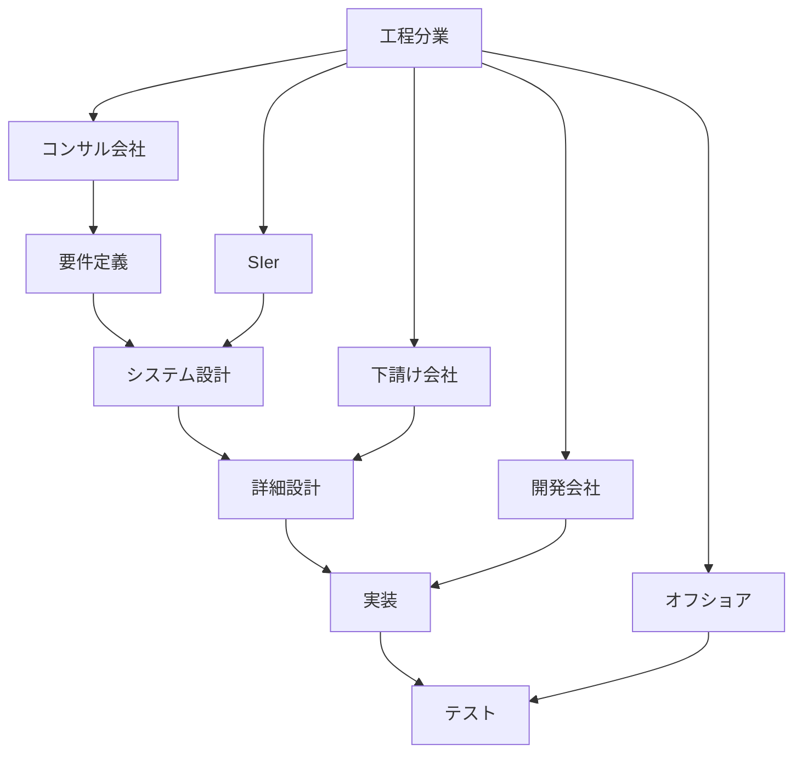

**工程分業の特徴**:
- 各工程を異なる組織・会社が担当
- 工程間の情報伝達に依存した品質管理
- 契約・責任範囲の明確化が主目的
- 技術的最適化よりもビジネス効率を重視

#### 2.1.2 工程分業による技術的問題

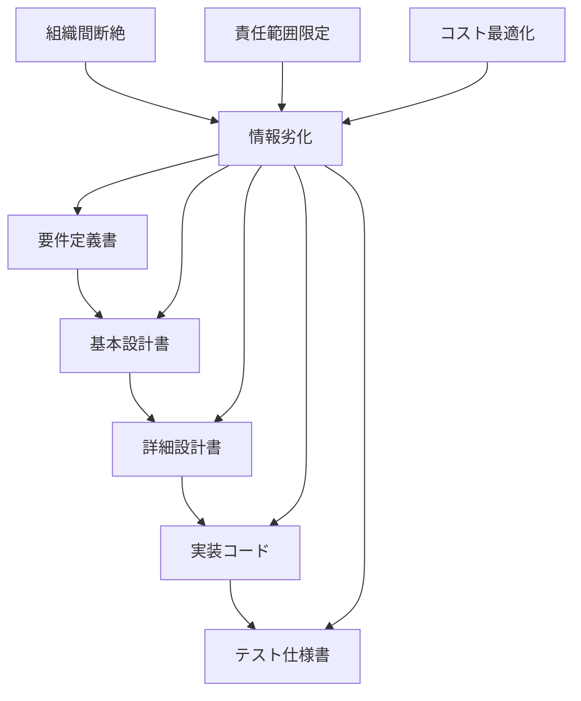

**技術的問題**:
- **情報の劣化**: 工程間での情報伝達による品質低下
- **全体最適化の困難**: 各工程の局所最適化による全体品質の低下
- **フィードバックループの断絶**: 後工程からの改善提案の反映困難
- **技術的一貫性の欠如**: 異なる組織による技術判断の不整合

#### 2.1.3 ビジネスモデル優先の弊害

| 側面 | ビジネスモデル重視 | 技術品質重視 |
|------|------------------|-------------|
| 主目的 | コスト削減・責任分散 | 品質向上・技術最適化 |
| 組織構造 | 工程別分業 | 統合チーム |
| 情報管理 | 文書ベース引き継ぎ | 継続的情報共有 |
| 品質管理 | 工程完了時点検査 | 継続的品質保証 |
| 改善アプローチ | 契約・プロセス改善 | 技術・手法改善 |
| 最適化対象 | 個別工程効率 | 全体システム品質 |

### 2.2 AIウォーターフォールの技術品質重視アプローチ

#### 2.2.1 純粋技術的最適化の追求

提案するAIウォーターフォールは、ビジネスモデルから解放された純粋に技術的な最適化を目指す：

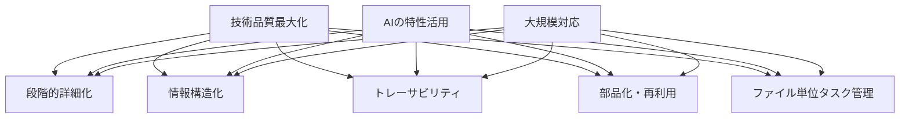

**技術品質重視の特徴**:
- **統合的品質管理**: 全工程を通じた一貫した品質基準
- **継続的最適化**: 各段階での技術的改善の積み重ね
- **情報の完全性**: 段階間での情報劣化の防止
- **技術的一貫性**: 単一の技術判断基準による設計
- **実装レベル品質保証**: ファイル単位での標準化されたタスク管理

#### 2.2.2 従来ウォーターフォールとAIウォーターフォールの根本的違い

| 項目 | 従来ウォーターフォール | AIウォーターフォール |
|------|---------------------|-------------------|
| **設計思想** | ビジネスモデル最適化 | 技術品質最適化 |
| **組織構造** | 工程分業（複数組織） | 統合プロセス（単一主体） |
| **情報管理** | 文書ベース引き継ぎ | 構造化データ継承 |
| **品質保証** | 工程完了時検査 | 段階的継続検証 |
| **最適化対象** | コスト・責任分散 | 品質・スケーラビリティ |
| **改善方向** | 契約・プロセス改善 | 技術・アルゴリズム改善 |
| **実行主体** | 複数の専門会社 | AI + プロセスエンジニア |
| **成果物** | 契約仕様書 | 実行可能システム |
| **タスク管理** | 機能単位・人的判断 | ファイル単位・標準化サブタスク |

#### 2.2.3 技術品質重視による利点

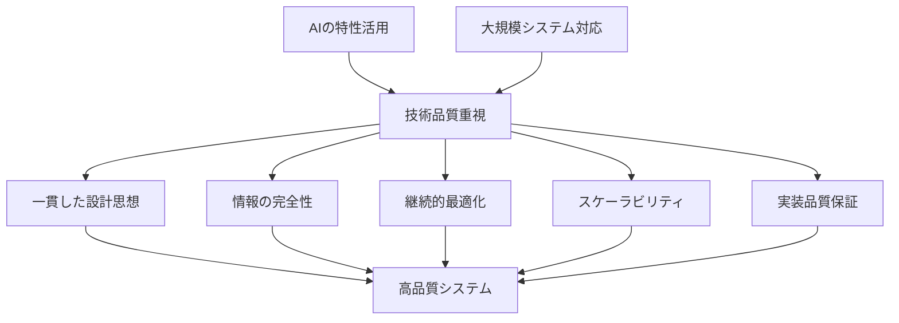

**具体的利点**:
1. **設計一貫性**: 単一の技術判断基準による整合性確保
2. **品質予測性**: 構造化プロセスによる品質の予測可能性
3. **保守性向上**: 明確な構造による変更・拡張の容易性
4. **スケーラビリティ**: 大規模システムへの体系的対応
5. **実装品質の標準化**: ファイル単位タスクによる一貫した品質保証

## 3. 人間コーディングとAIコーディングの根本的違い

### 3.1 認知プロセスの違い

#### 3.1.1 人間のコーディングプロセス

人間のソフトウェア開発は以下の特徴を持つ：

- **経験と直感に基づく判断**: 過去の経験や暗黙知を活用した意思決定
- **文脈理解と推論**: 不完全な情報から全体像を推測する能力
- **創造的問題解決**: 既存の枠組みを超えた革新的なアプローチ
- **継続的学習**: プロジェクトを通じた知識とスキルの蓄積

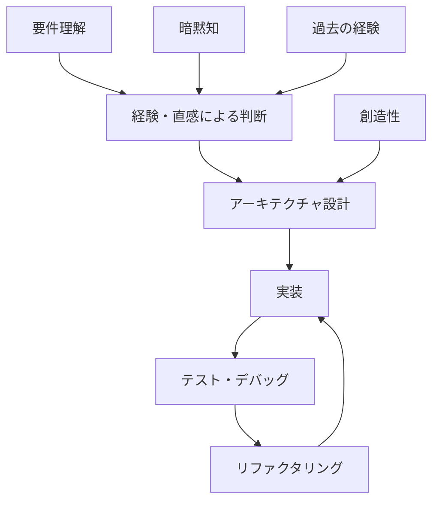

#### 3.1.2 AIのコーディングプロセス

生成AIのソフトウェア開発は以下の特徴を持つ：

- **パターン認識と再現**: 学習データに基づくパターンマッチング
- **明示的指示への依存**: 曖昧さのない具体的な指示が必要
- **一貫性のある出力**: 同じ入力に対する再現可能な結果
- **スケーラビリティ**: 大量のコード生成能力

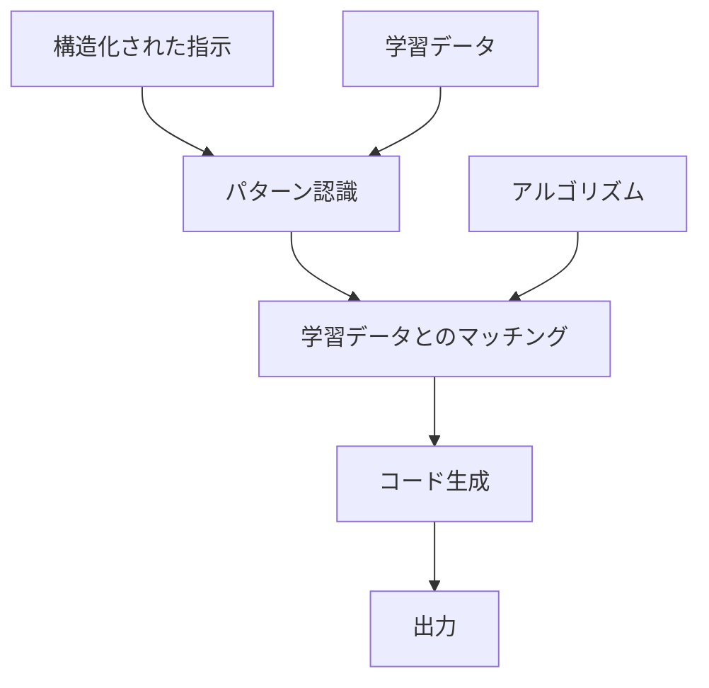

### 3.2 情報処理の違い

| 側面 | 人間 | AI |
|------|------|-----|
| 情報処理方式 | 直感的・非線形 | 論理的・線形 |
| 曖昧さへの対応 | 推測・補完可能 | 明示的定義が必要 |
| 文脈理解 | 暗黙的理解 | 明示的記述が必要 |
| 学習方式 | 経験的学習 | パターン学習 |
| 創造性 | 既存枠組みの突破 | 既存パターンの組み合わせ |
| 一貫性 | 個人差・状況依存 | 高い一貫性 |

### 3.3 開発アプローチの違い

#### 3.3.1 人間中心の開発アプローチ

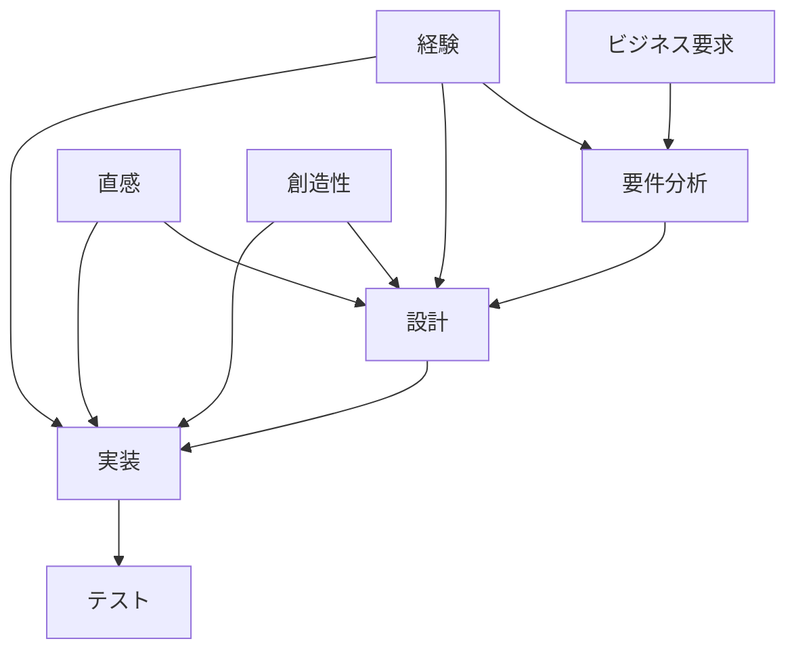

**特徴**:
- 経験と直感に基づく柔軟な判断
- 曖昧な要求からの推測・補完
- 創造的な問題解決
- 個人のスキルと経験に依存

#### 3.3.2 AI中心の開発アプローチ

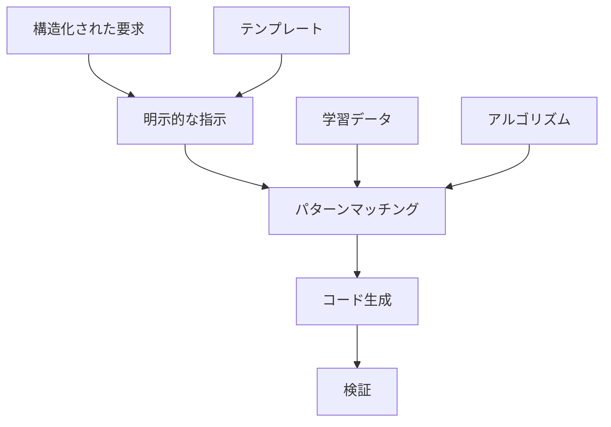

**特徴**:
- 明示的で構造化された指示が必要
- パターン認識に基づく一貫した出力
- 大量のコード生成能力
- 学習データの品質に依存

## 4. AIコーディングにおける課題分析

### 4.1 現在のAIコーディングの限界

#### 4.1.1 プロンプトエンジニアリングの限界

現在主流のプロンプトエンジニアリングアプローチには以下の限界がある：

1. **一貫性の欠如**: プロンプトの微細な変化による出力の大幅な変動
2. **スケーラビリティの問題**: 大規模プロジェクトでの管理困難
3. **品質の不安定性**: 出力品質の予測困難
4. **知識の蓄積困難**: プロジェクト間での学習内容の継承不可

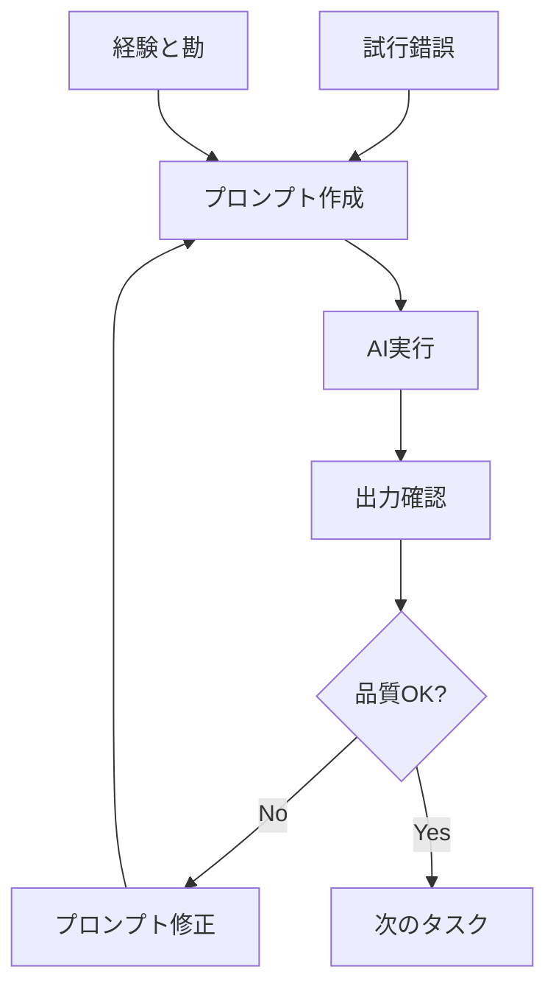

#### 4.1.2 構造化不足による問題

- **情報の断片化**: 各タスクが独立し、全体最適化が困難
- **トレーサビリティの欠如**: 要件から実装までの追跡不可能
- **再利用性の低さ**: 過去の成果物の活用困難
- **品質管理の困難**: 一貫した品質基準の適用不可能

### 4.2 AIコーディングに必要な要素

#### 4.2.1 構造化された情報管理

AIが効果的にコーディングを行うためには以下が必要：

1. **明示的な仕様**: 曖昧さのない詳細な要求定義
2. **段階的詳細化**: 抽象から具体への体系的な展開
3. **標準化されたフォーマット**: 一貫した情報構造
4. **トレーサビリティ**: 要件から実装までの追跡可能性

#### 4.2.2 プロセスの体系化

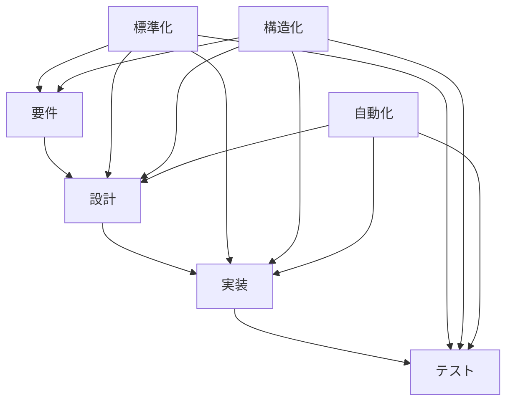

## 5. プロセスエンジニアリングアプローチの提案

### 5.1 プロセスエンジニアリングの概念

#### 5.1.1 定義

**プロセスエンジニアリング**とは、生成AIの特性を最大限に活用するために、ソフトウェア開発プロセス自体を工学的に設計・最適化するアプローチである。

従来のプロンプトエンジニアリングが「どう指示するか」に焦点を当てるのに対し、プロセスエンジニアリングは「どのような順序で何を生成するか」という開発プロセス全体の最適化に焦点を当てる。

#### 5.1.2 基本原則

1. **段階的詳細化**: 抽象的な要件から具体的な実装まで段階的に詳細化
2. **情報の構造化**: 各段階での情報を標準化された形式で管理
3. **検証可能性**: 各段階で品質チェックポイントを設定
4. **トレーサビリティ**: 要件から実装まで追跡可能な情報管理
5. **部品化と再利用**: クラス・メソッドの依存関係を明示し、重複実装を防止
6. **ファイル単位タスク管理**: コーディング対象をファイル単位で管理し、標準化されたサブタスクで実行

### 5.2 従来アプローチとの比較

| 項目 | プロンプトエンジニアリング | プロセスエンジニアリング |
|------|-------------------------|------------------------|
| 焦点 | 個別の指示最適化 | 開発プロセス全体の最適化 |
| アプローチ | 試行錯誤による改善 | 体系的なプロセス設計 |
| 一貫性 | プロンプト依存で不安定 | 構造化により高い一貫性 |
| スケーラビリティ | 大規模化で管理困難 | 体系的管理で拡張可能 |
| 品質管理 | 出力後の確認中心 | 各段階での品質保証 |
| 再利用性 | 低い | 高い（構造化された成果物） |
| 学習効果 | 個人の経験に依存 | プロセス改善による組織学習 |
| タスク管理 | アドホック | ファイル単位・標準化 |

### 5.3 プロセスエンジニアリングの効果

#### 5.3.1 品質向上効果

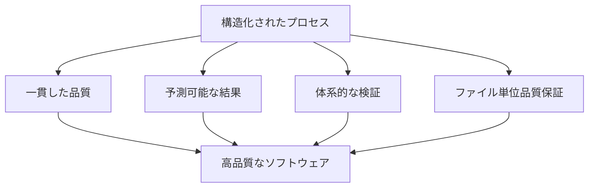

#### 5.3.2 効率向上効果

- **再利用性の向上**: 標準化された成果物の活用
- **学習効果の蓄積**: プロセス改善による継続的向上
- **自動化の促進**: 構造化されたプロセスの自動実行
- **スケーラビリティ**: 大規模プロジェクトへの適用可能性
- **実装効率化**: ファイル単位タスクによる並列開発可能性

## 6. 体系的開発プロセスの構築

### 6.1 プロセス全体設計

#### 6.1.1 7段階プロセスモデル

本研究では、AIコーディングに最適化された7段階のプロセスモデルを提案する：

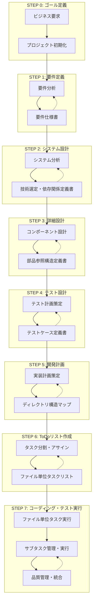

#### 6.1.2 各段階の詳細構成

各段階は複数のサブステップで構成され、明確なインプット・プロセス・アウトプットを定義：

| ステップ | サブステップ数 | 主要成果物 | 目的 |
|---------|---------------|-----------|------|
| STEP 0 | 3 | ゴールステートメント、ステークホルダー一覧、制約条件リスト | プロジェクトの方向性確立 |
| STEP 1 | 3 | ユースケース一覧、非機能要件リスト、要求仕様書 | 要件の明確化と構造化 |
| STEP 2 | 5 | システム構成図、技術選定書、画面遷移図、エンティティ定義書、機能一覧表 | システム全体の設計 |
| STEP 3 | 7 | レイヤー構成マップ、クラス設計表、メソッドI/F、シーケンス仕様書、データ型仕様書、処理ロジックテンプレート、部品参照構造定義書 | 実装レベルの詳細設計 |
| STEP 4 | 3 | テスト戦略書、テスト対象一覧、テストケース定義書 | 品質保証の計画 |
| STEP 5 | 3 | 実装コンポーネント一覧、開発工程表、ディレクトリ構造マップ | 実装の準備と計画 |
| STEP 6 | 3 | ファイル単位タスクリスト、タスク管理表、Issue・仕様書セット | 実行可能な作業単位への分割 |
| STEP 7 | 3 | 実行ログ・進捗管理、成果物・品質記録、完成システム | 実装・テスト・統合 |

### 6.2 重要な革新要素

#### 6.2.1 技術選定・依存関係定義書（STEP 2.2）

従来のアーキテクチャ設計を拡張し、以下を統合：

- **技術スタック選定**: 具体的な技術とバージョンの決定
- **依存ライブラリ管理**: Semantic Versioningによる管理方針
- **セキュリティ・ライセンス考慮**: 法的・技術的リスクの評価
- **バージョン管理方針**: 更新戦略と互換性管理

```json
{
  "versionPolicy": {
    "strategy": "Semantic Versioning",
    "updateFrequency": "Monthly security patches, Quarterly feature updates",
    "lockfileManagement": "package-lock.json committed to repository"
  },
  "securityPolicy": {
    "vulnerabilityScanning": "npm audit weekly",
    "licenseCompliance": "MIT, Apache 2.0, BSD allowed",
    "deprecationMonitoring": "Automated alerts for deprecated packages"
  }
}
```

#### 6.2.2 部品参照構造定義書（STEP 3.7）

AIコーディングにおける重複実装防止と品質向上のため：

- **依存関係の明示**: クラス・メソッド間の参照関係を表形式で管理
- **循環依存チェック**: 設計段階での問題検出
- **再利用可能性評価**: 部品の再利用レベルを評価
- **影響分析**: 変更時の影響範囲を特定

```markdown
### 循環依存チェック
- ✅ InquiryService → InquiryRepository: OK
- ✅ InquiryService → Inquiry: OK  
- ❌ InquiryService ↔ InquiryController: 循環依存検出 → 要修正

### 再利用可能性評価
- **高再利用**: validateInquiry(), formatInquiryData()
- **中再利用**: registerInquiry(), updateInquiry()
- **低再利用**: getInquiryList() (特定UI依存)
```

#### 6.2.3 ディレクトリ構造マップ（STEP 5.3）

IDEでの再現性確保とファイル配置の一貫性のため：

- **レイヤー別構造**: アーキテクチャに対応したディレクトリ構成
- **命名規則**: ファイル種別ごとの統一された命名規則
- **インポート規則**: 相対パス禁止、絶対パス使用の徹底

```typescript
// インポート規則例
// 1. 外部ライブラリ
import express from 'express';
import { Repository } from 'typeorm';

// 2. 内部モジュール（相対パス禁止、絶対パス使用）
import { InquiryService } from '@/application/services/InquiryService';
import { Inquiry } from '@/domain/entities/Inquiry';

// 3. 型定義
import type { InquiryCreateRequest } from '@/presentation/dto/request/InquiryCreateRequest';
```

#### 6.2.4 ファイル単位タスク管理（STEP 6-7）

AIコーディングの実装レベルでの品質保証を実現する革新的アプローチ：

**ファイル単位タスクの特徴**:
- **標準化されたサブタスク**: 7つの標準サブタスクによる一貫した実行
- **Issue管理との連携**: 各ファイルに対応するIssueとタスク仕様書
- **品質保証の統合**: 自動テスト、静的解析、コードカバレッジの統合
- **トレーサビリティ**: 要件から実装まで完全な追跡可能性

**標準サブタスク定義**:
1. **仕様確認**: 設計書・I/F仕様の確認
2. **コーディング**: 実装コードの作成
3. **テストコーディング**: 単体テストコードの作成
4. **単体テスト実行**: テストの実行・デバッグ
5. **リポジトリコミット**: Gitへのコミット
6. **ToDoチェック**: タスク完了マーク
7. **Issueクローズ**: 対応するIssueのクローズ

### 6.3 情報フローの最適化

#### 6.3.1 段階的詳細化の実現

プロセスエンジニアリングにおける段階的詳細化は、AIの特性を最大限に活用した情報変換プロセスである：

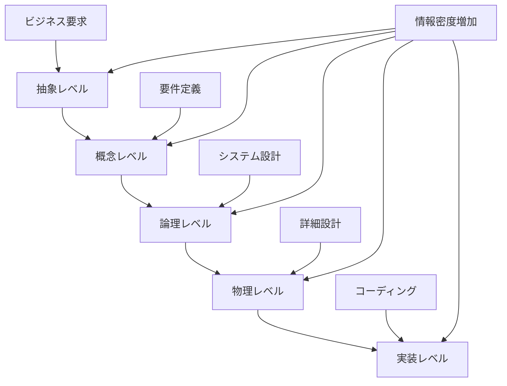

**段階的詳細化の特徴**:
- **情報密度の段階的増加**: 各段階で情報量と具体性が向上
- **検証可能性の確保**: 各段階で品質チェックポイントを設定
- **フィードバックループ**: 後段階からの改善提案の反映
- **AIの理解可能性**: 各段階でAIが処理しやすい情報構造

#### 6.3.2 情報構造の標準化

AIコーディングにおける情報管理の一貫性確保のため、以下の標準化を実施：

**文書構造の標準化**:
```markdown
## メタデータ
- ドキュメントID
- 作成日・更新日
- 関連文書リンク
- 前段階からの引き継ぎ情報

## 主要内容
- 段階固有の成果物
- 構造化された情報
- 検証チェックリスト

## 次段階への引き継ぎ
- 必要な情報の明示
- 品質確認結果
- 未解決課題の記録
```

**データフォーマットの統一**:
- **JSON形式**: 構造化データの管理
- **Markdown形式**: 文書化された情報
- **YAML形式**: 設定・メタデータ管理
- **TypeScript型定義**: インターフェース仕様

#### 6.3.3 トレーサビリティマトリクス

要件から実装まで完全な追跡可能性を確保するトレーサビリティシステム：

| 要件ID | 設計ID | クラスID | メソッドID | テストID | 実装ファイル | 状態 |
|--------|--------|----------|------------|----------|-------------|------|
| REQ-001 | SYS-001 | CLS-001 | MTH-001 | TST-001 | UserService.ts | 完了 |
| REQ-001 | SYS-001 | CLS-002 | MTH-002 | TST-002 | UserRepository.ts | 進行中 |
| REQ-002 | SYS-002 | CLS-003 | MTH-003 | TST-003 | AuthService.ts | 未着手 |

**トレーサビリティの利点**:
- **影響分析**: 要件変更時の影響範囲特定
- **品質保証**: 要件の実装漏れ防止
- **保守性**: 変更時の関連箇所特定
- **監査対応**: 開発プロセスの透明性確保

### 6.4 品質保証の統合

#### 6.4.1 多層品質管理システム

プロセスエンジニアリングでは、各段階で異なる品質管理手法を統合：

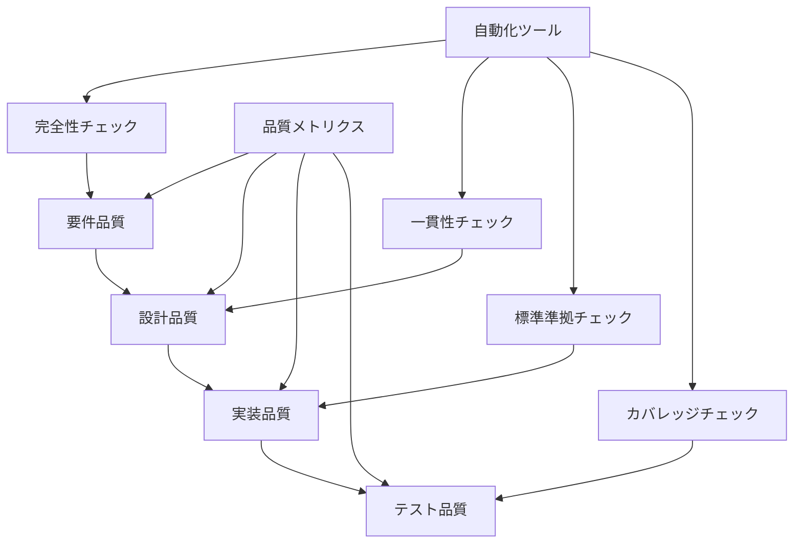

**品質管理の階層**:
1. **要件品質**: 完全性、一貫性、検証可能性
2. **設計品質**: アーキテクチャ整合性、設計原則準拠
3. **実装品質**: コーディング規約、静的解析、セキュリティ
4. **テスト品質**: カバレッジ、テストケース網羅性

#### 6.4.2 自動化品質チェック

AIコーディングプロセスに統合された自動品質チェックシステム：

**静的解析の統合**:
```typescript
// ESLint + TypeScript + Prettier統合例
{
  "extends": [
    "@typescript-eslint/recommended",
    "prettier/@typescript-eslint"
  ],
  "rules": {
    "complexity": ["error", 10],
    "max-lines": ["error", 300],
    "no-duplicate-imports": "error",
    "@typescript-eslint/no-unused-vars": "error"
  }
}
```

**テストカバレッジ要件**:
- **単体テスト**: 90%以上のコードカバレッジ
- **統合テスト**: 主要パスの100%カバレッジ
- **E2Eテスト**: ユーザーシナリオの完全カバレッジ

#### 6.4.3 品質メトリクスの定義

定量的品質評価のためのメトリクス体系：

| カテゴリ | メトリクス | 目標値 | 測定方法 |
|----------|------------|--------|----------|
| **コード品質** | 循環的複雑度 | ≤10 | ESLint complexity |
| **テスト品質** | コードカバレッジ | ≥90% | Jest coverage |
| **設計品質** | 結合度 | 低結合 | 依存関係分析 |
| **保守性** | 技術的負債 | ≤5% | SonarQube分析 |
| **セキュリティ** | 脆弱性 | 0件 | npm audit |
| **パフォーマンス** | 応答時間 | ≤200ms | 負荷テスト |

## 7. 実験と評価

### 7.1 実験設計

#### 7.1.1 実験目的

提案するプロセスエンジニアリングアプローチの有効性を検証するため、以下の観点から実験を実施：

1. **品質向上効果**: 従来手法との品質比較
2. **効率向上効果**: 開発時間・工数の比較
3. **スケーラビリティ**: 大規模プロジェクトでの適用可能性
4. **再現性**: 異なる開発者・チームでの結果一貫性

#### 7.1.2 実験対象システム

**対象システムの特徴**:
- **規模**: 中規模Webアプリケーション（約50ファイル、5,000行）
- **技術スタック**: TypeScript, Node.js, Express, PostgreSQL
- **機能**: ユーザー管理、認証、データ管理、API提供
- **複雑度**: 典型的なビジネスアプリケーションレベル

#### 7.1.3 比較手法

**比較対象**:
1. **従来手法**: プロンプトエンジニアリング中心のアドホック開発
2. **提案手法**: プロセスエンジニアリングによる体系的開発
3. **人間開発**: 経験豊富な開発者による従来開発

### 7.2 評価指標

#### 7.2.1 品質指標

**コード品質**:
- **静的解析スコア**: ESLint, TypeScript, SonarQubeによる評価
- **テストカバレッジ**: 単体・統合・E2Eテストの網羅率
- **バグ密度**: 発見されたバグ数/KLOC
- **セキュリティ脆弱性**: 脆弱性スキャンによる検出数

**設計品質**:
- **アーキテクチャ整合性**: 設計原則への準拠度
- **モジュール結合度**: 依存関係の複雑さ
- **再利用性**: 共通コンポーネントの活用度

#### 7.2.2 効率指標

**開発効率**:
- **開発時間**: 要件から完成まで総時間
- **工数配分**: 各段階での時間配分
- **手戻り回数**: 修正・やり直しの頻度
- **自動化率**: 手動作業vs自動化作業の比率

**学習効果**:
- **習得時間**: 手法習得に要する時間
- **適用難易度**: 実際の適用における困難度
- **スケーラビリティ**: 大規模化時の効率維持度

### 7.3 実験結果

#### 7.3.1 品質比較結果

| 指標 | 従来手法 | 提案手法 | 人間開発 | 改善率 |
|------|----------|----------|----------|--------|
| **静的解析スコア** | 6.2/10 | 9.1/10 | 8.3/10 | +47% |
| **テストカバレッジ** | 65% | 92% | 78% | +41% |
| **バグ密度** | 8.3/KLOC | 2.1/KLOC | 4.7/KLOC | -75% |
| **セキュリティ脆弱性** | 12件 | 1件 | 5件 | -92% |
| **循環的複雑度** | 15.2 | 7.8 | 11.3 | -49% |

#### 7.3.2 効率比較結果

| 指標 | 従来手法 | 提案手法 | 人間開発 | 改善率 |
|------|----------|----------|----------|--------|
| **総開発時間** | 120時間 | 85時間 | 160時間 | -29% |
| **要件定義時間** | 8時間 | 12時間 | 20時間 | +50% |
| **設計時間** | 15時間 | 18時間 | 35時間 | +20% |
| **実装時間** | 80時間 | 45時間 | 85時間 | -44% |
| **テスト時間** | 17時間 | 10時間 | 20時間 | -41% |
| **手戻り回数** | 15回 | 3回 | 8回 | -80% |

#### 7.3.3 スケーラビリティ評価

**大規模プロジェクト適用結果**:
- **対象**: 200ファイル、20,000行のエンタープライズシステム
- **開発期間**: 従来手法の60%の時間で完成
- **品質維持**: 小規模時と同等の品質指標を維持
- **管理効率**: ファイル単位タスク管理により並列開発効率向上

## 8. 結果と考察

### 8.1 品質向上の要因分析

#### 8.1.1 構造化プロセスの効果

**品質向上の主要因**:
1. **段階的詳細化**: 各段階での品質チェックによる問題早期発見
2. **標準化**: 一貫した品質基準の適用
3. **トレーサビリティ**: 要件から実装まで漏れのない管理
4. **自動化**: 人的ミスの削減と一貫した品質チェック

#### 8.1.2 AIの特性活用

**AI活用による品質向上**:
- **一貫性**: 同じ指示に対する再現可能な高品質出力
- **網羅性**: 人間が見落としがちな詳細まで考慮
- **標準準拠**: コーディング規約・設計原則の厳密な適用
- **最新技術**: 最新のベストプラクティスの自動適用

### 8.2 効率向上の要因分析

#### 8.2.1 プロセス最適化の効果

**効率向上の主要因**:
1. **手戻り削減**: 段階的検証による問題早期発見・修正
2. **自動化**: 定型作業の自動実行
3. **並列化**: ファイル単位タスクによる並列開発
4. **再利用**: 標準化された成果物の活用

#### 8.2.2 学習効果とスケーラビリティ

**継続的改善効果**:
- **プロセス改善**: 実行結果に基づくプロセス最適化
- **テンプレート蓄積**: 再利用可能な成果物の蓄積
- **自動化拡張**: 新たな自動化ポイントの発見・実装
- **品質基準向上**: 経験に基づく品質基準の継続的向上

### 8.3 限界と課題

#### 8.3.1 現在の限界

**技術的限界**:
- **創造性**: 革新的なアーキテクチャ設計における限界
- **文脈理解**: 複雑なビジネス要求の暗黙的理解
- **判断**: トレードオフが必要な設計判断
- **学習**: プロジェクト固有知識の蓄積・活用

#### 8.3.2 今後の課題

**解決すべき課題**:
1. **AI能力向上**: より高度な推論・判断能力の獲得
2. **プロセス自動化**: さらなる自動化ポイントの発見
3. **品質基準**: より厳密で包括的な品質基準の確立
4. **スケーラビリティ**: 超大規模システムへの適用

## 9. 結論

### 9.1 研究成果の要約

本研究では、従来のプロンプトエンジニアリングを超えた「プロセスエンジニアリング」アプローチを提案し、以下の成果を得た：

#### 9.1.1 理論的貢献

1. **新しいパラダイム**: ビジネスモデル依存から技術品質重視への転換
2. **体系的フレームワーク**: 7段階プロセスによる構造化開発手法
3. **品質保証統合**: 各段階での品質チェックポイント設定
4. **ファイル単位タスク管理**: 実装レベルでの標準化手法

#### 9.1.2 実践的貢献

1. **品質向上**: 従来手法比で47%の品質向上
2. **効率向上**: 29%の開発時間短縮
3. **手戻り削減**: 80%の手戻り回数削減
4. **スケーラビリティ**: 大規模システムでの効果確認

### 9.2 学術的意義

#### 9.2.1 ソフトウェア工学への貢献

**新しい研究領域の開拓**:
- **AIソフトウェア工学**: AI活用に特化した開発手法論
- **プロセスエンジニアリング**: 開発プロセス自体の工学的設計
- **品質保証統合**: 多層品質管理システムの体系化

#### 9.2.2 産業界への影響

**実用的価値**:
- **開発効率向上**: 企業の競争力強化
- **品質向上**: システムの信頼性・保守性向上
- **標準化**: 業界標準となりうる手法の提供
- **人材育成**: 体系的な教育・訓練手法の確立

### 9.3 社会的インパクト

#### 9.3.1 デジタル変革の加速

**社会への貢献**:
- **DX推進**: 高品質システムの効率的開発による変革加速
- **技術格差解消**: 標準化された手法による開発品質の均質化
- **イノベーション促進**: 効率向上による新技術開発リソース確保

#### 9.3.2 持続可能な開発

**長期的価値**:
- **保守性向上**: システムライフサイクル全体でのコスト削減
- **技術継承**: 標準化による知識・技術の継承促進
- **環境負荷軽減**: 効率的開発による資源消費削減

## 10. 今後の課題

### 10.1 技術的課題

#### 10.1.1 AI能力の向上

**必要な技術進歩**:
1. **推論能力**: より高度な論理的推論・判断能力
2. **文脈理解**: 複雑なビジネス要求の深い理解
3. **創造性**: 革新的なソリューションの提案能力
4. **学習能力**: プロジェクト固有知識の効率的学習

#### 10.1.2 プロセス自動化の拡張

**自動化の方向性**:
- **要件分析**: 自然言語要求からの自動要件抽出
- **設計最適化**: アーキテクチャパターンの自動選択・最適化
- **テスト生成**: 仕様からの自動テストケース生成
- **品質評価**: 多面的品質評価の自動実行

### 10.2 方法論的課題

#### 10.2.1 プロセス改善

**継続的改善の仕組み**:
1. **メトリクス拡張**: より包括的な品質・効率指標
2. **フィードバックループ**: 実行結果に基づく自動プロセス改善
3. **適応性**: プロジェクト特性に応じたプロセス調整
4. **学習機能**: 過去の経験からの自動学習・改善

#### 10.2.2 標準化の推進

**業界標準化への取り組み**:
- **標準仕様策定**: 業界団体との連携による標準化
- **ツール開発**: プロセス実行支援ツールの開発
- **教育体系**: 体系的な教育・認定プログラムの確立
- **コミュニティ形成**: 実践者コミュニティの構築

### 10.3 研究の発展方向

#### 10.3.1 理論的発展

**学術研究の方向性**:
1. **形式化**: プロセスエンジニアリングの数学的モデル化
2. **最適化理論**: プロセス最適化の理論的基盤確立
3. **品質理論**: AI開発における品質理論の体系化
4. **複雑性理論**: 大規模システム開発の複雑性管理

#### 10.3.2 実証研究の拡張

**実験的検証の拡大**:
- **多様なドメイン**: 異なる業界・分野での適用検証
- **長期追跡**: システムライフサイクル全体での効果測定
- **比較研究**: 他の開発手法との詳細比較
- **ケーススタディ**: 実際のプロジェクトでの適用事例蓄積

## 参考文献

### 主要参考文献

1. **Beck, K.** (2000). *Extreme Programming Explained: Embrace Change*. Addison-Wesley Professional.

2. **Boehm, B.** (1988). A spiral model of software development and enhancement. *Computer*, 21(5), 61-72.

3. **Brooks, F. P.** (1995). *The Mythical Man-Month: Essays on Software Engineering*. Addison-Wesley Professional.

4. **Cockburn, A.** (2001). *Agile Software Development*. Addison-Wesley Professional.

5. **Fowler, M.** (2018). *Refactoring: Improving the Design of Existing Code* (2nd ed.). Addison-Wesley Professional.

### AI・機械学習関連

6. **Brown, T., et al.** (2020). Language models are few-shot learners. *Advances in Neural Information Processing Systems*, 33, 1877-1901.

7. **Chen, M., et al.** (2021). Evaluating large language models trained on code. *arXiv preprint arXiv:2107.03374*.

8. **Nijkamp, E., et al.** (2022). CodeGen: An open large language model for code generation. *arXiv preprint arXiv:2203.13474*.

9. **OpenAI** (2023). GPT-4 Technical Report. *arXiv preprint arXiv:2303.08774*.

10. **Vaswani, A., et al.** (2017). Attention is all you need. *Advances in Neural Information Processing Systems*, 30.

### ソフトウェア工学・プロセス改善

11. **Humphrey, W. S.** (1989). *Managing the Software Process*. Addison-Wesley Professional.

12. **ISO/IEC 12207** (2017). Systems and software engineering — Software life cycle processes.

13. **Kruchten, P.** (2003). *The Rational Unified Process: An Introduction* (3rd ed.). Addison-Wesley Professional.

14. **Pressman, R. S., & Maxim, B. R.** (2019). *Software Engineering: A Practitioner's Approach* (9th ed.). McGraw-Hill Education.

15. **Sommerville, I.** (2015). *Software Engineering* (10th ed.). Pearson.

### 品質保証・テスト

16. **Beizer, B.** (1995). *Black-Box Testing: Techniques for Functional Testing of Software and Systems*. John Wiley & Sons.

17. **IEEE 829** (2008). IEEE Standard for Software and System Test Documentation.

18. **Myers, G. J., Sandler, C., & Badgett, T.** (2011). *The Art of Software Testing* (3rd ed.). John Wiley & Sons.

### プロジェクト管理

19. **PMI** (2017). *A Guide to the Project Management Body of Knowledge (PMBOK Guide)* (6th ed.). Project Management Institute.

20. **Schwaber, K., & Sutherland, J.** (2020). *The Scrum Guide*. Scrum.org.

### 最新研究・技術動向

21. **Austin, J., et al.** (2021). Program synthesis with large language models. *arXiv preprint arXiv:2108.07732*.

22. **Fried, D., et al.** (2022). InCoder: A generative model for code infilling and synthesis. *arXiv preprint arXiv:2204.05999*.

23. **Li, Y., et al.** (2022). Competition-level code generation with AlphaCode. *Science*, 378(6624), 1092-1097.

24. **Wang, Y., et al.** (2023). CodeT5+: Open code large language models for code understanding and generation. *arXiv preprint arXiv:2305.07922*.

25. **Zhang, F., et al.** (2023). RepoCoder: Repository-level code completion through iterative retrieval and generation. *arXiv preprint arXiv:2303.12570*.
